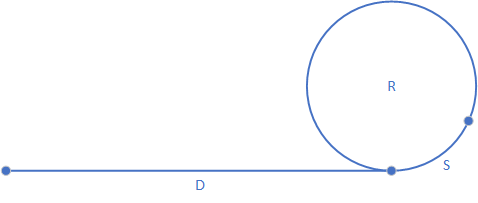

# 链表中与环相关的问题

## 1. 判断链表中是否有环

使用快慢指针来解决，两个指针起始位置都在链表的头部，指针walker每次移动$1$个位置，指针runner每次移动$2$个位置，两个指针一起向前移动，如果在某一时刻，runner到达链表的尾部，则链表中没有环，如果在某一时刻，两个指针重合，则链表中有环。

## 2. 如果链表中有环，求环的长度

在runner与walker重合时开始计数，walker再走$1$圈，计数即为环的长度。

## 3. 如果链表中有环，求入环的节点

如上图，假设起点到入环点的长度为$D$，入环点到runner与walker第一次相遇点的长度为$S$，环的长度为$R$。
那么在runner与walker第一次相遇时：
> runner共行进了$D + nR + S$，其中$n$为自然数；  
> walker共行进了$D + S$;  
> 由于runner的速度是walker的2倍，所以$D + nR + S = 2(D + S)$  
> 即$D = nR -S$

所以，在runner与walker第$1$次相遇时，创建另一个步长为1的指针walker2，并让walker2在链表的头部，这时让walker与walker2一起前进，当walker2走到入环点（假定知道在哪）时，显然walker行进了$D$，那么walker也行进了$D$，也就是行进了$nR - S$，即walker行进了$nR - S$相当于走了$n$圈（$n$圈相当于没动）再后退$S$，也就是说，这时walker也在入环点，那也就是说，walker与walker2第$1$次相遇的位置就是入环点。
