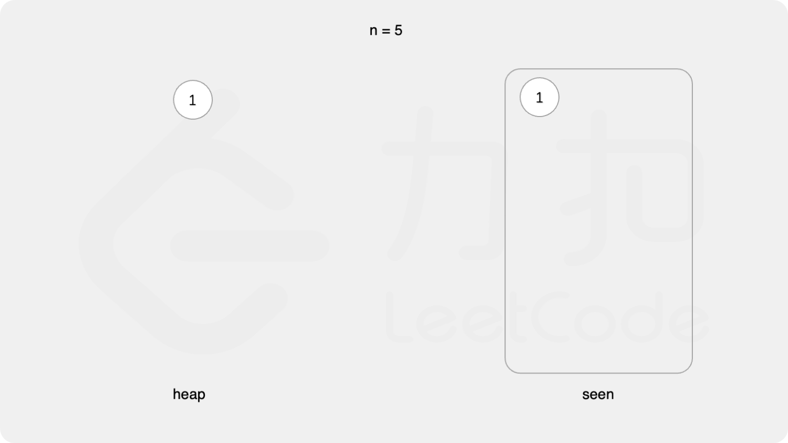
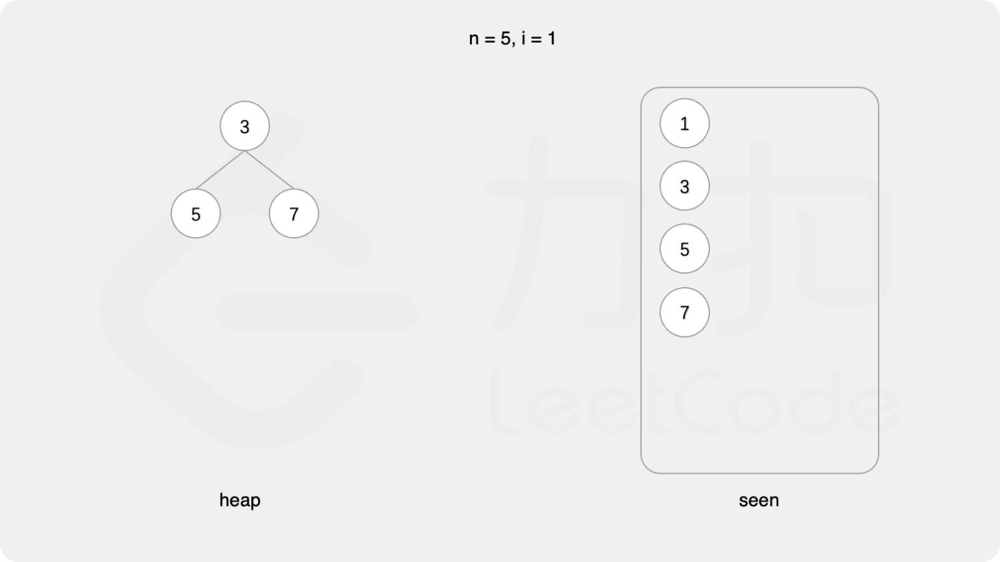
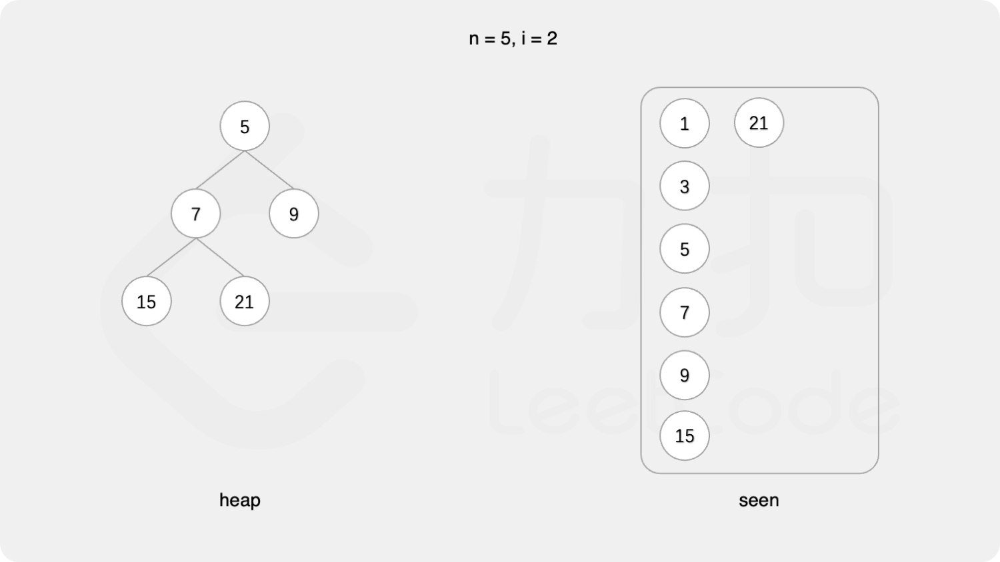
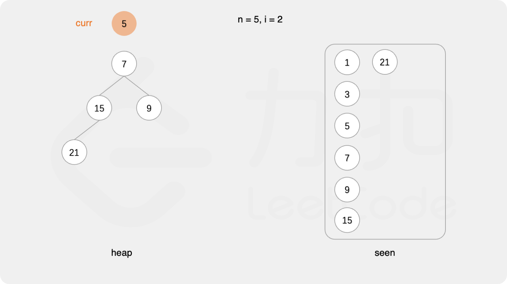
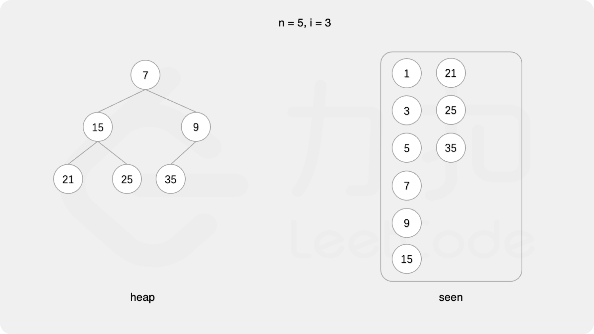
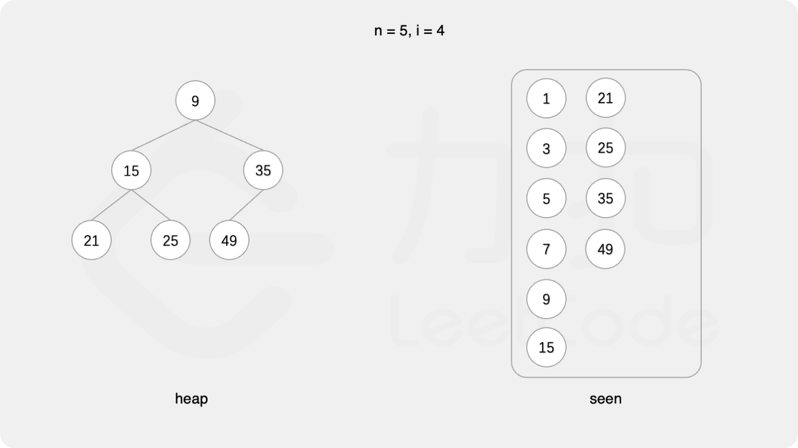
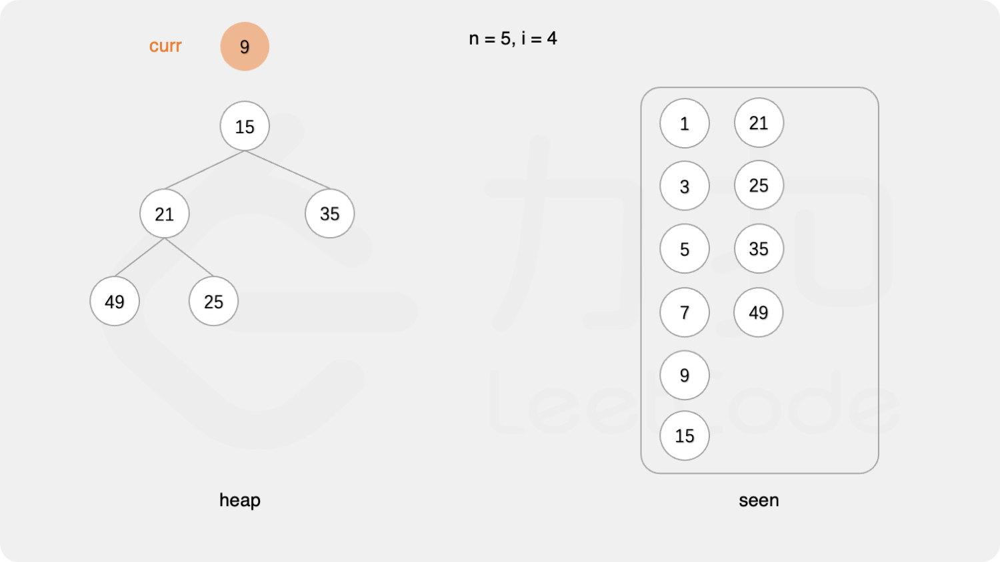
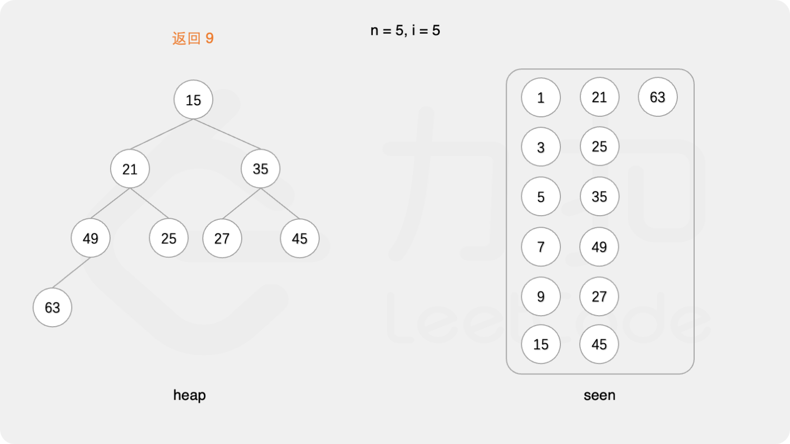

#### [](https://leetcode.cn/problems/get-kth-magic-number-lcci/solution/di-k-ge-shu-by-leetcode-solution-vzp7//#方法一：最小堆)方法一：最小堆

要得到从小到大的第 k 个数，可以使用**最小堆**实现。

初始时堆为空。首先将最小的数 1 加入堆。

每次取出堆顶元素 x，则 x 是堆中最小的数，由于 3x,5x,7x 也是符合要求的数，因此将 3x,5x,7x 加入堆。

上述做法会导致堆中出现重复元素的情况。为了避免重复元素，可以使用哈希集合去重，避免相同元素多次加入堆。

在排除重复元素的情况下，第 k 次从最小堆中取出的元素即为第 k 个数。













```Java
class Solution {
    public int getKthMagicNumber(int k) {
        int[] factors = {3, 5, 7};
        Set<Long> seen = new HashSet<Long>();
        PriorityQueue<Long> heap = new PriorityQueue<Long>();
        seen.add(1L);
        heap.offer(1L);
        int magic = 0;
        for (int i = 0; i < k; i++) {
            long curr = heap.poll();
            magic = (int) curr;
            for (int factor : factors) {
                long next = curr * factor;
                if (seen.add(next)) {
                    heap.offer(next);
                }
            }
        }
        return magic;
    }
}
```

```C#
public class Solution {
    public int GetKthMagicNumber(int k) {
        int[] factors = {3, 5, 7};
        ISet<long> seen = new HashSet<long>();
        PriorityQueue<long, long> heap = new PriorityQueue<long, long>();
        seen.Add(1);
        heap.Enqueue(1, 1);
        int magic = 0;
        for (int i = 0; i < k; i++) {
            long curr = heap.Dequeue();
            magic = (int) curr;
            foreach (int factor in factors) {
                long next = curr * factor;
                if (seen.Add(next)) {
                    heap.Enqueue(next, next);
                }
            }
        }
        return magic;
    }
}
```

```JavaScript
var getKthMagicNumber = function(k) {
    const factors = [3, 5, 7];
    const seen = new Set();
    const heap = new MinHeap();
    seen.add(1);
    heap.insert(1);
    let magic = 0;
    for (let i = 0; i < k; i++) {
        magic = heap.pop();
        for (const factor of factors) {
            const next = magic * factor;
            if (!seen.has(next)) {
                seen.add(next);
                heap.insert(next);
            }
        }
        
    }
    return magic;
};

// 最小堆
class MinHeap {
    constructor() {
        this.heap = [];
    }

    getParentIndex(i) {
        return (i - 1) >> 1;
    }

    getLeftIndex(i) {
        return i * 2 + 1;
    }

    getRightIndex(i) {
        return i * 2 + 2;
    }

    shiftUp(index) {
        if(index === 0) { return; }
        const parentIndex = this.getParentIndex(index);
        if(this.heap[parentIndex] > this.heap[index]){
            this.swap(parentIndex, index);
            this.shiftUp(parentIndex);
        }
    }

    swap(i1, i2) {
        const temp = this.heap[i1];
        this.heap[i1]= this.heap[i2];
        this.heap[i2] = temp;
    }

    insert(value) {
        this.heap.push(value);
        this.shiftUp(this.heap.length - 1);
    }

    pop() {
        this.heap[0] = this.heap.pop();
        this.shiftDown(0);
        return this.heap[0];
    }

    shiftDown(index) {
        const leftIndex = this.getLeftIndex(index);
        const rightIndex = this.getRightIndex(index);
        if (this.heap[leftIndex] < this.heap[index]) {
            this.swap(leftIndex, index);
            this.shiftDown(leftIndex);
        }
        if (this.heap[rightIndex] < this.heap[index]){
            this.swap(rightIndex, index);
            this.shiftDown(rightIndex);
        }
    }

    peek() {
        return this.heap[0];
    }

    size() {
        return this.heap.length;
    }
}
```

```Go
var factors = []int{3, 5, 7}

type hp struct{ sort.IntSlice }
func (h *hp) Push(v interface{}) { h.IntSlice = append(h.IntSlice, v.(int)) }
func (h *hp) Pop() interface{}   { a := h.IntSlice; v := a[len(a)-1]; h.IntSlice = a[:len(a)-1]; return v }

func getKthMagicNumber(k int) int {
    h := &hp{sort.IntSlice{1}}
    seen := map[int]struct{}{1: {}}
    for i := 1; ; i++ {
        x := heap.Pop(h).(int)
        if i == k {
            return x
        }
        for _, f := range factors {
            next := x * f
            if _, has := seen[next]; !has {
                heap.Push(h, next)
                seen[next] = struct{}{}
            }
        }
    }
}
```

```Python
class Solution:
    def getKthMagicNumber(self, k: int) -> int:
        factors = [3, 5, 7]
        seen = {1}
        heap = [1]

        for i in range(k - 1):
            curr = heapq.heappop(heap)
            for factor in factors:
                if (nxt := curr * factor) not in seen:
                    seen.add(nxt)
                    heapq.heappush(heap, nxt)

        return heapq.heappop(heap)
```

```C++
class Solution {
public:
    int getKthMagicNumber(int k) {
        vector<int> factors = {3, 5, 7};
        unordered_set<long> seen;
        priority_queue<long, vector<long>, greater<long>> heap;
        seen.insert(1L);
        heap.push(1L);
        int magic = 0;
        for (int i = 0; i < k; i++) {
            long curr = heap.top();
            heap.pop();
            magic = (int)curr;
            for (int factor : factors) {
                long next = curr * factor;
                if (!seen.count(next)) {
                    seen.insert(next);
                    heap.push(next);
                }
            }
        }
        return magic;
    }
};
```

```C
#define HASH_FIND_LONG(head, findint, out) HASH_FIND(hh, head, findint, sizeof(long), out)
#define HASH_ADD_LONG(head, intfield, add) HASH_ADD(hh, head, intfield, sizeof(long), add)

struct HashTable {
    long key;
    UT_hash_handle hh;
};

void insert(struct HashTable** hashTable, long ikey) {
    struct HashTable* tmp;
    HASH_FIND_LONG(*hashTable, &ikey, tmp);
    if (tmp == NULL) {
        tmp = malloc(sizeof(struct HashTable));
        tmp->key = ikey;
        HASH_ADD_LONG(*hashTable, key, tmp);
    }
}

bool count(struct HashTable** hashTable, long ikey) {
    struct HashTable* tmp;
    HASH_FIND_LONG(*hashTable, &ikey, tmp);
    return tmp == NULL;
}

struct Heap {
    long* heap;
    int heapSize;
    bool (*cmp)(long, long);
};

void init(struct Heap* obj, int n, bool (*cmp)(long, long)) {
    obj->heap = malloc(sizeof(long) * (k + 1));
    obj->heapSize = 0;
    obj->cmp = cmp;
}

bool cmp1(long a, long b) {
    return a > b;
}

void swap(long* a, long* b) {
    long tmp = *a;
    *a = *b, *b = tmp;
}

void push(struct Heap* obj, long x) {
    int p = ++(obj->heapSize), q = p >> 1;
    obj->heap[p] = x;
    while (q) {
        if (!obj->cmp(obj->heap[q], obj->heap[p])) {
            break;
        }
        swap(&(obj->heap[q]), &(obj->heap[p]));
        p = q, q = p >> 1;
    }
}

void pop(struct Heap* obj) {
    swap(&(obj->heap[1]), &(obj->heap[(obj->heapSize)--]));
    int p = 1, q = p << 1;
    while (q <= obj->heapSize) {
        if (q + 1 <= obj->heapSize) {
            if (obj->cmp(obj->heap[q], obj->heap[q + 1])) {
                q++;
            }
        }
        if (!obj->cmp(obj->heap[p], obj->heap[q])) {
            break;
        }
        swap(&(obj->heap[q]), &(obj->heap[p]));
        p = q, q = p << 1;
    }
}

long top(struct Heap* obj) {
    return obj->heap[1];
}

bool empty(struct Heap* obj) {
    return obj->heapSize == 0;
}

int getKthMagicNumber(int k) {
    int factors[3] = {3, 5, 7};
    struct HashTable* hashTable = NULL;
    insert(&hashTable, 1);
    struct Heap* heap = malloc(sizeof(struct Heap));
    init(heap, k * 3, cmp1);
    push(heap, 1);
    int magic = 0;
    for (int i = 0; i < k; i++) {
        long curr = top(heap);
        pop(heap);
        magic = (int)curr;
        for (int i = 0; i < 3; i++) {
            long next = curr * factors[i];
            if (count(&hashTable, next)) {
                insert(&hashTable, next);
                push(heap, next);
            }
        }
    }
    return magic;
}
```

**复杂度分析**

-   时间复杂度：O(klogk)。得到第 k 个数需要进行 k 次循环，每次循环都要从最小堆中取出 1 个元素以及向最小堆中加入最多 3 个元素，因此每次循环的时间复杂度是 O(log(3k)+3log(3k))=O(logk)，总时间复杂度是 O(klogk)。
-   空间复杂度：O(k)。空间复杂度主要取决于最小堆和哈希集合的大小，最小堆和哈希集合的大小都不会超过 3k。
