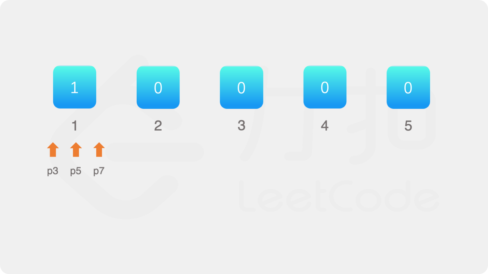
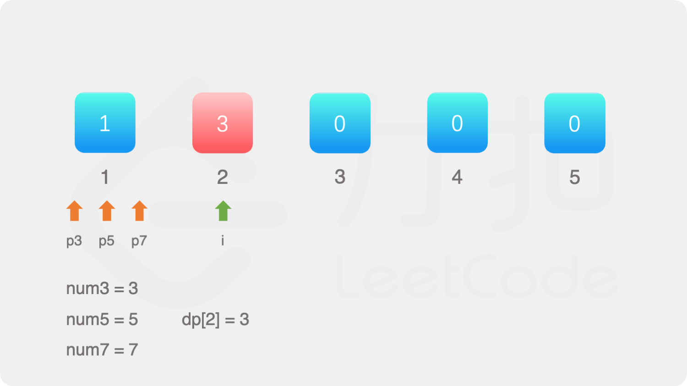
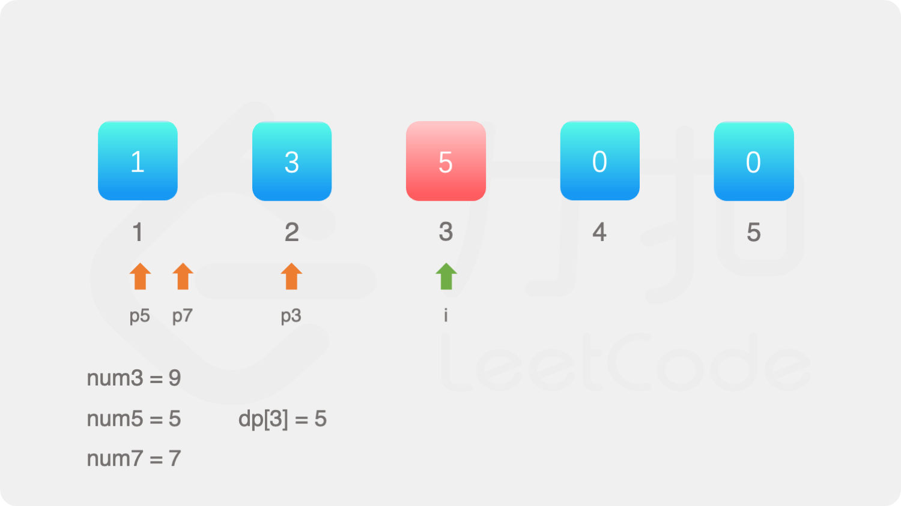
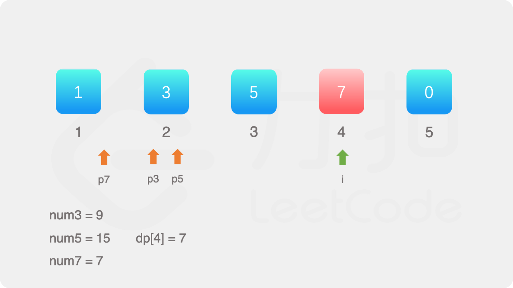
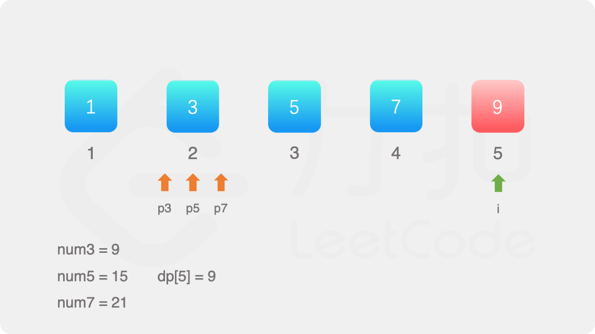

#### [](https://leetcode.cn/problems/get-kth-magic-number-lcci/solution/di-k-ge-shu-by-leetcode-solution-vzp7//#方法二：动态规划)方法二：动态规划

方法一使用最小堆，会预先存储较多的数，维护最小堆的过程也导致时间复杂度较高。可以使用动态规划的方法进行优化。

定义数组 dp，其中 dp[i] 表示第 i 个数，第 k 个数即为 dp[k]。

由于最小的数是 1，因此 dp[1]=1。

如何得到其余的数呢？定义三个指针 p3,p5,p7，表示下一个数是当前指针指向的数乘以对应的质因数。初始时，三个指针的值都是 1。

当 2≤i≤k 时，令 dp[i]=min(dp[p3]×3,dp[p5]×5,dp[p7]×7)，然后分别比较 dp[i] 和 dp[p3]×3,dp[p5]×5,dp[p7]×7 是否相等，如果相等则将对应的指针加 1。

**正确性证明**

对于 i>1，在计算 dp[i] 时，指针 px(x∈{3,5,7}) 的含义是使得 dp[j]×x>dp[i−1] 的最小的下标 j，即当 j≥px 时 dp[j]×x>dp[i−1]，当 j<px 时 dp[j]×x≤dp[i−1]。

因此，对于 i>1，在计算 dp[i] 时，dp[p3]×3,dp[p5]×5,dp[p7]×7 都大于 dp[i−1]，dp[p3−1]×3,dp[p5−1]×5,dp[p7−1]×7 都小于或等于 dp[i−1]。令 dp[i]=min(dp[p3]×3,dp[p5]×5,dp[p7]×7)，则 dp[i]>dp[i−1] 且 dp[i] 是大于 dp[i−1] 的最小的数。

在计算 dp[i] 之后，会更新三个指针 p3,p5,p7，更新之后的指针将用于计算 dp[i+1]，同样满足 dp[i+1]>dp[i] 且 dp[i+1] 是大于 dp[i] 的最小的数。







```Java
class Solution {
    public int getKthMagicNumber(int k) {
        int[] dp = new int[k + 1];
        dp[1] = 1;
        int p3 = 1, p5 = 1, p7 = 1;
        for (int i = 2; i <= k; i++) {
            int num3 = dp[p3] * 3, num5 = dp[p5] * 5, num7 = dp[p7] * 7;
            dp[i] = Math.min(Math.min(num3, num5), num7);
            if (dp[i] == num3) {
                p3++;
            }
            if (dp[i] == num5) {
                p5++;
            }
            if (dp[i] == num7) {
                p7++;
            }
        }
        return dp[k];
    }
}
```

```C#
public class Solution {
    public int GetKthMagicNumber(int k) {
        int[] dp = new int[k + 1];
        dp[1] = 1;
        int p3 = 1, p5 = 1, p7 = 1;
        for (int i = 2; i <= k; i++) {
            int num3 = dp[p3] * 3, num5 = dp[p5] * 5, num7 = dp[p7] * 7;
            dp[i] = Math.Min(Math.Min(num3, num5), num7);
            if (dp[i] == num3) {
                p3++;
            }
            if (dp[i] == num5) {
                p5++;
            }
            if (dp[i] == num7) {
                p7++;
            }
        }
        return dp[k];
    }
}
```

```JavaScript
var getKthMagicNumber = function(k) {
    const dp = new Array(k + 1).fill(0);
    dp[1] = 1;
    let p3 = 1, p5 = 1, p7 = 1;
    for (let i = 2; i <= k; i++) {
        const num3 = dp[p3] * 3, num5 = dp[p5] * 5, num7 = dp[p7] * 7;
        dp[i] = Math.min(Math.min(num3, num5), num7);
        if (dp[i] === num3) {
            p3++;
        }
        if (dp[i] === num5) {
            p5++;
        }
        if (dp[i] === num7) {
            p7++;
        }
    }
    return dp[k];
};
```

```Go
func getKthMagicNumber(k int) int {
    dp := make([]int, k+1)
    dp[1] = 1
    p3, p5, p7 := 1, 1, 1
    for i := 2; i <= k; i++ {
        x2, x3, x5 := dp[p3]*3, dp[p5]*5, dp[p7]*7
        dp[i] = min(min(x2, x3), x5)
        if dp[i] == x2 {
            p3++
        }
        if dp[i] == x3 {
            p5++
        }
        if dp[i] == x5 {
            p7++
        }
    }
    return dp[k]
}

func min(a, b int) int {
    if a < b {
        return a
    }
    return b
}
```

```Python
class Solution:
    def getKthMagicNumber(self, k: int) -> int:
        dp = [0] * (k + 1)
        dp[1] = 1
        p3 = p5 = p7 = 1

        for i in range(2, k + 1):
            num3, num5, num7 = dp[p3] * 3, dp[p5] * 5, dp[p7] * 7
            dp[i] = min(num3, num5, num7)
            if dp[i] == num3:
                p3 += 1
            if dp[i] == num5:
                p5 += 1
            if dp[i] == num7:
                p7 += 1
        
        return dp[k]
```

```C++
class Solution {
public:
    int getKthMagicNumber(int k) {
        vector<int> dp(k + 1);
        dp[1] = 1;
        int p3 = 1, p5 = 1, p7 = 1;
        for (int i = 2; i <= k; i++) {
            int num3 = dp[p3] * 3, num5 = dp[p5] * 5, num7 = dp[p7] * 7;
            dp[i] = min(min(num3, num5), num7);
            if (dp[i] == num3) {
                p3++;
            }
            if (dp[i] == num5) {
                p5++;
            }
            if (dp[i] == num7) {
                p7++;
            }
        }
        return dp[k];
    }
};
```

```C
int getKthMagicNumber(int k) {
    int dp[k + 1];
    dp[1] = 1;
    int p3 = 1, p5 = 1, p7 = 1;
    for (int i = 2; i <= k; i++) {
        int num3 = dp[p3] * 3, num5 = dp[p5] * 5, num7 = dp[p7] * 7;
        dp[i] = fmin(fmin(num3, num5), num7);
        if (dp[i] == num3) {
            p3++;
        }
        if (dp[i] == num5) {
            p5++;
        }
        if (dp[i] == num7) {
            p7++;
        }
    }
    return dp[k];
}
```

**复杂度分析**

-   时间复杂度：O(k)。需要计算数组 dp 中的 k 个元素，每个元素的计算都可以在 O(1) 的时间内完成。
-   空间复杂度：O(k)。空间复杂度主要取决于数组 dp 的大小。
