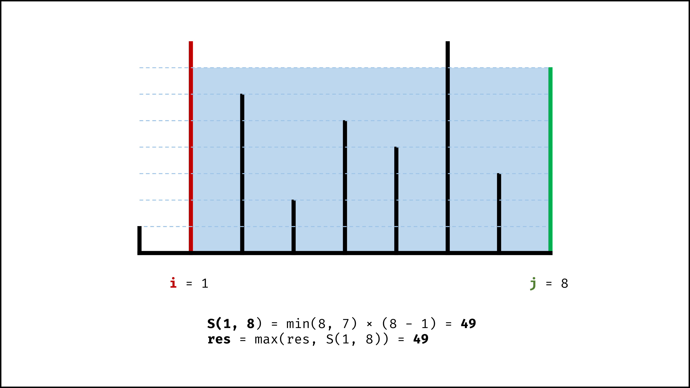
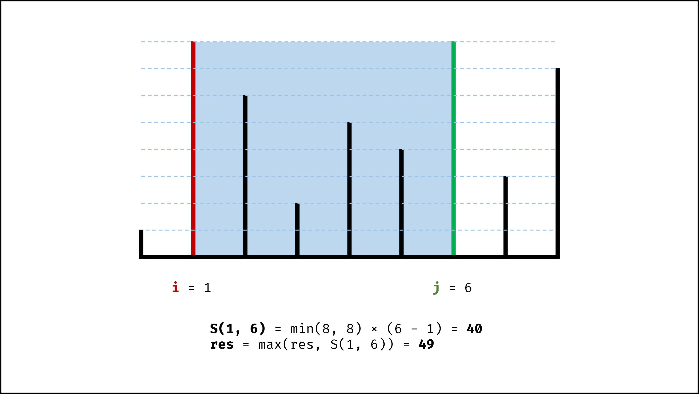
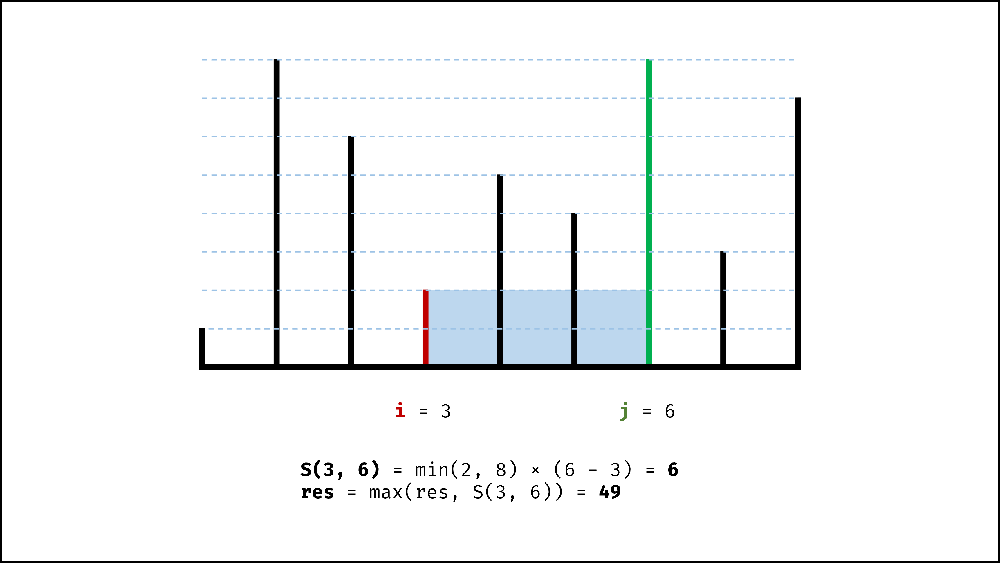

#### 11\. 盛最多水的容器（双指针，清晰图解）

设两指针 i , j ，指向的水槽板高度分别为 h[i] , h[j] ，此状态下水槽面积为 S(i,j) 。由于可容纳水的高度由两板中的 **短板** 决定，因此可得如下 **面积公式** ：

S(i,j)=min(h[i],h[j])×(j−i)


在每个状态下，无论长板或短板向中间收窄一格，都会导致水槽 **底边宽度** −1 变短：

-   若向内 **移动短板** ，水槽的短板 min(h[i],h[j]) 可能变大，因此下个水槽的面积 **可能增大** 。
-   若向内 **移动长板** ，水槽的短板 min(h[i],h[j]) 不变或变小，因此下个水槽的面积 **一定变小** 。

因此，初始化双指针分列水槽左右两端，循环每轮将短板向内移动一格，并更新面积最大值，直到两指针相遇时跳出；即可获得最大面积。

#### [](https://leetcode.cn/problems/container-with-most-water/solution/container-with-most-water-shuang-zhi-zhen-fa-yi-do//#算法流程：)算法流程：

1.  **初始化：** 双指针 i , j 分列水槽左右两端；
2.  **循环收窄：** 直至双指针相遇时跳出；
    1.  更新面积最大值 res ；
    2.  选定两板高度中的短板，向中间收窄一格；
3.  **返回值：** 返回面积最大值 res 即可；

#### [](https://leetcode.cn/problems/container-with-most-water/solution/container-with-most-water-shuang-zhi-zhen-fa-yi-do//#正确性证明：)正确性证明：

若暴力枚举，水槽两板围成面积 S(i,j) 的状态总数为 C(n,2) 。

假设状态 S(i,j) 下 h[i]<h[j] ，在向内移动短板至 S(i+1,j) ，则相当于消去了 S(i,j−1),S(i,j−2),...,S(i,i+1) 状态集合。而所有消去状态的面积一定都小于当前面积（即 <S(i,j)），因为这些状态：

-   短板高度：相比 S(i,j) 相同或更短（即 ≤h[i] ）；
-   底边宽度：相比 S(i,j) 更短；

因此，每轮向内移动短板，所有消去的状态都 **不会导致面积最大值丢失** ，证毕。









#### [](https://leetcode.cn/problems/container-with-most-water/solution/container-with-most-water-shuang-zhi-zhen-fa-yi-do//#复杂度分析：)复杂度分析：

-   **时间复杂度 O(N) ：** 双指针遍历一次底边宽度 N 。
-   **空间复杂度 O(1) ：** 变量 i , j , res 使用常数额外空间。

#### [](https://leetcode.cn/problems/container-with-most-water/solution/container-with-most-water-shuang-zhi-zhen-fa-yi-do//#代码：)代码：

```Python
class Solution:
    def maxArea(self, height: List[int]) -> int:
        i, j, res = 0, len(height) - 1, 0
        while i < j:
            if height[i] < height[j]:
                res = max(res, height[i] * (j - i))
                i += 1
            else:
                res = max(res, height[j] * (j - i))
                j -= 1
        return res
```

```Java
class Solution {
    public int maxArea(int[] height) {
        int i = 0, j = height.length - 1, res = 0;
        while(i < j) {
            res = height[i] < height[j] ? 
                Math.max(res, (j - i) * height[i++]): 
                Math.max(res, (j - i) * height[j--]); 
        }
        return res;
    }
}
```

```C++
class Solution {
public:
    int maxArea(vector<int>& height) {
        int i = 0, j = height.size() - 1, res = 0;
        while(i < j) {
            res = height[i] < height[j] ? 
                max(res, (j - i) * height[i++]): 
                max(res, (j - i) * height[j--]); 
        }
        return res;
    }
};
```
