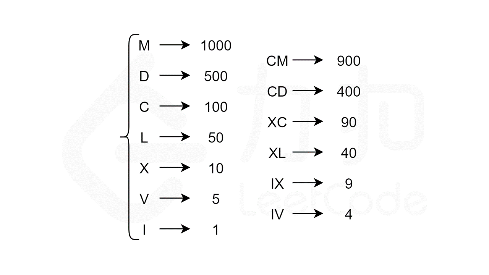

#### [](https://leetcode.cn/problems/integer-to-roman/solution/zheng-shu-zhuan-luo-ma-shu-zi-by-leetcod-75rs//#前言)前言

**罗马数字符号**

罗马数字由 7 个不同的单字母符号组成，每个符号对应一个具体的数值。此外，减法规则（如问题描述中所述）给出了额外的 6 个复合符号。这给了我们总共 13 个独特的符号（每个符号由 1 个或 2 个字母组成），如下图所示。



**罗马数字的唯一表示法**

让我们从一个例子入手。考虑 140 的罗马数字表示，下面哪一个是正确的？


我们用来确定罗马数字的规则是：对于罗马数字从左到右的每一位，选择尽可能大的符号值。对于 140，最大可以选择的符号值为 C=100。接下来，对于剩余的数字 40，最大可以选择的符号值为 XL=40。因此，140 的对应的罗马数字为 C+XL=CXL。

#### [](https://leetcode.cn/problems/integer-to-roman/solution/zheng-shu-zhuan-luo-ma-shu-zi-by-leetcod-75rs//#方法一：模拟)方法一：模拟

**思路**

根据罗马数字的唯一表示法，为了表示一个给定的整数 num，我们寻找不超过 num 的最大符号值，将 num 减去该符号值，然后继续寻找不超过 num 的最大符号值，将该符号拼接在上一个找到的符号之后，循环直至 num 为 0。最后得到的字符串即为 num 的罗马数字表示。

编程时，可以建立一个数值-符号对的列表 valueSymbols，按数值从大到小排列。遍历 valueSymbols 中的每个数值-符号对，若当前数值 value 不超过 num，则从 num 中不断减去 value，直至 num 小于 value，然后遍历下一个数值-符号对。若遍历中 num 为 0 则跳出循环。

**代码**

```C++
const pair<int, string> valueSymbols[] = {
    {1000, "M"},
    {900,  "CM"},
    {500,  "D"},
    {400,  "CD"},
    {100,  "C"},
    {90,   "XC"},
    {50,   "L"},
    {40,   "XL"},
    {10,   "X"},
    {9,    "IX"},
    {5,    "V"},
    {4,    "IV"},
    {1,    "I"},
};

class Solution {
public:
    string intToRoman(int num) {
        string roman;
        for (const auto &[value, symbol] : valueSymbols) {
            while (num >= value) {
                num -= value;
                roman += symbol;
            }
            if (num == 0) {
                break;
            }
        }
        return roman;
    }
};

```

```Java
class Solution {
    int[] values = {1000, 900, 500, 400, 100, 90, 50, 40, 10, 9, 5, 4, 1};
    String[] symbols = {"M", "CM", "D", "CD", "C", "XC", "L", "XL", "X", "IX", "V", "IV", "I"};

    public String intToRoman(int num) {
        StringBuffer roman = new StringBuffer();
        for (int i = 0; i < values.length; ++i) {
            int value = values[i];
            String symbol = symbols[i];
            while (num >= value) {
                num -= value;
                roman.append(symbol);
            }
            if (num == 0) {
                break;
            }
        }
        return roman.toString();
    }
}

```

```C#
public class Solution {
    readonly Tuple<int, string>[] valueSymbols = {
        new Tuple<int, string>(1000, "M"),
        new Tuple<int, string>(900, "CM"),
        new Tuple<int, string>(500, "D"),
        new Tuple<int, string>(400, "CD"),
        new Tuple<int, string>(100, "C"),
        new Tuple<int, string>(90, "XC"),
        new Tuple<int, string>(50, "L"),
        new Tuple<int, string>(40, "XL"),
        new Tuple<int, string>(10, "X"),
        new Tuple<int, string>(9, "IX"),
        new Tuple<int, string>(5, "V"),
        new Tuple<int, string>(4, "IV"),
        new Tuple<int, string>(1, "I")
    };

    public string IntToRoman(int num) {
        StringBuilder roman = new StringBuilder();
        foreach (Tuple<int, string> tuple in valueSymbols) {
            int value = tuple.Item1;
            string symbol = tuple.Item2;
            while (num >= value) {
                num -= value;
                roman.Append(symbol);
            }
            if (num == 0) {
                break;
            }
        }
        return roman.ToString();
    }
}

```

```Go
var valueSymbols = []struct {
    value  int
    symbol string
}{
    {1000, "M"},
    {900, "CM"},
    {500, "D"},
    {400, "CD"},
    {100, "C"},
    {90, "XC"},
    {50, "L"},
    {40, "XL"},
    {10, "X"},
    {9, "IX"},
    {5, "V"},
    {4, "IV"},
    {1, "I"},
}

func intToRoman(num int) string {
    roman := []byte{}
    for _, vs := range valueSymbols {
        for num >= vs.value {
            num -= vs.value
            roman = append(roman, vs.symbol...)
        }
        if num == 0 {
            break
        }
    }
    return string(roman)
}

```

```JavaScript
var intToRoman = function(num) {
    const valueSymbols = [[1000, "M"], [900, "CM"], [500, "D"], [400, "CD"], [100, "C"], [90, "XC"], [50, "L"], [40, "XL"], [10, "X"], [9, "IX"], [5, "V"], [4, "IV"], [1, "I"]];
    const roman = [];
    for (const [value, symbol] of valueSymbols) {
        while (num >= value) {
            num -= value;
            roman.push(symbol);
        }
        if (num == 0) {
            break;
        }
    }
    return roman.join('');
};

```

```Python
class Solution:

    VALUE_SYMBOLS = [
        (1000, "M"),
        (900, "CM"),
        (500, "D"),
        (400, "CD"),
        (100, "C"),
        (90, "XC"),
        (50, "L"),
        (40, "XL"),
        (10, "X"),
        (9, "IX"),
        (5, "V"),
        (4, "IV"),
        (1, "I"),
    ]

    def intToRoman(self, num: int) -> str:
        roman = list()
        for value, symbol in Solution.VALUE_SYMBOLS:
            while num >= value:
                num -= value
                roman.append(symbol)
            if num == 0:
                break
        return "".join(roman)

```

```C
const int values[] = {1000, 900, 500, 400, 100, 90, 50, 40, 10, 9, 5, 4, 1};
const char* symbols[] = {"M", "CM", "D", "CD", "C", "XC", "L", "XL", "X", "IX", "V", "IV", "I"};

char* intToRoman(int num) {
    char* roman = malloc(sizeof(char) * 16);
    roman[0] = '\0';
    for (int i = 0; i < 13; i++) {
        while (num >= values[i]) {
            num -= values[i];
            strcpy(roman + strlen(roman), symbols[i]);
        }
        if (num == 0) {
            break;
        }
    }
    return roman;
}

```

**复杂度分析**

-   时间复杂度：O(1)。由于 valueSymbols 长度是固定的，且这 13 字符中的每个字符的出现次数均不会超过 3，因此循环次数有一个确定的上限。对于本题给出的数据范围，循环次数不会超过 15 次。

-   空间复杂度：O(1)。
