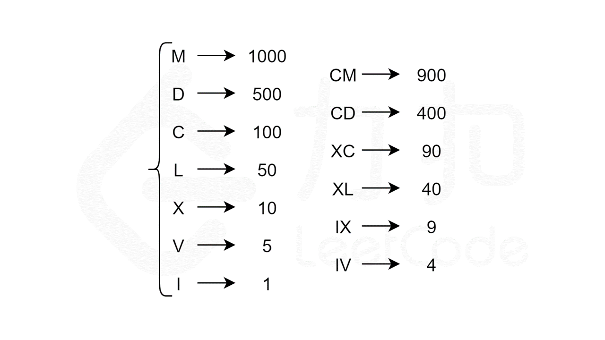
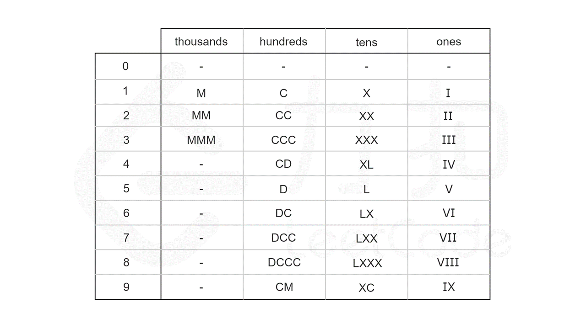

#### [](https://leetcode.cn/problems/integer-to-roman/solution/zheng-shu-zhuan-luo-ma-shu-zi-by-leetcod-75rs//#方法二：硬编码数字)方法二：硬编码数字

**思路**



回顾前言中列出的这 1 个符号，可以发现：

-   千位数字只能由 M 表示；
-   百位数字只能由 C，CD，D 和 CM 表示；
-   十位数字只能由 X，XL，L 和 XC 表示；
-   个位数字只能由 I，IV，V 和 IX 表示。

这恰好把这 13 个符号分为四组，且组与组之间没有公共的符号。因此，整数 num 的十进制表示中的每一个数字都是可以单独处理的。

进一步地，我们可以计算出每个数字在每个位上的表示形式，整理成一张硬编码表。如下图所示，其中 0 对应的是空字符串。



利用模运算和除法运算，我们可以得到 num 每个位上的数字：

```
thousands_digit = num / 1000
hundreds_digit = (num % 1000) / 100
tens_digit = (num % 100) / 10
ones_digit = num % 10
```

最后，根据 num 每个位上的数字，在硬编码表中查找对应的罗马字符，并将结果拼接在一起，即为 num 对应的罗马数字。

**代码**

```C++
const string thousands[] = {"", "M", "MM", "MMM"};
const string hundreds[]  = {"", "C", "CC", "CCC", "CD", "D", "DC", "DCC", "DCCC", "CM"};
const string tens[]      = {"", "X", "XX", "XXX", "XL", "L", "LX", "LXX", "LXXX", "XC"};
const string ones[]      = {"", "I", "II", "III", "IV", "V", "VI", "VII", "VIII", "IX"};

class Solution {
public:
    string intToRoman(int num) {
        return thousands[num / 1000] + hundreds[num % 1000 / 100] + tens[num % 100 / 10] + ones[num % 10];
    }
};
```

```Java
class Solution {
    String[] thousands = {"", "M", "MM", "MMM"};
    String[] hundreds  = {"", "C", "CC", "CCC", "CD", "D", "DC", "DCC", "DCCC", "CM"};
    String[] tens      = {"", "X", "XX", "XXX", "XL", "L", "LX", "LXX", "LXXX", "XC"};
    String[] ones      = {"", "I", "II", "III", "IV", "V", "VI", "VII", "VIII", "IX"};

    public String intToRoman(int num) {
        StringBuffer roman = new StringBuffer();
        roman.append(thousands[num / 1000]);
        roman.append(hundreds[num % 1000 / 100]);
        roman.append(tens[num % 100 / 10]);
        roman.append(ones[num % 10]);
        return roman.toString();
    }
}
```

```C#
public class Solution {
    readonly string[] thousands = {"", "M", "MM", "MMM"};
    readonly string[] hundreds  = {"", "C", "CC", "CCC", "CD", "D", "DC", "DCC", "DCCC", "CM"};
    readonly string[] tens      = {"", "X", "XX", "XXX", "XL", "L", "LX", "LXX", "LXXX", "XC"};
    readonly string[] ones      = {"", "I", "II", "III", "IV", "V", "VI", "VII", "VIII", "IX"};

    public string IntToRoman(int num) {
        StringBuilder roman = new StringBuilder();
        roman.Append(thousands[num / 1000]);
        roman.Append(hundreds[num % 1000 / 100]);
        roman.Append(tens[num % 100 / 10]);
        roman.Append(ones[num % 10]);
        return roman.ToString();
    }
}
```

```Go
var (
    thousands = []string{"", "M", "MM", "MMM"}
    hundreds  = []string{"", "C", "CC", "CCC", "CD", "D", "DC", "DCC", "DCCC", "CM"}
    tens      = []string{"", "X", "XX", "XXX", "XL", "L", "LX", "LXX", "LXXX", "XC"}
    ones      = []string{"", "I", "II", "III", "IV", "V", "VI", "VII", "VIII", "IX"}
)

func intToRoman(num int) string {
    return thousands[num/1000] + hundreds[num%1000/100] + tens[num%100/10] + ones[num%10]
}

```

```JavaScript
var intToRoman = function(num) {
    const thousands = ["", "M", "MM", "MMM"];
    const hundreds = ["", "C", "CC", "CCC", "CD", "D", "DC", "DCC", "DCCC", "CM"];
    const tens     = ["", "X", "XX", "XXX", "XL", "L", "LX", "LXX", "LXXX", "XC"];
    const ones     = ["", "I", "II", "III", "IV", "V", "VI", "VII", "VIII", "IX"];

    const roman = [];
    roman.push(thousands[Math.floor(num / 1000)]);
    roman.push(hundreds[Math.floor(num % 1000 / 100)]);
    roman.push(tens[Math.floor(num % 100 / 10)]);
    roman.push(ones[num % 10]);
    return roman.join('');
};
```

```Python
class Solution:

    THOUSANDS = ["", "M", "MM", "MMM"]
    HUNDREDS = ["", "C", "CC", "CCC", "CD", "D", "DC", "DCC", "DCCC", "CM"]
    TENS = ["", "X", "XX", "XXX", "XL", "L", "LX", "LXX", "LXXX", "XC"]
    ONES = ["", "I", "II", "III", "IV", "V", "VI", "VII", "VIII", "IX"]

    def intToRoman(self, num: int) -> str:
        return Solution.THOUSANDS[num // 1000] + \
            Solution.HUNDREDS[num % 1000 // 100] + \
            Solution.TENS[num % 100 // 10] + \
            Solution.ONES[num % 10]
```

```C
const char* thousands[] = {"", "M", "MM", "MMM"};
const char* hundreds[] = {"", "C", "CC", "CCC", "CD", "D", "DC", "DCC", "DCCC", "CM"};
const char* tens[] = {"", "X", "XX", "XXX", "XL", "L", "LX", "LXX", "LXXX", "XC"};
const char* ones[] = {"", "I", "II", "III", "IV", "V", "VI", "VII", "VIII", "IX"};

char* intToRoman(int num) {
    char* roman = malloc(sizeof(char) * 16);
    roman[0] = '\0';
    strcpy(roman + strlen(roman), thousands[num / 1000]);
    strcpy(roman + strlen(roman), hundreds[num % 1000 / 100]);
    strcpy(roman + strlen(roman), tens[num % 100 / 10]);
    strcpy(roman + strlen(roman), ones[num % 10]);
    return roman;
}
```

**复杂度分析**

-   时间复杂度：O(1)。计算量与输入数字的大小无关。
-   空间复杂度：O(1)。
