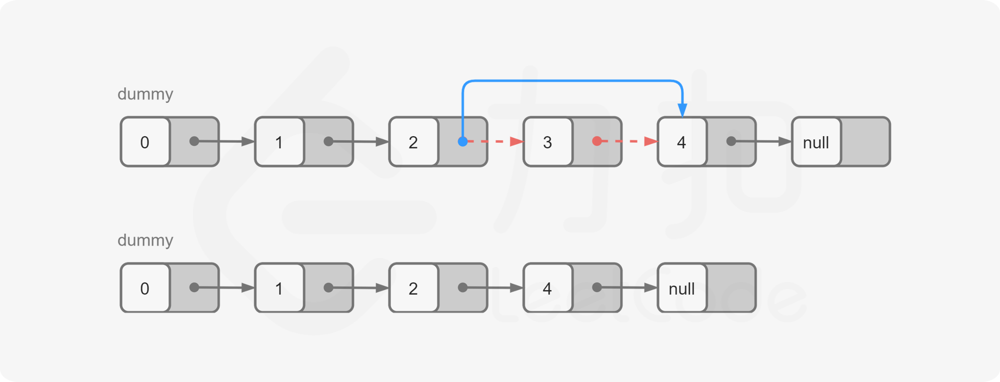

#### [](https://leetcode.cn/problems/remove-nth-node-from-end-of-list/solution/shan-chu-lian-biao-de-dao-shu-di-nge-jie-dian-b-61//#前言)前言

在对链表进行操作时，一种常用的技巧是添加一个哑节点（dummy node），它的 next 指针指向链表的头节点。这样一来，我们就不需要对头节点进行特殊的判断了。

例如，在本题中，如果我们要删除节点 y，我们需要知道节点 y 的前驱节点 x，并将 x 的指针指向 y 的后继节点。但由于头节点不存在前驱节点，因此我们需要在删除头节点时进行特殊判断。但如果我们添加了哑节点，那么头节点的前驱节点就是哑节点本身，此时我们就只需要考虑通用的情况即可。

特别地，在某些语言中，由于需要自行对内存进行管理。因此在实际的面试中，对于「是否需要释放被删除节点对应的空间」这一问题，我们需要和面试官进行积极的沟通以达成一致。下面的代码中默认不释放空间。

#### [](https://leetcode.cn/problems/remove-nth-node-from-end-of-list/solution/shan-chu-lian-biao-de-dao-shu-di-nge-jie-dian-b-61//#方法一：计算链表长度)方法一：计算链表长度

**思路与算法**

一种容易想到的方法是，我们首先从头节点开始对链表进行一次遍历，得到链表的长度 L。随后我们再从头节点开始对链表进行一次遍历，当遍历到第 L−n+1 个节点时，它就是我们需要删除的节点。

> 为了与题目中的 n 保持一致，节点的编号从 1 开始，头节点为编号 1 的节点。

为了方便删除操作，我们可以从哑节点开始遍历 L−n+1 个节点。当遍历到第 L−n+1 个节点时，**它的下一个节点**就是我们需要删除的节点，这样我们只需要修改一次指针，就能完成删除操作。



**代码**

```C++
class Solution {
public:
    int getLength(ListNode* head) {
        int length = 0;
        while (head) {
            ++length;
            head = head->next;
        }
        return length;
    }

    ListNode* removeNthFromEnd(ListNode* head, int n) {
        ListNode* dummy = new ListNode(0, head);
        int length = getLength(head);
        ListNode* cur = dummy;
        for (int i = 1; i < length - n + 1; ++i) {
            cur = cur->next;
        }
        cur->next = cur->next->next;
        ListNode* ans = dummy->next;
        delete dummy;
        return ans;
    }
};
```

```Java
class Solution {
    public ListNode removeNthFromEnd(ListNode head, int n) {
        ListNode dummy = new ListNode(0, head);
        int length = getLength(head);
        ListNode cur = dummy;
        for (int i = 1; i < length - n + 1; ++i) {
            cur = cur.next;
        }
        cur.next = cur.next.next;
        ListNode ans = dummy.next;
        return ans;
    }

    public int getLength(ListNode head) {
        int length = 0;
        while (head != null) {
            ++length;
            head = head.next;
        }
        return length;
    }
}
```

```Python
class Solution:
    def removeNthFromEnd(self, head: ListNode, n: int) -> ListNode:
        def getLength(head: ListNode) -> int:
            length = 0
            while head:
                length += 1
                head = head.next
            return length
        
        dummy = ListNode(0, head)
        length = getLength(head)
        cur = dummy
        for i in range(1, length - n + 1):
            cur = cur.next
        cur.next = cur.next.next
        return dummy.next
```

```Go
func getLength(head *ListNode) (length int) {
    for ; head != nil; head = head.Next {
        length++
    }
    return
}

func removeNthFromEnd(head *ListNode, n int) *ListNode {
    length := getLength(head)
    dummy := &ListNode{0, head}
    cur := dummy
    for i := 0; i < length-n; i++ {
        cur = cur.Next
    }
    cur.Next = cur.Next.Next
    return dummy.Next
}
```

```C
int getLength(struct ListNode* head) {
    int length = 0;
    while (head) {
        ++length;
        head = head->next;
    }
    return length;
}

struct ListNode* removeNthFromEnd(struct ListNode* head, int n) {
    struct ListNode* dummy = malloc(sizeof(struct ListNode));
    dummy->val = 0, dummy->next = head;
    int length = getLength(head);
    struct ListNode* cur = dummy;
    for (int i = 1; i < length - n + 1; ++i) {
        cur = cur->next;
    }
    cur->next = cur->next->next;
    struct ListNode* ans = dummy->next;
    free(dummy);
    return ans;
}
```

**复杂度分析**

-   时间复杂度：O(L)，其中 L 是链表的长度。
-   空间复杂度：O(1)。
