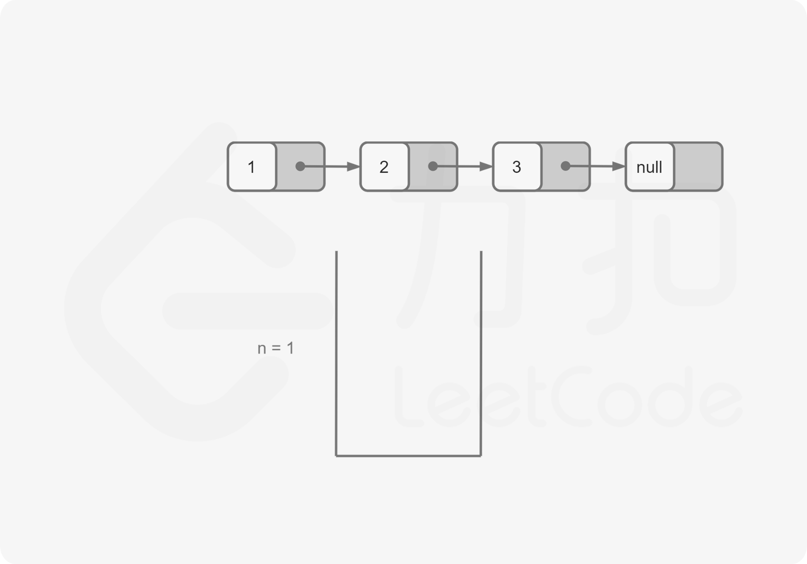
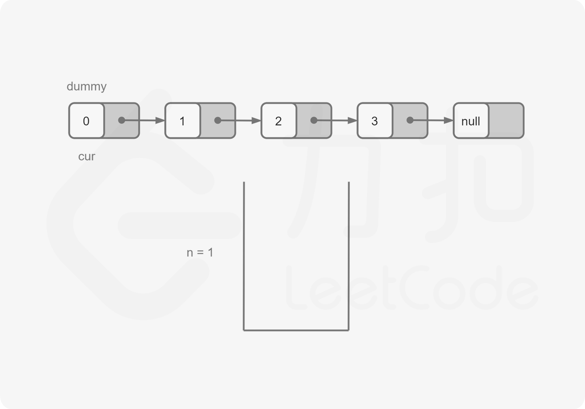
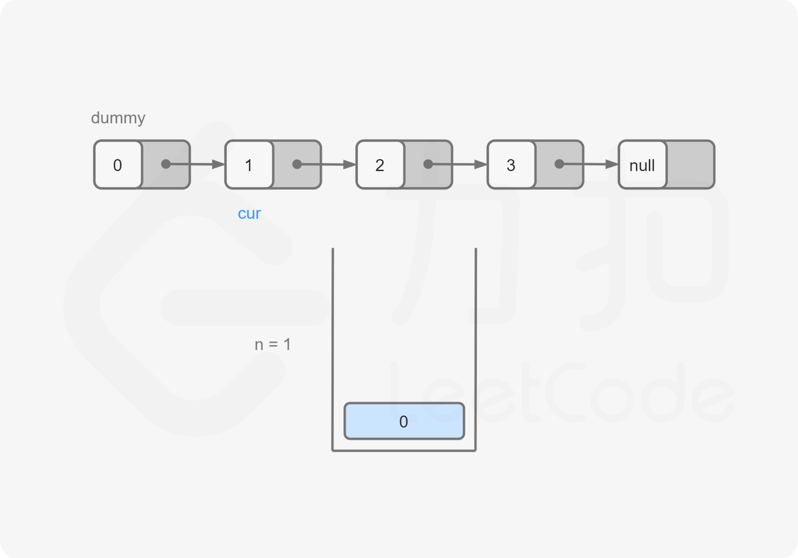
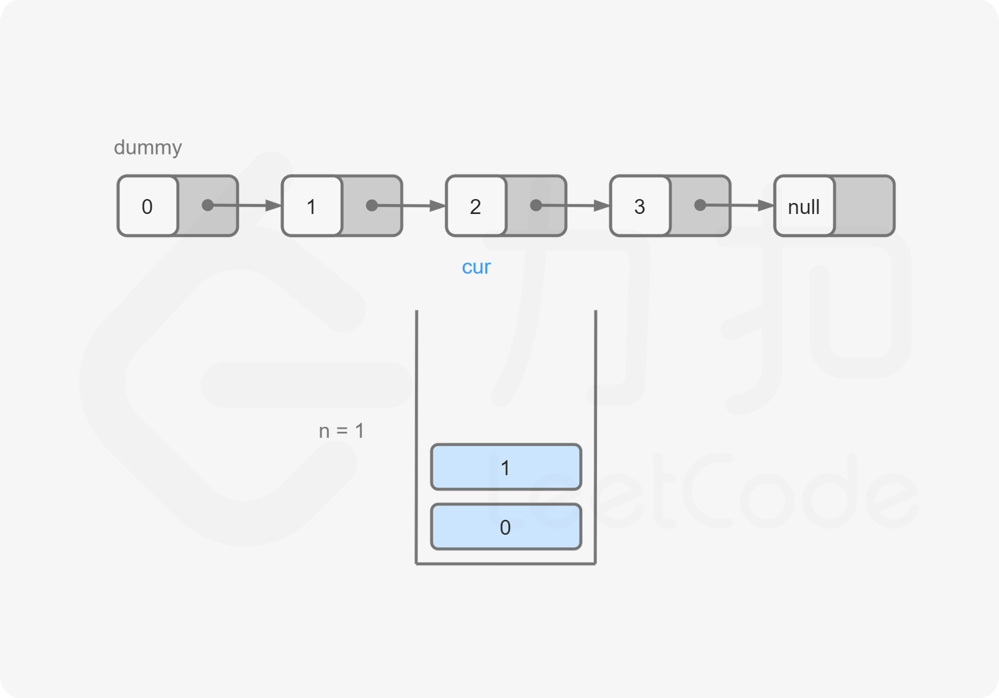
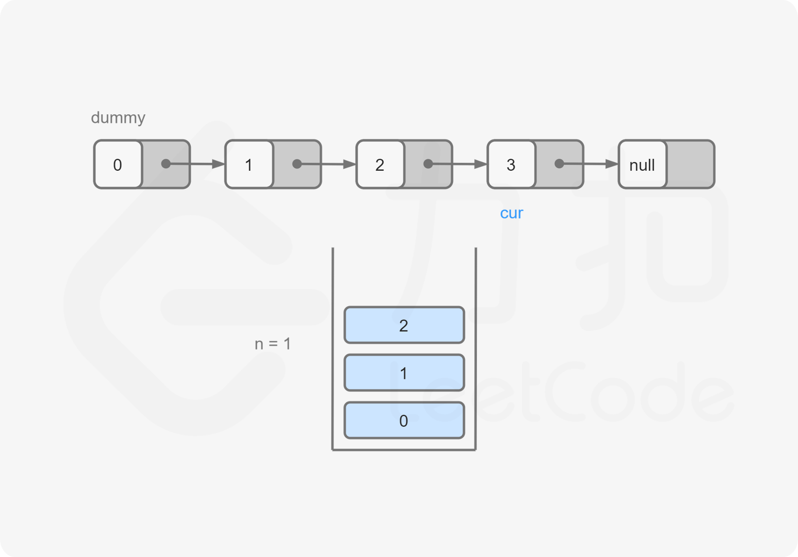
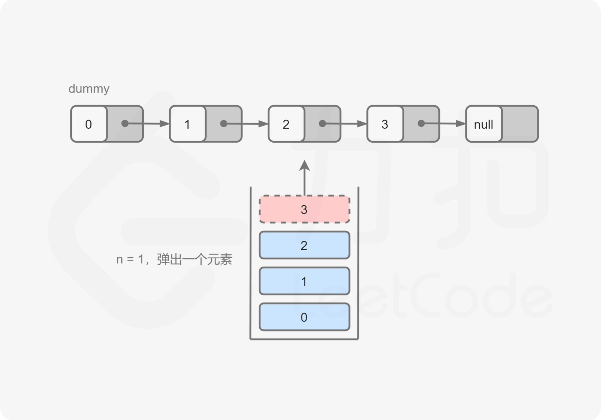
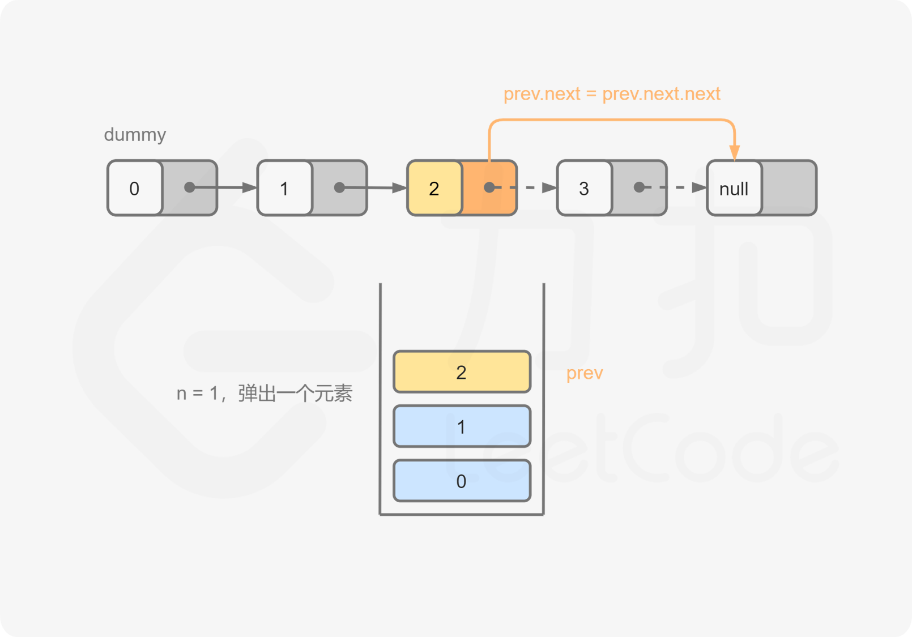
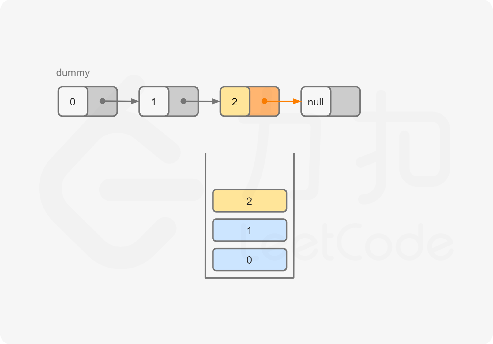
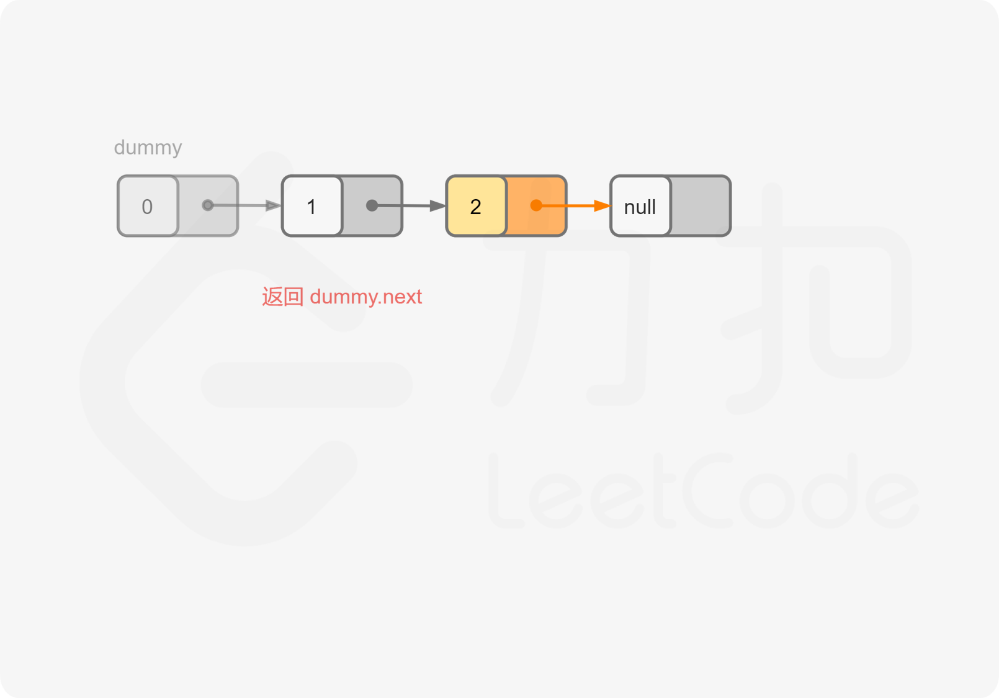

#### [](https://leetcode.cn/problems/remove-nth-node-from-end-of-list/solution/shan-chu-lian-biao-de-dao-shu-di-nge-jie-dian-b-61//#方法二：栈)方法二：栈

**思路与算法**

我们也可以在遍历链表的同时将所有节点依次入栈。根据栈「先进后出」的原则，我们弹出栈的第 n 个节点就是需要删除的节点，并且目前栈顶的节点就是待删除节点的前驱节点。这样一来，删除操作就变得十分方便了。












**代码**

```C++
class Solution {
public:
    ListNode* removeNthFromEnd(ListNode* head, int n) {
        ListNode* dummy = new ListNode(0, head);
        stack<ListNode*> stk;
        ListNode* cur = dummy;
        while (cur) {
            stk.push(cur);
            cur = cur->next;
        }
        for (int i = 0; i < n; ++i) {
            stk.pop();
        }
        ListNode* prev = stk.top();
        prev->next = prev->next->next;
        ListNode* ans = dummy->next;
        delete dummy;
        return ans;
    }
};
```

```Java
class Solution {
    public ListNode removeNthFromEnd(ListNode head, int n) {
        ListNode dummy = new ListNode(0, head);
        Deque<ListNode> stack = new LinkedList<ListNode>();
        ListNode cur = dummy;
        while (cur != null) {
            stack.push(cur);
            cur = cur.next;
        }
        for (int i = 0; i < n; ++i) {
            stack.pop();
        }
        ListNode prev = stack.peek();
        prev.next = prev.next.next;
        ListNode ans = dummy.next;
        return ans;
    }
}
```

```Python
class Solution:
    def removeNthFromEnd(self, head: ListNode, n: int) -> ListNode:
        dummy = ListNode(0, head)
        stack = list()
        cur = dummy
        while cur:
            stack.append(cur)
            cur = cur.next
        
        for i in range(n):
            stack.pop()

        prev = stack[-1]
        prev.next = prev.next.next
        return dummy.next
```

```Go
func removeNthFromEnd(head *ListNode, n int) *ListNode {
    nodes := []*ListNode{}
    dummy := &ListNode{0, head}
    for node := dummy; node != nil; node = node.Next {
        nodes = append(nodes, node)
    }
    prev := nodes[len(nodes)-1-n]
    prev.Next = prev.Next.Next
    return dummy.Next
}
```

```C
struct Stack {
    struct ListNode* val;
    struct Stack* next;
};

struct ListNode* removeNthFromEnd(struct ListNode* head, int n) {
    struct ListNode* dummy = malloc(sizeof(struct ListNode));
    dummy->val = 0, dummy->next = head;
    struct Stack* stk = NULL;
    struct ListNode* cur = dummy;
    while (cur) {
        struct Stack* tmp = malloc(sizeof(struct Stack));
        tmp->val = cur, tmp->next = stk;
        stk = tmp;
        cur = cur->next;
    }
    for (int i = 0; i < n; ++i) {
        struct Stack* tmp = stk->next;
        free(stk);
        stk = tmp;
    }
    struct ListNode* prev = stk->val;
    prev->next = prev->next->next;
    struct ListNode* ans = dummy->next;
    free(dummy);
    return ans;
}
```

**复杂度分析**

-   时间复杂度：O(L)，其中 L 是链表的长度。
-   空间复杂度：O(L)，其中 L 是链表的长度。主要为栈的开销。
