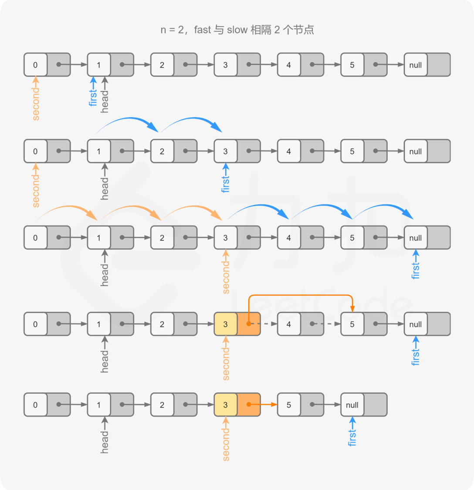

#### [](https://leetcode.cn/problems/remove-nth-node-from-end-of-list/solution/shan-chu-lian-biao-de-dao-shu-di-nge-jie-dian-b-61//#方法三：双指针)方法三：双指针

**思路与算法**

我们也可以在不预处理出链表的长度，以及使用常数空间的前提下解决本题。

由于我们需要找到倒数第 n 个节点，因此我们可以使用两个指针 first 和 second 同时对链表进行遍历，并且 first 比 second 超前 n 个节点。当 first 遍历到链表的末尾时，second 就恰好处于倒数第 n 个节点。

具体地，初始时 first 和 second 均指向头节点。我们首先使用 first 对链表进行遍历，遍历的次数为 n。此时，first 和 second 之间间隔了 n−1 个节点，即 first 比 second 超前了 n 个节点。

在这之后，我们同时使用 first 和 second 对链表进行遍历。当 first 遍历到链表的末尾（即 first 为空指针）时，second 恰好指向倒数第 n 个节点。

根据方法一和方法二，如果我们能够得到的是倒数第 n 个节点的前驱节点而不是倒数第 n 个节点的话，删除操作会更加方便。因此我们可以考虑在初始时将 second 指向哑节点，其余的操作步骤不变。这样一来，当 first 遍历到链表的末尾时，second 的**下一个节点**就是我们需要删除的节点。



**代码**

```C++
class Solution {
public:
    ListNode* removeNthFromEnd(ListNode* head, int n) {
        ListNode* dummy = new ListNode(0, head);
        ListNode* first = head;
        ListNode* second = dummy;
        for (int i = 0; i < n; ++i) {
            first = first->next;
        }
        while (first) {
            first = first->next;
            second = second->next;
        }
        second->next = second->next->next;
        ListNode* ans = dummy->next;
        delete dummy;
        return ans;
    }
};
```

```Java
class Solution {
    public ListNode removeNthFromEnd(ListNode head, int n) {
        ListNode dummy = new ListNode(0, head);
        ListNode first = head;
        ListNode second = dummy;
        for (int i = 0; i < n; ++i) {
            first = first.next;
        }
        while (first != null) {
            first = first.next;
            second = second.next;
        }
        second.next = second.next.next;
        ListNode ans = dummy.next;
        return ans;
    }
}
```

```Python
class Solution:
    def removeNthFromEnd(self, head: ListNode, n: int) -> ListNode:
        dummy = ListNode(0, head)
        first = head
        second = dummy
        for i in range(n):
            first = first.next

        while first:
            first = first.next
            second = second.next
        
        second.next = second.next.next
        return dummy.next
```

```Go
func removeNthFromEnd(head *ListNode, n int) *ListNode {
    dummy := &ListNode{0, head}
    first, second := head, dummy
    for i := 0; i < n; i++ {
        first = first.Next
    }
    for ; first != nil; first = first.Next {
        second = second.Next
    }
    second.Next = second.Next.Next
    return dummy.Next
}
```

```C
struct ListNode* removeNthFromEnd(struct ListNode* head, int n) {
    struct ListNode* dummy = malloc(sizeof(struct ListNode));
    dummy->val = 0, dummy->next = head;
    struct ListNode* first = head;
    struct ListNode* second = dummy;
    for (int i = 0; i < n; ++i) {
        first = first->next;
    }
    while (first) {
        first = first->next;
        second = second->next;
    }
    second->next = second->next->next;
    struct ListNode* ans = dummy->next;
    free(dummy);
    return ans;
}
```

**复杂度分析**

-   时间复杂度：O(L)，其中 L 是链表的长度。
-   空间复杂度：O(1)。
