#### [](https://leetcode.cn/problems/swap-nodes-in-pairs/solution/liang-liang-jiao-huan-lian-biao-zhong-de-jie-di-91//#方法二：迭代)方法二：迭代

**思路与算法**

也可以通过迭代的方式实现两两交换链表中的节点。

创建哑结点 `dummyHead`，令 `dummyHead.next = head`。令 `temp` 表示当前到达的节点，初始时 `temp = dummyHead`。每次需要交换 `temp` 后面的两个节点。

如果 `temp` 的后面没有节点或者只有一个节点，则没有更多的节点需要交换，因此结束交换。否则，获得 `temp` 后面的两个节点 `node1` 和 `node2`，通过更新节点的指针关系实现两两交换节点。

具体而言，交换之前的节点关系是 `temp -> node1 -> node2`，交换之后的节点关系要变成 `temp -> node2 -> node1`，因此需要进行如下操作。

```
temp.next = node2
node1.next = node2.next
node2.next = node1
```

完成上述操作之后，节点关系即变成 `temp -> node2 -> node1`。再令 `temp = node1`，对链表中的其余节点进行两两交换，直到全部节点都被两两交换。

两两交换链表中的节点之后，新的链表的头节点是 `dummyHead.next`，返回新的链表的头节点即可。

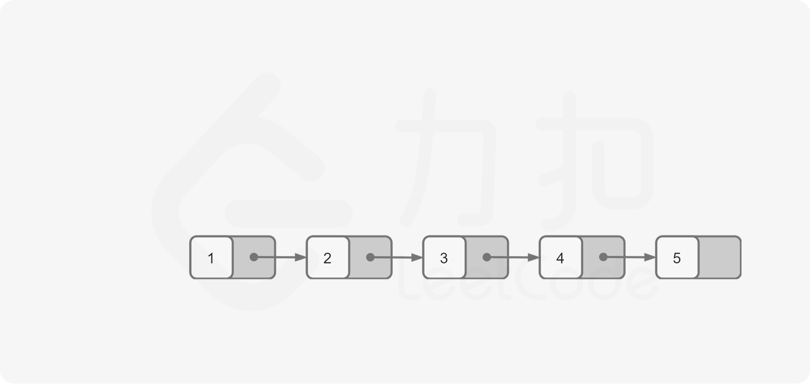
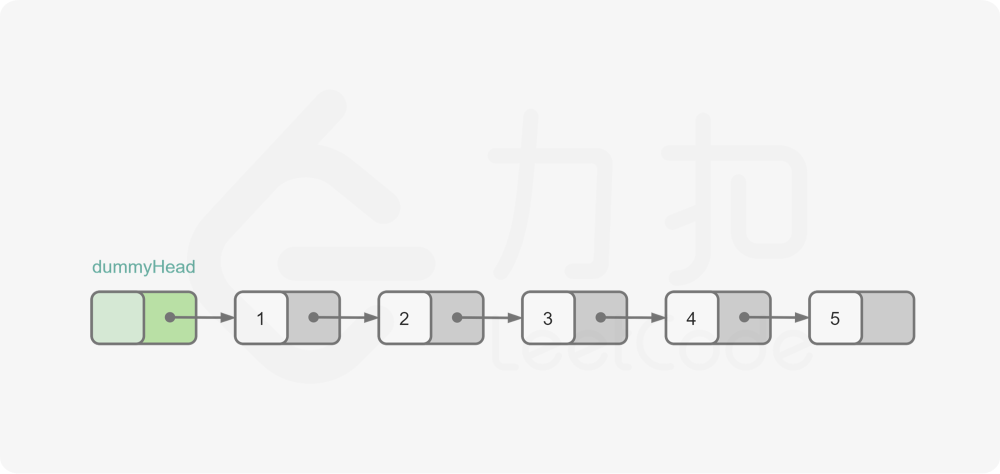


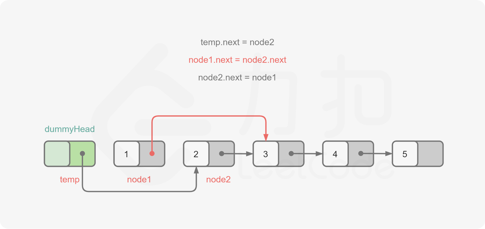
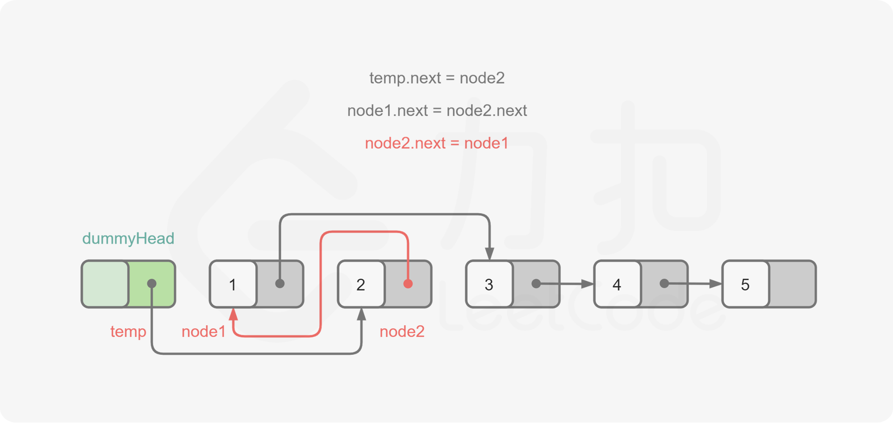
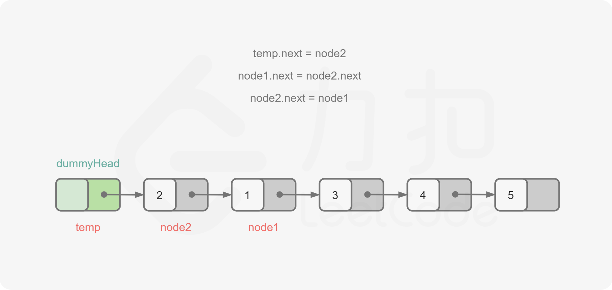
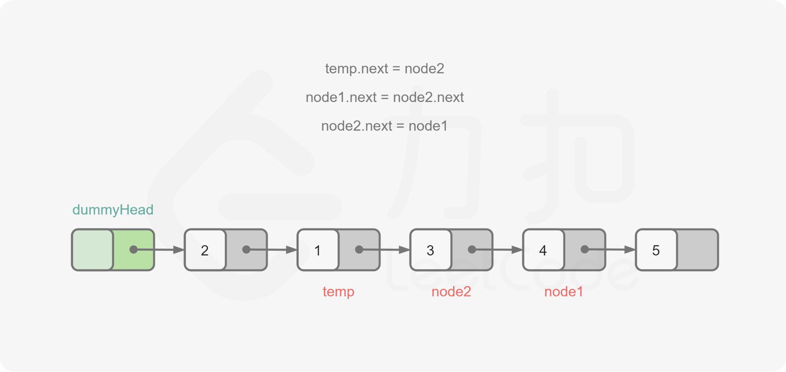
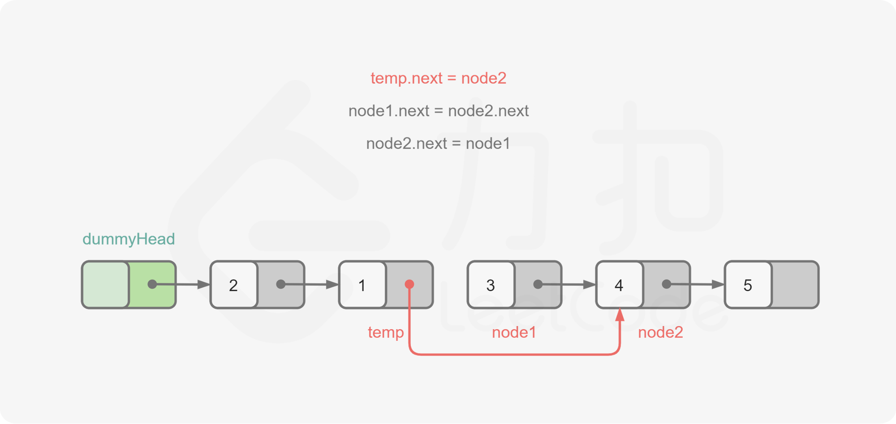
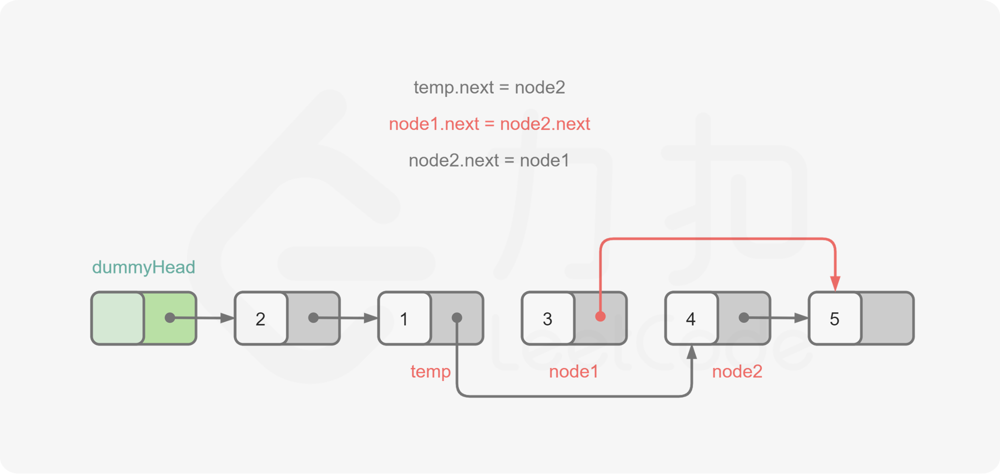
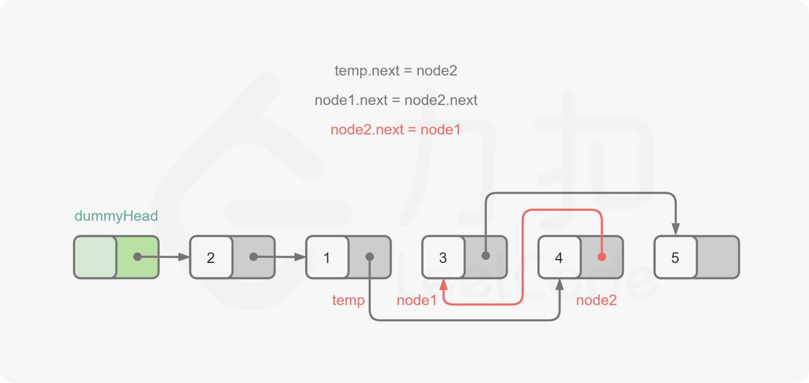
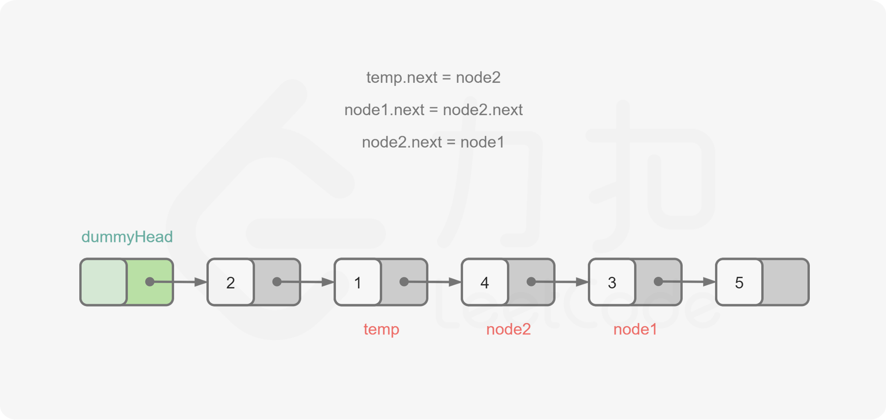
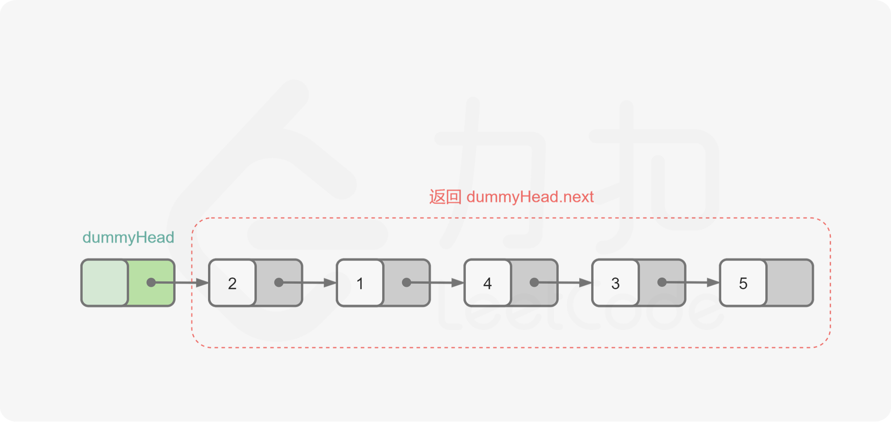

**代码**

```Java
class Solution {
    public ListNode swapPairs(ListNode head) {
        ListNode dummyHead = new ListNode(0);
        dummyHead.next = head;
        ListNode temp = dummyHead;
        while (temp.next != null && temp.next.next != null) {
            ListNode node1 = temp.next;
            ListNode node2 = temp.next.next;
            temp.next = node2;
            node1.next = node2.next;
            node2.next = node1;
            temp = node1;
        }
        return dummyHead.next;
    }
}
```

```C++
class Solution {
public:
    ListNode* swapPairs(ListNode* head) {
        ListNode* dummyHead = new ListNode(0);
        dummyHead->next = head;
        ListNode* temp = dummyHead;
        while (temp->next != nullptr && temp->next->next != nullptr) {
            ListNode* node1 = temp->next;
            ListNode* node2 = temp->next->next;
            temp->next = node2;
            node1->next = node2->next;
            node2->next = node1;
            temp = node1;
        }
        return dummyHead->next;
    }
};
```

```JavaScript
var swapPairs = function(head) {
    const dummyHead = new ListNode(0);
    dummyHead.next = head;
    let temp = dummyHead;
    while (temp.next !== null && temp.next.next !== null) {
        const node1 = temp.next;
        const node2 = temp.next.next;
        temp.next = node2;
        node1.next = node2.next;
        node2.next = node1;
        temp = node1;
    }
    return dummyHead.next;
};
```

```Python
class Solution:
    def swapPairs(self, head: ListNode) -> ListNode:
        dummyHead = ListNode(0)
        dummyHead.next = head
        temp = dummyHead
        while temp.next and temp.next.next:
            node1 = temp.next
            node2 = temp.next.next
            temp.next = node2
            node1.next = node2.next
            node2.next = node1
            temp = node1
        return dummyHead.next
```

```Go
func swapPairs(head *ListNode) *ListNode {
    dummyHead := &ListNode{0, head}
    temp := dummyHead
    for temp.Next != nil && temp.Next.Next != nil {
        node1 := temp.Next
        node2 := temp.Next.Next
        temp.Next = node2
        node1.Next = node2.Next
        node2.Next = node1
        temp = node1
    }
    return dummyHead.Next
}
```

```C
struct ListNode* swapPairs(struct ListNode* head) {
    struct ListNode dummyHead;
    dummyHead.next = head;
    struct ListNode* temp = &dummyHead;
    while (temp->next != NULL && temp->next->next != NULL) {
        struct ListNode* node1 = temp->next;
        struct ListNode* node2 = temp->next->next;
        temp->next = node2;
        node1->next = node2->next;
        node2->next = node1;
        temp = node1;
    }
    return dummyHead.next;
}
```

**复杂度分析**

-   时间复杂度：O(n)，其中 n 是链表的节点数量。需要对每个节点进行更新指针的操作。
-   空间复杂度：O(1)。
