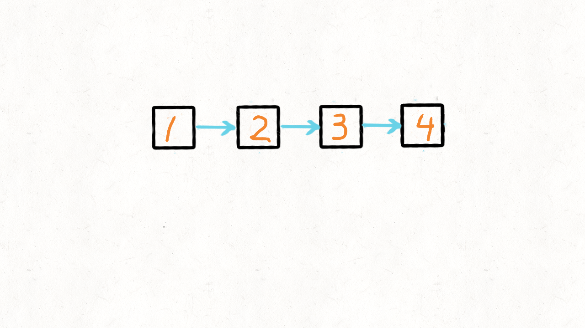
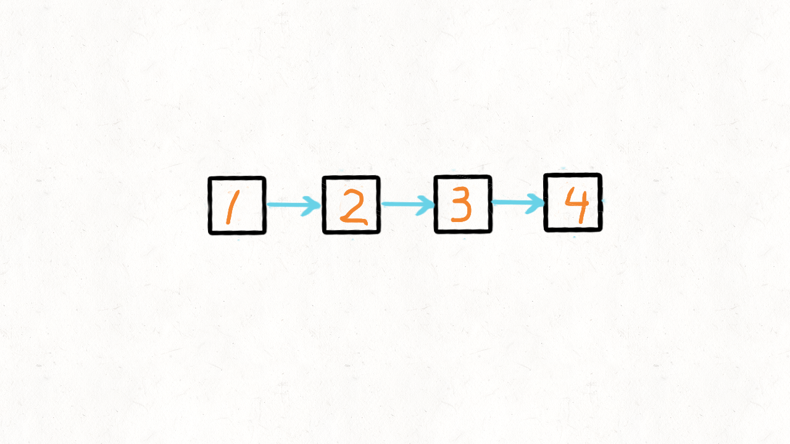

#### [](https://leetcode.cn/problems/swap-nodes-in-pairs/solution/dong-hua-yan-shi-24-liang-liang-jiao-huan-lian-bia//#解题思路)解题思路

**利用stack**
我们利用一个 stack，然后不断迭代链表，每次取出两个节点放入 stack 中，再从 stack 中拿出两个节点。
借助 stack 后进先出的特点，放进去的时候是 1,2 。拿出来的时候就是 2，1 两个节点了。
再把这两个节点串联起来，重复这个逻辑遍历完整个链表，就可以做到两两反转的效果了。
虽然用到了 stack，但因为只存了两个元素，所以空间复杂度还是 O(1)，时间复杂度是 O(n)。


代码实现：

```Java
class Solution {
    public ListNode swapPairs(ListNode head) {
        if(head==null || head.next==null) {
            return head;
        }
        //用stack保存每次迭代的两个节点
        Stack<ListNode> stack = new Stack<ListNode>();
        ListNode p = new ListNode(-1);
        ListNode cur = head;
        //head指向新的p节点，函数结束时返回head.next即可
        head = p;
        while(cur!=null && cur.next!=null) {
            //将两个节点放入stack中
            stack.add(cur);
            stack.add(cur.next);
            //当前节点往前走两步
            cur = cur.next.next;
            //从stack中弹出两个节点，然后用p节点指向新弹出的两个节点
            p.next = stack.pop();
            p = p.next;
            p.next = stack.pop();
            p = p.next;
        }
        //注意边界条件，当链表长度是奇数时，cur就不为空
        if(cur!=null) {
            p.next = cur;
        } else {
            p.next = null;
        }

        return head.next;
    }
}
```

```Python
class Solution(object):
    def swapPairs(self, head):
    if not (head and head.next):
        return head
    p = ListNode(-1)
    # 用stack保存每次迭代的两个节点
    # head指向新的p节点，函数结束时返回head.next即可
    cur,head,stack = head,p,[]
    while cur and cur.next:
        # 将两个节点放入stack中
        _,_ = stack.append(cur),stack.append(cur.next)
        # 当前节点往前走两步
        cur = cur.next.next
        # 从stack中弹出两个节点，然后用p节点指向新弹出的两个节点
        p.next = stack.pop()
        p.next.next = stack.pop()
        p = p.next.next
    # 注意边界条件，当链表长度是奇数时，cur就不为空
    if cur:
        p.next = cur
    else:
        p.next = None

    return head.next
```

#### [](https://leetcode.cn/problems/swap-nodes-in-pairs/solution/dong-hua-yan-shi-24-liang-liang-jiao-huan-lian-bia//#迭代实现)迭代实现

迭代实现就比 stack 方式复杂多了，需要很小心的处理节点的指向。
这里我们需要三个指针，a，b，tmp。
假设链表是
`1->2->3->4->5->6`
在迭代的时候，每次处理两个节点，于是第一轮 a 指向 1，b 指向 2。
第二轮的时候 a 指向 3，b 指向 4。第三轮的时候 a 指向 5，b 指向 6。
我们通过 `a.next = b.next`，以及`b.next=a`就把两个指针的位置反转了，于是`1->2`就变成`2->1`。
但这里有一个细节需要处理，当我们第二轮迭代的时候，a 指向 3，b 指向 4。按照题目要求，最终应该是`2->1->4->3`。
也就是节点 1 需要跟节点 4 串起来，只有两个指针就没法弄了，所以需要第三个指针 tmp，用来记录上一轮 a 的位置，然后下一轮迭代的时候，将原先的 a(也就是节点 1)指向 4。


代码实现：

```Java
class Solution {
    public ListNode swapPairs(ListNode head) {
        //增加一个特殊节点方便处理
        ListNode p = new ListNode(-1);
        p.next = head;
        //创建a，b两个指针，这里还需要一个tmp指针
        ListNode a = p;
        ListNode b = p;
        ListNode tmp = p;
        while(b!=null && b.next!=null && b.next.next!=null) {
            //a前进一位，b前进两位
            a = a.next;
            b = b.next.next;
            //这步很关键，tmp指针用来处理边界条件的
            //假设链表是1->2->3->4，a指向1，b指向2
            //改变a和b的指向，于是就变成2->1，但是1指向谁呢？
            //1是不能指向2的next，1应该指向4，而循环迭代的时候一次处理2个节点
            //1和2的关系弄清楚了，3和4的关系也能弄清楚，但需要一个指针来处理
            //2->1，4->3的关系，tmp指针就是干这个用的
            tmp.next = b;
            a.next = b.next;
            b.next = a;
            //现在链表就变成2->1->3->4
            //tmp和b都指向1节点，等下次迭代的时候
            //a就变成3，b就变成4，然后tmp就指向b，也就是1指向4
            tmp = a;
            b = a;
        }
        return p.next;
    }
}
```

```Python
class Solution(object):
    def swapPairs(self, head):
    # 增加一个特殊节点方便处理
    p = ListNode(-1)
    # 创建a，b两个指针，这里还需要一个tmp指针
    a,b,p.next,tmp = p,p,head,p
    while b.next and b.next.next:
        # a前进一位，b前进两位
        a,b = a.next,b.next.next
        # 这步很关键，tmp指针用来处理边界条件的
        # 假设链表是1->2->3->4，a指向1，b指向2
        # 改变a和b的指向，于是就变成2->1，但是1指向谁呢？
        # 1是不能指向2的next，1应该指向4，而循环迭代的时候一次处理2个节点
        # 1和2的关系弄清楚了，3和4的关系也能弄清楚，但需要一个指针来处理
        # 2->1，4->3的关系，tmp指针就是干这个用的
        tmp.next,a.next,b.next = b,b.next,a
        # 现在链表就变成2->1->3->4
        # tmp和b都指向1节点，等下次迭代的时候
        # a就变成3，b就变成4，然后tmp就指向b，也就是1指向4
        tmp,b = a,a
    return p.next
```

#### [](https://leetcode.cn/problems/swap-nodes-in-pairs/solution/dong-hua-yan-shi-24-liang-liang-jiao-huan-lian-bia//#递归解法)递归解法

个人感觉递归解法其实比迭代要容易一些，没有那些复杂的指来指去的关系。
写递归的话，需要搞清楚递归的终止条件，以及递归函数内做什么。
下面以`1->2->....`来说明：
终止条件：当前节点为null，或者下一个节点为 `null`
函数内：将 2 指向 1，1 指向下一层的递归函数，最后返回节点 2
下面中t就表示函数内的临时节点 tmp，图中节点 1，节点 3 指向的一个片空白，这表示引用关系还没真正确定，要等下一层递归函数返回后，才能真正确定最终指向。


我们来一一分析下，假设链表总长是偶数，那么递归函数执行到终止条件时，head 就等于 null。如果链表链表总长是偶数，那么递归函数执行到终止条件时，head.next 就等于 null。
递归函数内，我们要改变 1->2 的指向，将其改为 2->1。
那后面的节点怎么办呢？不用担心，这是由下一层递归函数来解决。下一层递归函数返回后的节点是 4，就是4->3->...这样的了，也就是后面的节点都已经串联好了。所以我们只需要将 1 节点指向 4 就可以啦。

代码如下：

```Java
class Solution {
    public ListNode swapPairs(ListNode head) {
    //递归的终止条件
        if(head==null || head.next==null) {
            return head;
        }
        //假设链表是 1->2->3->4
        //这句就先保存节点2
        ListNode tmp = head.next;
        //继续递归，处理节点3->4
        //当递归结束返回后，就变成了4->3
        //于是head节点就指向了4，变成1->4->3
        head.next = swapPairs(tmp.next);
        //将2节点指向1
        tmp.next = head;

        return tmp;
    }
}
```

```Python
class Solution(object):
    def swapPairs(self, head):
    # 递归的终止条件
    if not (head and head.next):
        return head
    # 假设链表是 1->2->3->4
    # 这句就先保存节点2
    tmp = head.next
    # 继续递归，处理节点3->4
    # 当递归结束返回后，就变成了4->3
    # 于是head节点就指向了4，变成1->4->3
    head.next = self.swapPairs(tmp.next)
    # 将2节点指向1
    tmp.next = head

    return tmp
```
