#### [](https://leetcode.cn/problems/reverse-nodes-in-k-group/solution/k-ge-yi-zu-fan-zhuan-lian-biao-by-leetcode-solutio//#方法一：模拟)方法一：模拟

**思路与算法**

本题的目标非常清晰易懂，不涉及复杂的算法，但是实现过程中需要考虑的细节比较多，容易写出冗长的代码。主要考查面试者设计的能力。

我们需要把链表节点按照 `k` 个一组分组，所以可以使用一个指针 `head` 依次指向每组的头节点。这个指针每次向前移动 `k` 步，直至链表结尾。对于每个分组，我们先判断它的长度是否大于等于 `k`。若是，我们就翻转这部分链表，否则不需要翻转。

接下来的问题就是如何翻转一个分组内的子链表。翻转一个链表并不难，过程可以参考「[206\. 反转链表](https://leetcode-cn.com/problems/reverse-linked-list/)」。但是对于一个子链表，除了翻转其本身之外，还需要将子链表的头部与上一个子链表连接，以及子链表的尾部与下一个子链表连接。如下图所示：

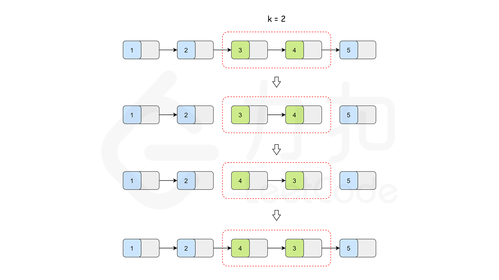

因此，在翻转子链表的时候，我们不仅需要子链表头节点 `head`，还需要有 `head` 的上一个节点 `pre`，以便翻转完后把子链表再接回 `pre`。

但是对于第一个子链表，它的头节点 `head` 前面是没有节点 `pre` 的。太麻烦了！难道只能特判了吗？答案是否定的。没有条件，我们就创造条件；没有节点，我们就创建一个节点。我们新建一个节点，把它接到链表的头部，让它作为 `pre` 的初始值，这样 `head` 前面就有了一个节点，我们就可以避开链表头部的边界条件。这么做还有一个好处，下面我们会看到。

反复移动指针 `head` 与 `pre`，对 `head` 所指向的子链表进行翻转，直到结尾，我们就得到了答案。下面我们该返回函数值了。

有的同学可能发现这又是一件麻烦事：链表翻转之后，链表的头节点发生了变化，那么应该返回哪个节点呢？照理来说，前 `k` 个节点翻转之后，链表的头节点应该是第 `k` 个节点。那么要在遍历过程中记录第 `k` 个节点吗？但是如果链表里面没有 `k` 个节点，答案又还是原来的头节点。我们又多了一大堆循环和判断要写，太崩溃了！

等等！还记得我们创建了节点 `pre` 吗？这个节点一开始被连接到了头节点的前面，而无论之后链表有没有翻转，它的 `next` 指针都会指向正确的头节点。那么我们只要返回它的下一个节点就好了。至此，问题解决。

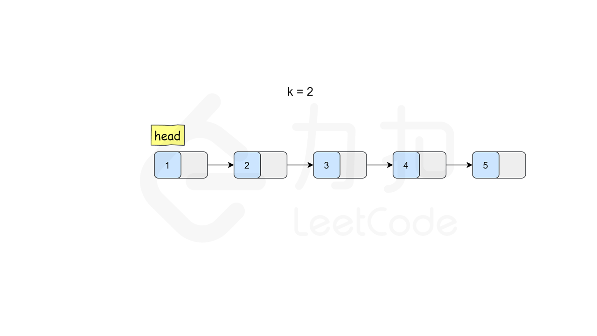

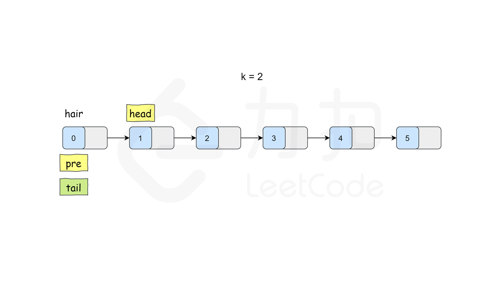
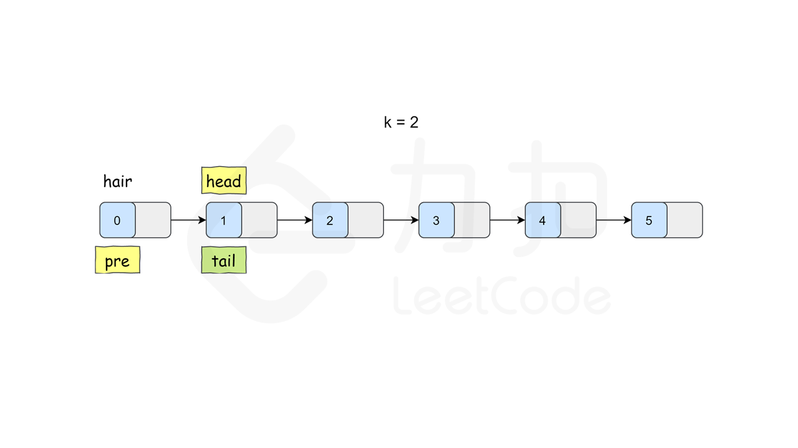
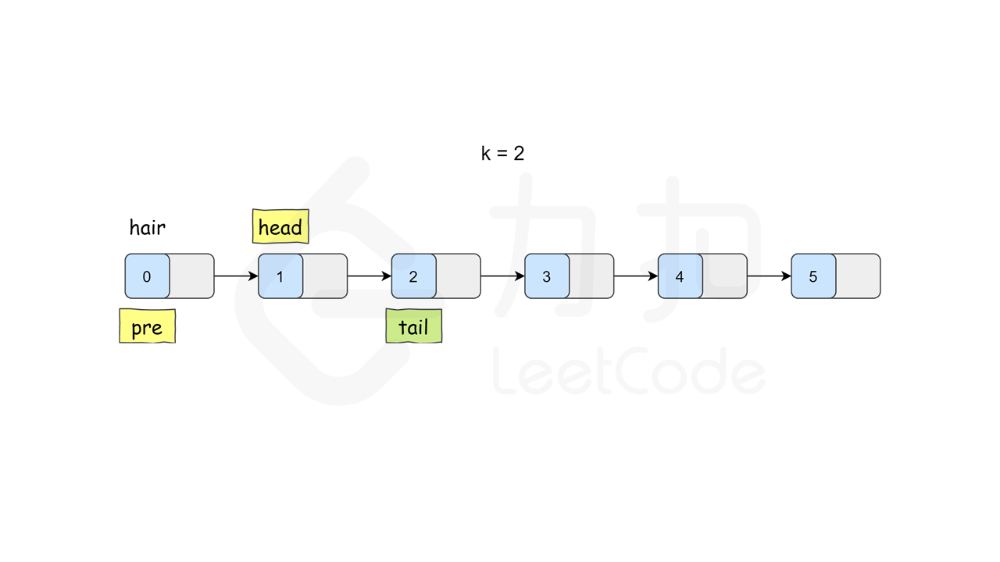

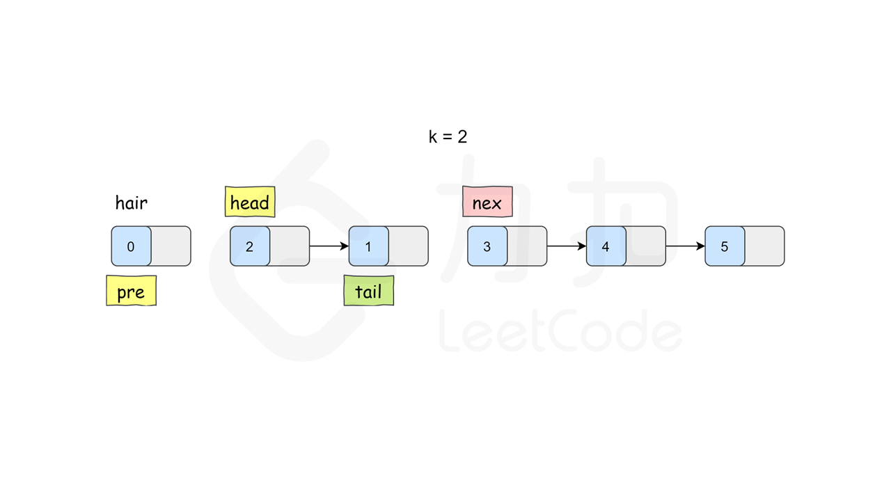

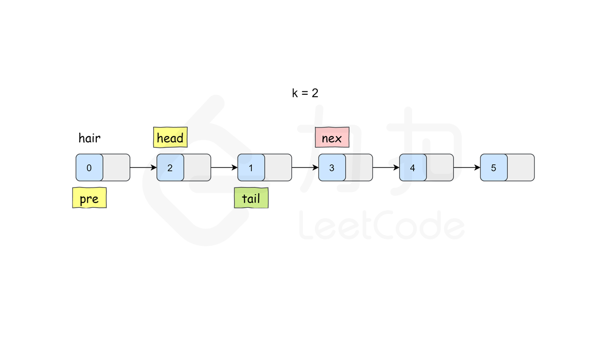
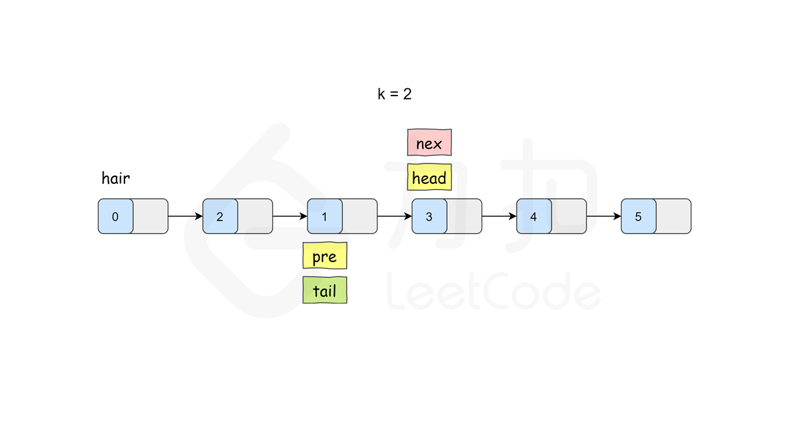
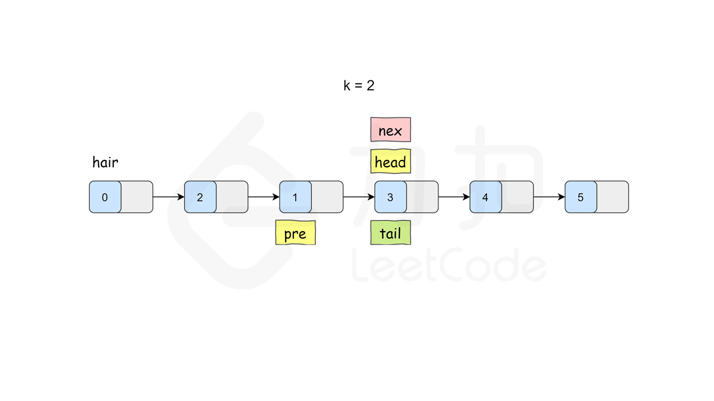
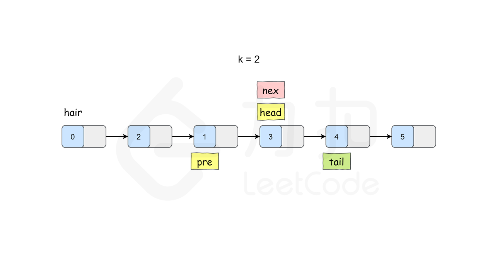
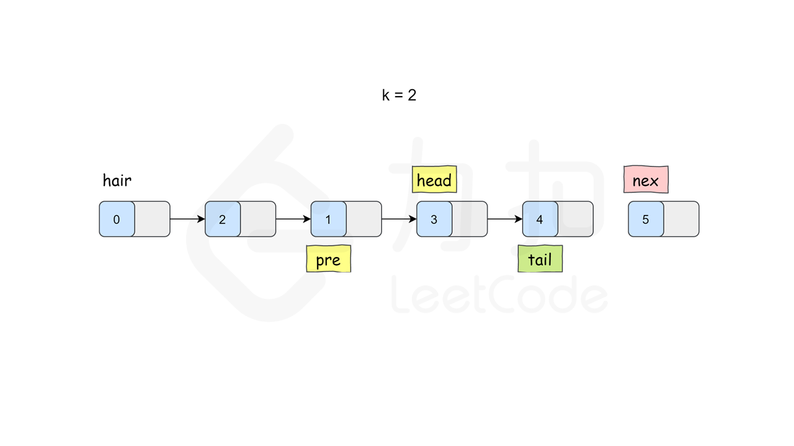


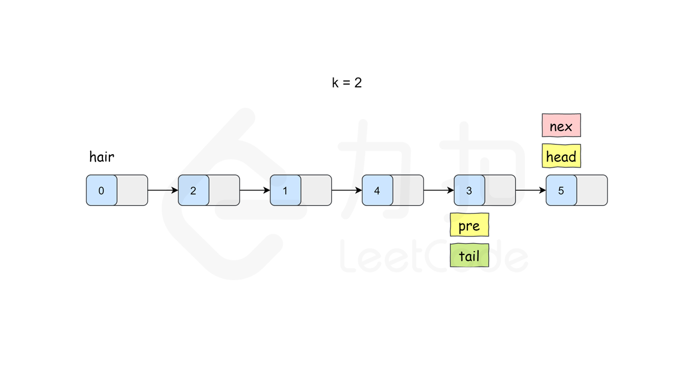

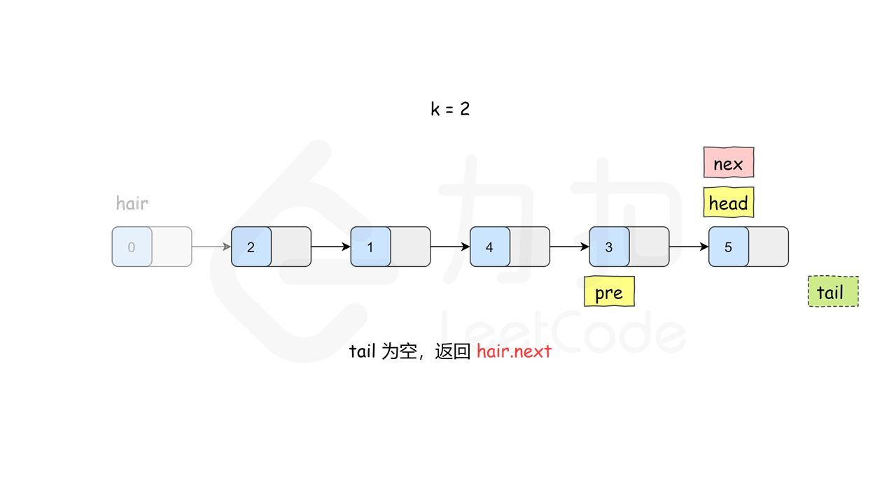

```Python
class Solution:
    # 翻转一个子链表，并且返回新的头与尾
    def reverse(self, head: ListNode, tail: ListNode):
        prev = tail.next
        p = head
        while prev != tail:
            nex = p.next
            p.next = prev
            prev = p
            p = nex
        return tail, head

    def reverseKGroup(self, head: ListNode, k: int) -> ListNode:
        hair = ListNode(0)
        hair.next = head
        pre = hair

        while head:
            tail = pre
            # 查看剩余部分长度是否大于等于 k
            for i in range(k):
                tail = tail.next
                if not tail:
                    return hair.next
            nex = tail.next
            head, tail = self.reverse(head, tail)
            # 把子链表重新接回原链表
            pre.next = head
            tail.next = nex
            pre = tail
            head = tail.next
        
        return hair.next
```

```C++
class Solution {
public:
    // 翻转一个子链表，并且返回新的头与尾
    pair<ListNode*, ListNode*> myReverse(ListNode* head, ListNode* tail) {
        ListNode* prev = tail->next;
        ListNode* p = head;
        while (prev != tail) {
            ListNode* nex = p->next;
            p->next = prev;
            prev = p;
            p = nex;
        }
        return {tail, head};
    }

    ListNode* reverseKGroup(ListNode* head, int k) {
        ListNode* hair = new ListNode(0);
        hair->next = head;
        ListNode* pre = hair;

        while (head) {
            ListNode* tail = pre;
            // 查看剩余部分长度是否大于等于 k
            for (int i = 0; i < k; ++i) {
                tail = tail->next;
                if (!tail) {
                    return hair->next;
                }
            }
            ListNode* nex = tail->next;
            // 这里是 C++17 的写法，也可以写成
            // pair<ListNode*, ListNode*> result = myReverse(head, tail);
            // head = result.first;
            // tail = result.second;
            tie(head, tail) = myReverse(head, tail);
            // 把子链表重新接回原链表
            pre->next = head;
            tail->next = nex;
            pre = tail;
            head = tail->next;
        }

        return hair->next;
    }
};
```

```Java
class Solution {
    public ListNode reverseKGroup(ListNode head, int k) {
        ListNode hair = new ListNode(0);
        hair.next = head;
        ListNode pre = hair;

        while (head != null) {
            ListNode tail = pre;
            // 查看剩余部分长度是否大于等于 k
            for (int i = 0; i < k; ++i) {
                tail = tail.next;
                if (tail == null) {
                    return hair.next;
                }
            }
            ListNode nex = tail.next;
            ListNode[] reverse = myReverse(head, tail);
            head = reverse[0];
            tail = reverse[1];
            // 把子链表重新接回原链表
            pre.next = head;
            tail.next = nex;
            pre = tail;
            head = tail.next;
        }

        return hair.next;
    }

    public ListNode[] myReverse(ListNode head, ListNode tail) {
        ListNode prev = tail.next;
        ListNode p = head;
        while (prev != tail) {
            ListNode nex = p.next;
            p.next = prev;
            prev = p;
            p = nex;
        }
        return new ListNode[]{tail, head};
    }
}
```

```JavaScript
const myReverse = (head, tail) => {
    let prev = tail.next;
    let p = head;
    while (prev !== tail) {
        const nex = p.next;
        p.next = prev;
        prev = p;
        p = nex;
    }
    return [tail, head];
}
var reverseKGroup = function(head, k) {
    const hair = new ListNode(0);
    hair.next = head;
    let pre = hair;

    while (head) {
        let tail = pre;
        // 查看剩余部分长度是否大于等于 k
        for (let i = 0; i < k; ++i) {
            tail = tail.next;
            if (!tail) {
                return hair.next;
            }
        }
        const nex = tail.next;
        [head, tail] = myReverse(head, tail);
        // 把子链表重新接回原链表
        pre.next = head;
        tail.next = nex;
        pre = tail;
        head = tail.next;
    }
    return hair.next;
};
```

```Go
func reverseKGroup(head *ListNode, k int) *ListNode {
    hair := &ListNode{Next: head}
    pre := hair

    for head != nil {
        tail := pre
        for i := 0; i < k; i++ {
            tail = tail.Next
            if tail == nil {
                return hair.Next
            }
        }
        nex := tail.Next
        head, tail = myReverse(head, tail)
        pre.Next = head
        tail.Next = nex
        pre = tail
        head = tail.Next
    }
    return hair.Next
}

func myReverse(head, tail *ListNode) (*ListNode, *ListNode) {
    prev := tail.Next
    p := head
    for prev != tail {
        nex := p.Next
        p.Next = prev
        prev = p
        p = nex
    }
    return tail, head
}
```

**复杂度分析**

-   时间复杂度：O(n)，其中 n 为链表的长度。`head` 指针会在 $O(\lfloor\frac{n}{k}\rfloor)$ 个节点上停留，每次停留需要进行一次 O(k) 的翻转操作。
-   空间复杂度：O(1)，我们只需要建立常数个变量。
