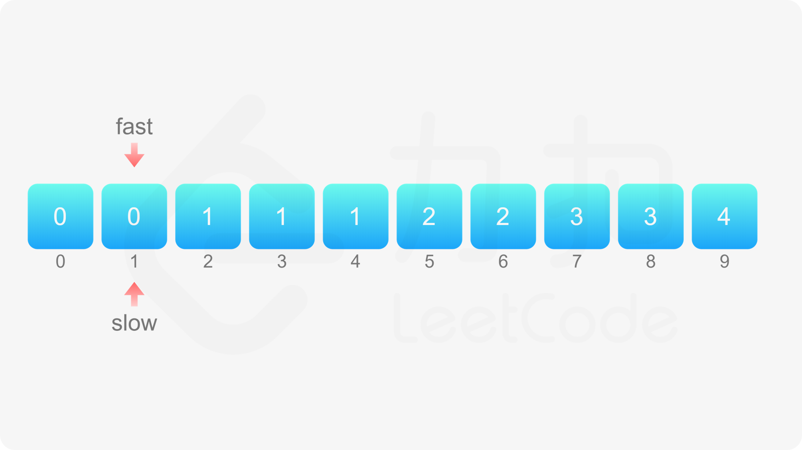
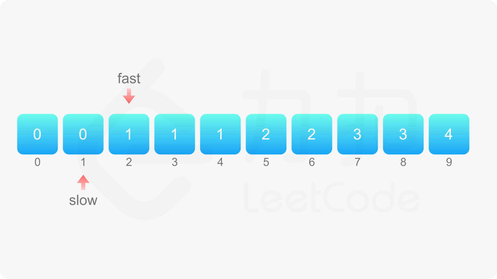
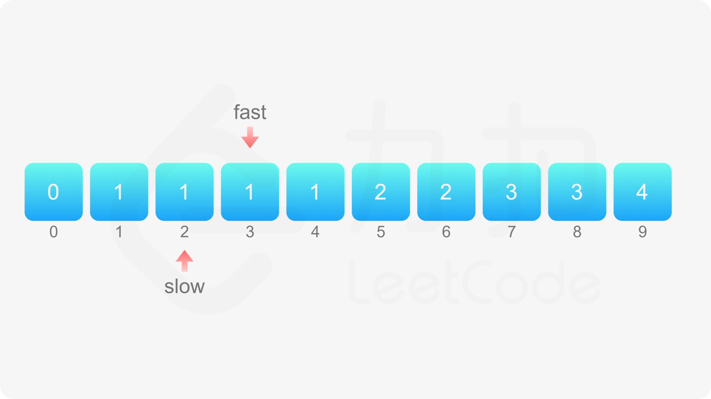
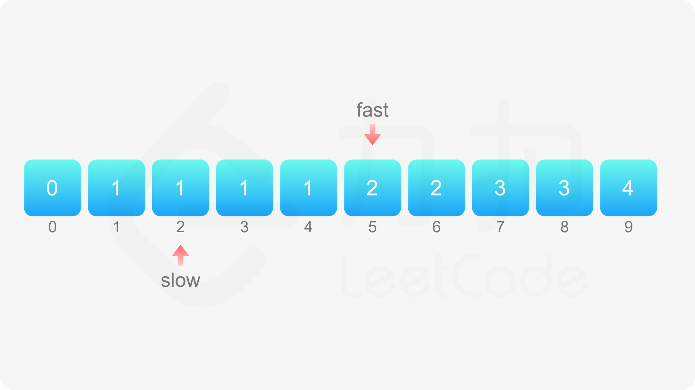
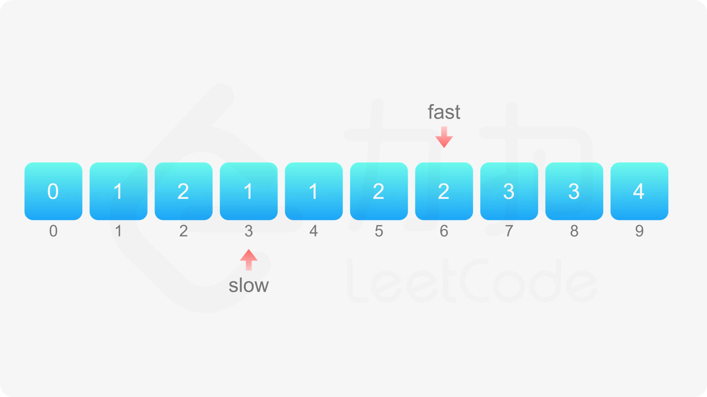
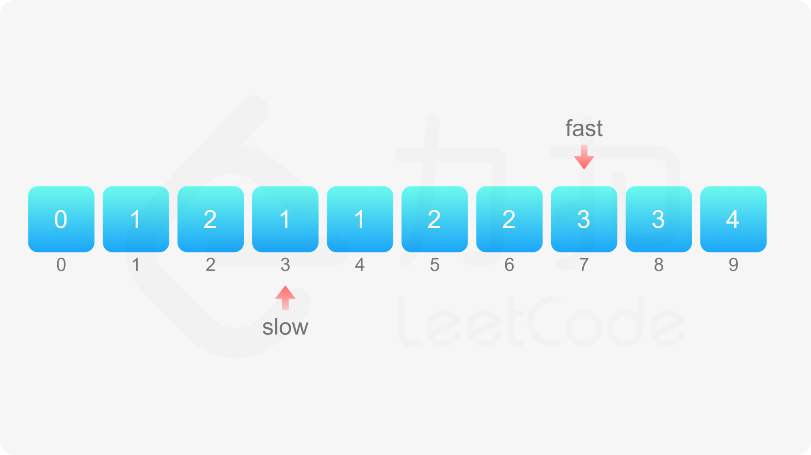
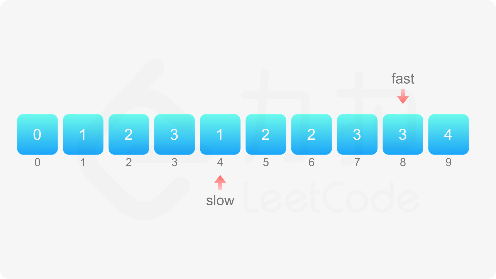
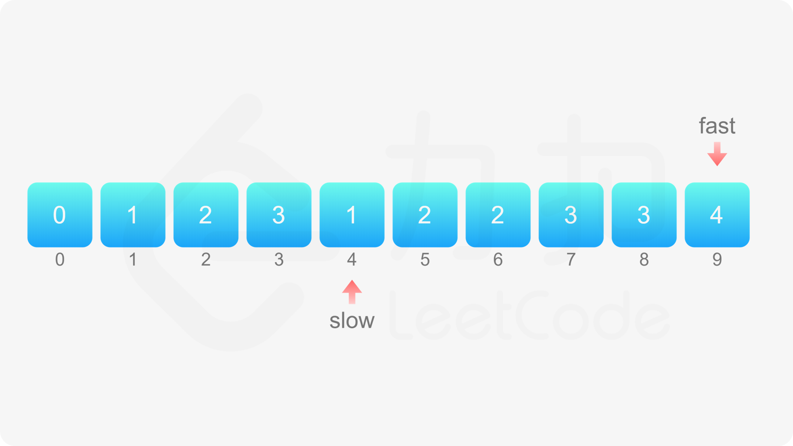
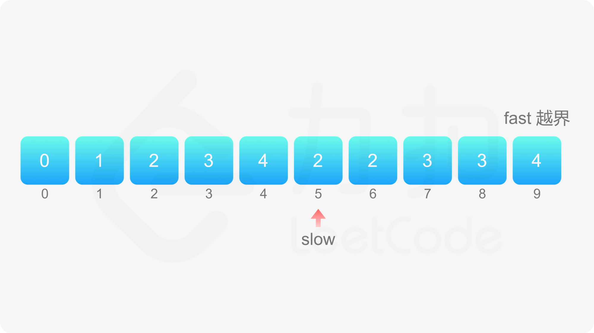
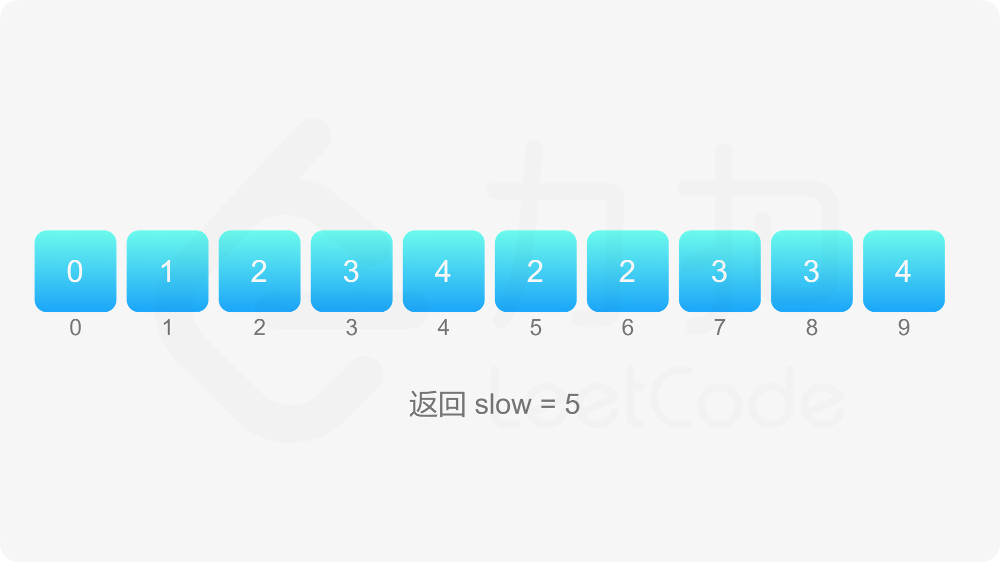

#### [](https://leetcode.cn/problems/remove-duplicates-from-sorted-array/solution/shan-chu-pai-xu-shu-zu-zhong-de-zhong-fu-tudo//#方法一：双指针)方法一：双指针

这道题目的要求是：对给定的有序数组 nums 删除重复元素，在删除重复元素之后，每个元素只出现一次，并返回新的长度，上述操作必须通过原地修改数组的方法，使用 O(1) 的空间复杂度完成。

由于给定的数组 nums 是有序的，因此对于任意 i<j，如果 nums[i]=nums[j]，则对任意 i≤k≤j，必有 nums[i]=nums[k]=nums[j]，即相等的元素在数组中的下标一定是连续的。利用数组有序的特点，可以通过双指针的方法删除重复元素。

如果数组 nums 的长度为 0，则数组不包含任何元素，因此返回 0。

当数组 nums 的长度大于 0 时，数组中至少包含一个元素，在删除重复元素之后也至少剩下一个元素，因此 nums[0] 保持原状即可，从下标 1 开始删除重复元素。

定义两个指针 fast 和 slow 分别为快指针和慢指针，快指针表示遍历数组到达的下标位置，慢指针表示下一个不同元素要填入的下标位置，初始时两个指针都指向下标 1。

假设数组 nums 的长度为 n。将快指针 fast 依次遍历从 1 到 n−1 的每个位置，对于每个位置，如果 nums[fast]≠nums[fast−1]，说明 nums[fast] 和之前的元素都不同，因此将 nums[fast] 的值复制到 nums[slow]，然后将 slow 的值加 1，即指向下一个位置。

遍历结束之后，从 nums[0] 到 nums[slow−1] 的每个元素都不相同且包含原数组中的每个不同的元素，因此新的长度即为 slow，返回 slow 即可。












```Java
class Solution {
    public int removeDuplicates(int[] nums) {
        int n = nums.length;
        if (n == 0) {
            return 0;
        }
        int fast = 1, slow = 1;
        while (fast < n) {
            if (nums[fast] != nums[fast - 1]) {
                nums[slow] = nums[fast];
                ++slow;
            }
            ++fast;
        }
        return slow;
    }
}
```

```JavaScript
var removeDuplicates = function(nums) {
    const n = nums.length;
    if (n === 0) {
        return 0;
    }
    let fast = 1, slow = 1;
    while (fast < n) {
        if (nums[fast] !== nums[fast - 1]) {
            nums[slow] = nums[fast];
            ++slow;
        }
        ++fast;
    }
    return slow;
};
```

```Go
func removeDuplicates(nums []int) int {
    n := len(nums)
    if n == 0 {
        return 0
    }
    slow := 1
    for fast := 1; fast < n; fast++ {
        if nums[fast] != nums[fast-1] {
            nums[slow] = nums[fast]
            slow++
        }
    }
    return slow
}
```

```Python
class Solution:
    def removeDuplicates(self, nums: List[int]) -> int:
        if not nums:
            return 0
        
        n = len(nums)
        fast = slow = 1
        while fast < n:
            if nums[fast] != nums[fast - 1]:
                nums[slow] = nums[fast]
                slow += 1
            fast += 1
        
        return slow
```

```C++
class Solution {
public:
    int removeDuplicates(vector<int>& nums) {
        int n = nums.size();
        if (n == 0) {
            return 0;
        }
        int fast = 1, slow = 1;
        while (fast < n) {
            if (nums[fast] != nums[fast - 1]) {
                nums[slow] = nums[fast];
                ++slow;
            }
            ++fast;
        }
        return slow;
    }
};
```

```C
int removeDuplicates(int* nums, int numsSize) {
    if (numsSize == 0) {
        return 0;
    }
    int fast = 1, slow = 1;
    while (fast < numsSize) {
        if (nums[fast] != nums[fast - 1]) {
            nums[slow] = nums[fast];
            ++slow;
        }
        ++fast;
    }
    return slow;
}
```

**复杂度分析**

-   时间复杂度：O(n)，其中 n 是数组的长度。快指针和慢指针最多各移动 n 次。
-   空间复杂度：O(1)。只需要使用常数的额外空间。
