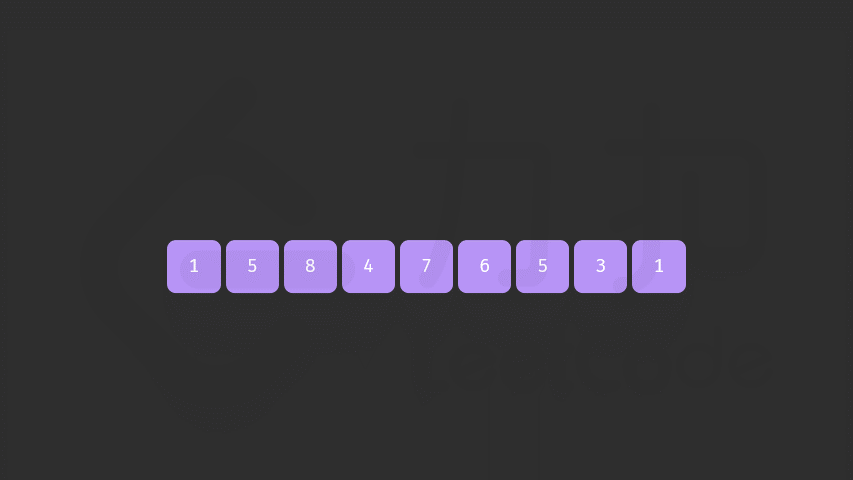

#### [前言](https://leetcode.cn/problems/next-permutation/solutions/479151/xia-yi-ge-pai-lie-by-leetcode-solution/)

本题要求我们实现一个算法，将给定数字序列重新排列成字典序中下一个更大的排列。

以数字序列 [1,2,3] 为例，其排列按照字典序依次为：
[1,2,3]\\ [1,3,2]\\ [2,1,3]\\ [2,3,1]\\ [3,1,2]\\ [3,2,1]

这样，排列 [2,3,1] 的下一个排列即为 [3,1,2]。特别的，最大的排列 [3,2,1] 的下一个排列为最小的排列 [1,2,3]。

#### 方法一：两遍扫描

**思路及解法**

注意到下一个排列总是比当前排列要大，除非该排列已经是最大的排列。我们希望找到一种方法，能够找到一个大于当前序列的新序列，且变大的幅度尽可能小。具体地：
1.  我们需要将一个左边的「较小数」与一个右边的「较大数」交换，以能够让当前排列变大，从而得到下一个排列。
2.  同时我们要让这个「较小数」尽量靠右，而「较大数」尽可能小。当交换完成后，「较大数」右边的数需要按照升序重新排列。这样可以在保证新排列大于原来排列的情况下，使变大的幅度尽可能小。

以排列 [4,5,2,6,3,1] 为例：
-   我们能找到的符合条件的一对「较小数」与「较大数」的组合为 2 与 3，满足「较小数」尽量靠右，而「较大数」尽可能小。
-   当我们完成交换后排列变为 [4,5,3,6,2,1]，此时我们可以重排「较小数」右边的序列，序列变为 [4,5,3,1,2,6]。

具体地，我们这样描述该算法，对于长度为 n 的排列 a：
1.  首先从后向前查找第一个顺序对 (i,i+1)，满足 a[i] < a[i+1]。这样「较小数」即为 a[i]。此时 [i+1,n) 必然是下降序列。
2.  如果找到了顺序对，那么在区间 [i+1,n) 中从后向前查找第一个元素 j 满足 a[i] < a[j]。这样「较大数」即为 a[j]。
3.  交换 a[i] 与 a[j]，此时可以证明区间 [i+1,n) 必为降序。我们可以直接使用双指针反转区间 [i+1,n) 使其变为升序，而无需对该区间进行排序。



**注意**

如果在步骤 1 找不到顺序对，说明当前序列已经是一个降序序列，即最大的序列，我们直接跳过步骤 2 执行步骤 3，即可得到最小的升序序列。

该方法支持序列中存在重复元素，且在 C++ 的标准库函数 [`next_permutation`](https://leetcode.cn/link/?target=https%3A%2F%2Fen.cppreference.com%2Fw%2Fcpp%2Falgorithm%2Fnext_permutation) 中被采用。

**代码**

```cpp
class Solution {
public:
    void nextPermutation(vector<int>& nums) {
        int i = nums.size() - 2;
        while (i >= 0 && nums[i] >= nums[i + 1]) {
            i--;
        }
        if (i >= 0) {
            int j = nums.size() - 1;
            while (j >= 0 && nums[i] >= nums[j]) {
                j--;
            }
            swap(nums[i], nums[j]);
        }
        reverse(nums.begin() + i + 1, nums.end());
    }
};
```

```java
class Solution {
    public void nextPermutation(int[] nums) {
        int i = nums.length - 2;
        while (i >= 0 && nums[i] >= nums[i + 1]) {
            i--;
        }
        if (i >= 0) {
            int j = nums.length - 1;
            while (j >= 0 && nums[i] >= nums[j]) {
                j--;
            }
            swap(nums, i, j);
        }
        reverse(nums, i + 1);
    }

    public void swap(int[] nums, int i, int j) {
        int temp = nums[i];
        nums[i] = nums[j];
        nums[j] = temp;
    }

    public void reverse(int[] nums, int start) {
        int left = start, right = nums.length - 1;
        while (left < right) {
            swap(nums, left, right);
            left++;
            right--;
        }
    }
}
```

```python
class Solution:
    def nextPermutation(self, nums: List[int]) -> None:
        i = len(nums) - 2
        while i >= 0 and nums[i] >= nums[i + 1]:
            i -= 1
        if i >= 0:
            j = len(nums) - 1
            while j >= 0 and nums[i] >= nums[j]:
                j -= 1
            nums[i], nums[j] = nums[j], nums[i]
        
        left, right = i + 1, len(nums) - 1
        while left < right:
            nums[left], nums[right] = nums[right], nums[left]
            left += 1
            right -= 1
```

```go
func nextPermutation(nums []int) {
    n := len(nums)
    i := n - 2
    for i >= 0 && nums[i] >= nums[i+1] {
        i--
    }
    if i >= 0 {
        j := n - 1
        for j >= 0 && nums[i] >= nums[j] {
            j--
        }
        nums[i], nums[j] = nums[j], nums[i]
    }
    reverse(nums[i+1:])
}

func reverse(a []int) {
    for i, n := 0, len(a); i < n/2; i++ {
        a[i], a[n-1-i] = a[n-1-i], a[i]
    }
}
```

```c
void swap(int *a, int *b) {
    int t = *a;
    *a = *b, *b = t;
}
void reverse(int *nums, int left, int right) {
    while (left < right) {
        swap(nums + left, nums + right);
        left++, right--;
    }
}

void nextPermutation(int *nums, int numsSize) {
    int i = numsSize - 2;
    while (i >= 0 && nums[i] >= nums[i + 1]) {
        i--;
    }
    if (i >= 0) {
        int j = numsSize - 1;
        while (j >= 0 && nums[i] >= nums[j]) {
            j--;
        }
        swap(nums + i, nums + j);
    }
    reverse(nums, i + 1, numsSize - 1);
}
```

**复杂度分析**

-   时间复杂度：O(N)，其中 N 为给定序列的长度。我们至多只需要扫描两次序列，以及进行一次反转操作。
-   空间复杂度：O(1)，只需要常数的空间存放若干变量。
