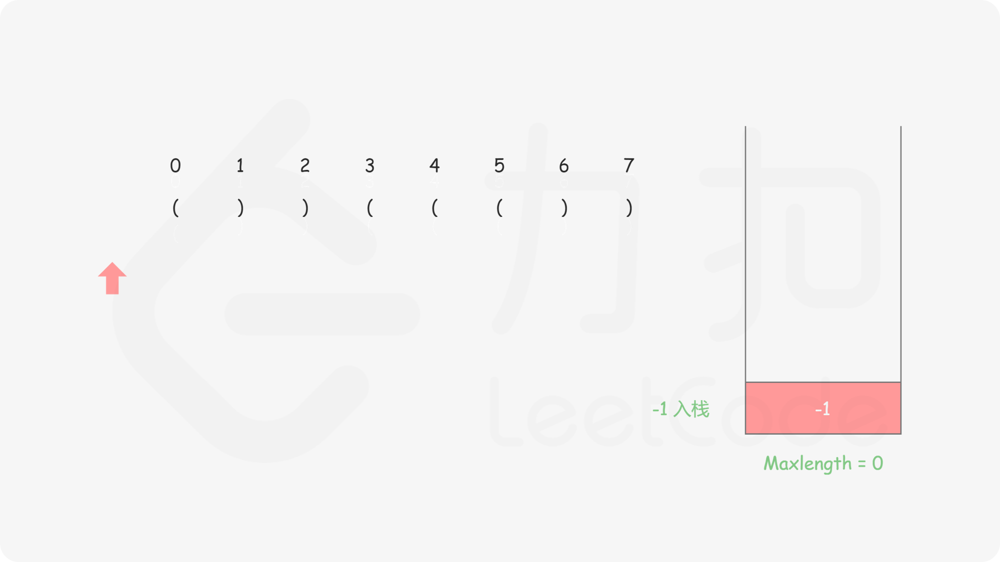
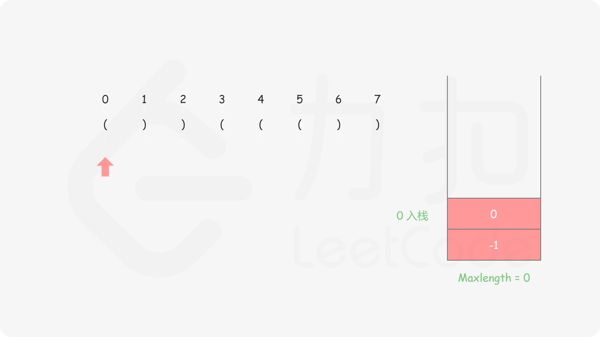
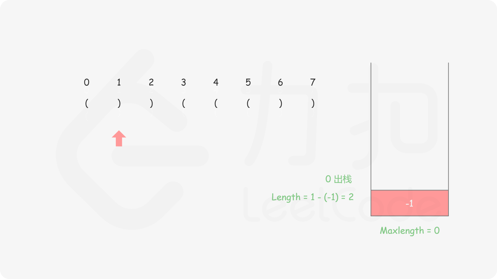
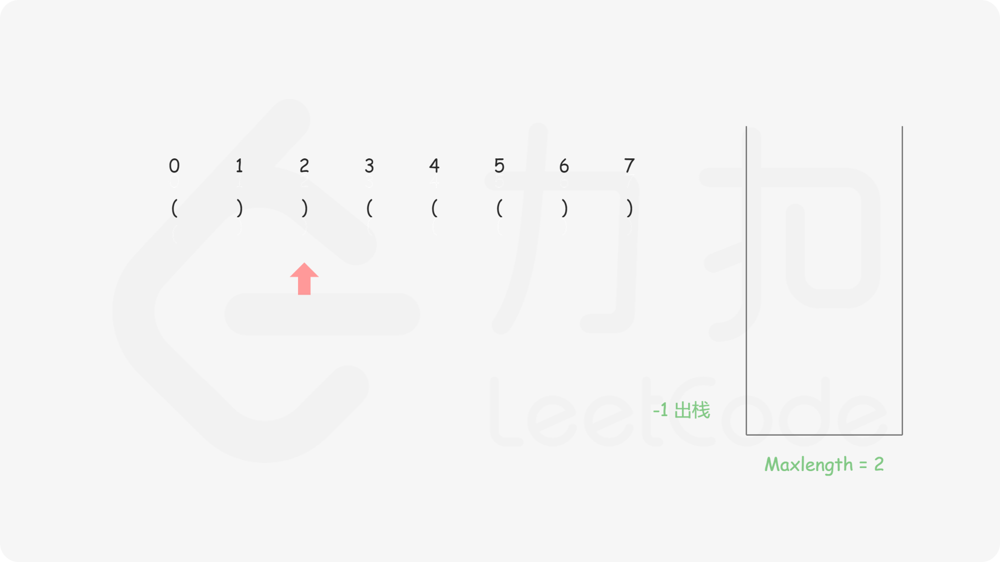
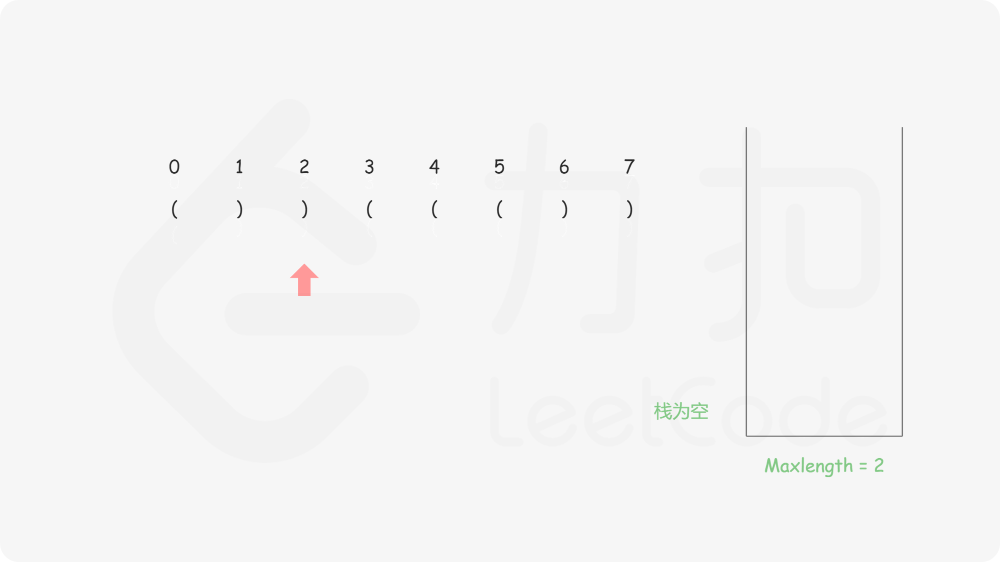
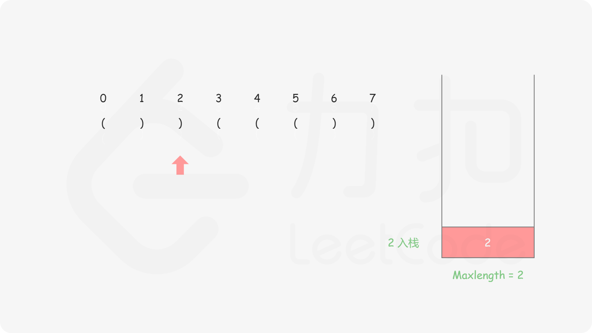
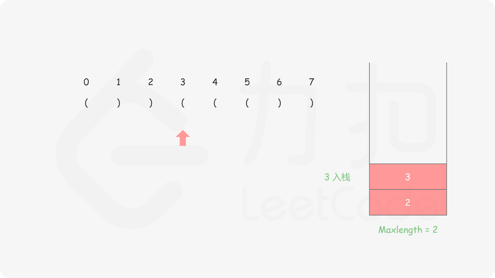
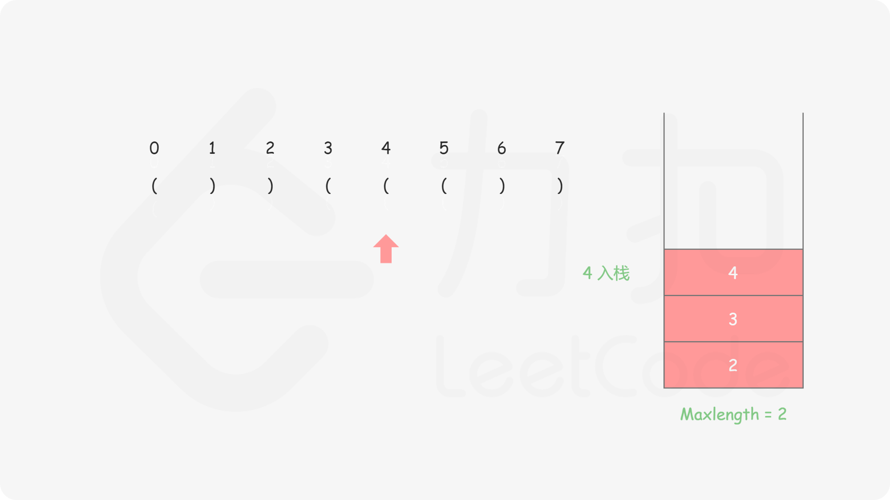
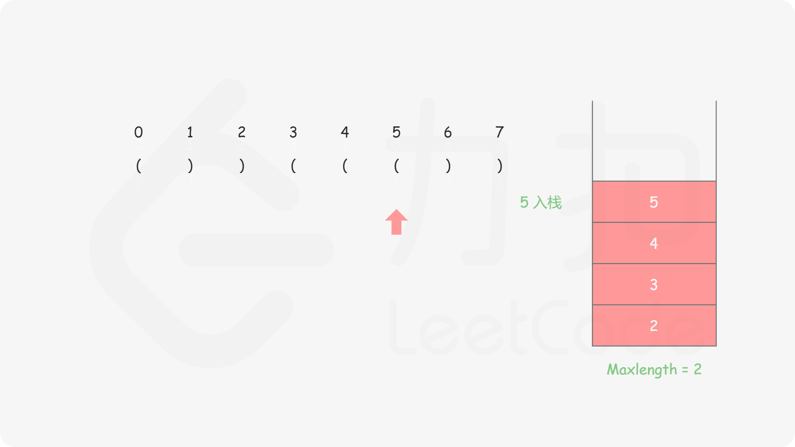
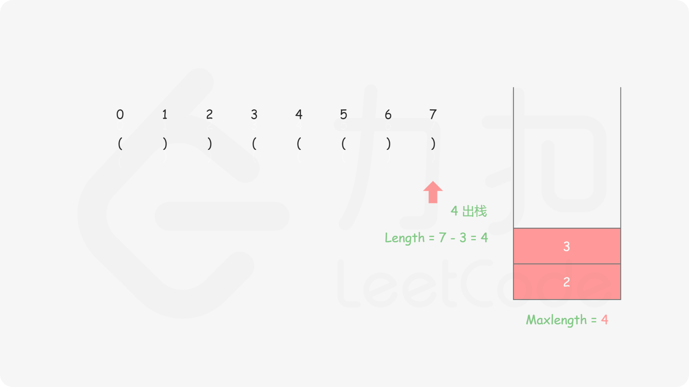

#### [方法二：栈](https://leetcode.cn/problems/longest-valid-parentheses/solutions/314683/zui-chang-you-xiao-gua-hao-by-leetcode-solution/)

**思路和算法**

撇开方法一提及的动态规划方法，相信大多数人对于这题的第一直觉是找到每个可能的子串后判断它的有效性，但这样的时间复杂度会达到 $O(n^3)$，无法通过所有测试用例。但是通过栈，我们可以在遍历给定字符串的过程中去判断到目前为止扫描的子串的有效性，同时能得到最长有效括号的长度。

具体做法是我们始终保持栈底元素为当前已经遍历过的元素中「最后一个没有被匹配的右括号的下标」，这样的做法主要是考虑了边界条件的处理，栈里其他元素维护左括号的下标：
-   对于遇到的每个 ‘(’ ，我们将它的下标放入栈中
-   对于遇到的每个 ‘)’ ，我们先弹出栈顶元素表示匹配了当前右括号：
    -   如果栈为空，说明当前的右括号为没有被匹配的右括号，我们将其下标放入栈中来更新我们之前提到的「最后一个没有被匹配的右括号的下标」
    -   如果栈不为空，当前右括号的下标减去栈顶元素即为「以该右括号为结尾的最长有效括号的长度」

我们从前往后遍历字符串并更新答案即可。

需要注意的是，如果一开始栈为空，第一个字符为左括号的时候我们会将其放入栈中，这样就不满足提及的「最后一个没有被匹配的右括号的下标」，为了保持统一，我们在一开始的时候往栈中放入一个值为 −1 的元素。













```java
class Solution {
    public int longestValidParentheses(String s) {
        int maxans = 0;
        Deque<Integer> stack = new LinkedList<Integer>();
        stack.push(-1);
        for (int i = 0; i < s.length(); i++) {
            if (s.charAt(i) == '(') {
                stack.push(i);
            } else {
                stack.pop();
                if (stack.isEmpty()) {
                    stack.push(i);
                } else {
                    maxans = Math.max(maxans, i - stack.peek());
                }
            }
        }
        return maxans;
    }
}
```

```cpp
class Solution {
public:
    int longestValidParentheses(string s) {
        int maxans = 0;
        stack<int> stk;
        stk.push(-1);
        for (int i = 0; i < s.length(); i++) {
            if (s[i] == '(') {
                stk.push(i);
            } else {
                stk.pop();
                if (stk.empty()) {
                    stk.push(i);
                } else {
                    maxans = max(maxans, i - stk.top());
                }
            }
        }
        return maxans;
    }
};
```

```c
int longestValidParentheses(char* s) {
    int maxans = 0, n = strlen(s);
    int stk[n + 1], top = -1;
    stk[++top] = -1;
    for (int i = 0; i < n; i++) {
        if (s[i] == '(') {
            stk[++top] = i;
        } else {
            --top;
            if (top == -1) {
                stk[++top] = i;
            } else {
                maxans = fmax(maxans, i - stk[top]);
            }
        }
    }
    return maxans;
}
```

```go
func longestValidParentheses(s string) int {
    maxAns := 0
    stack := []int{}
    stack = append(stack, -1)
    for i := 0; i < len(s); i++ {
        if s[i] == '(' {
            stack = append(stack, i)
        } else {
            stack = stack[:len(stack)-1]
            if len(stack) == 0 {
                stack = append(stack, i)
            } else {
                maxAns = max(maxAns, i - stack[len(stack)-1])
            }
        }
    }
    return maxAns
}

func max(x, y int) int {
    if x > y {
        return x
    }
    return y
}
```

**复杂度分析**

-   时间复杂度： O(n)，n 是给定字符串的长度。我们只需要遍历字符串一次即可。
-   空间复杂度： O(n)。栈的大小在最坏情况下会达到 n，因此空间复杂度为 O(n)。
