#### [方法三：不需要额外的空间](https://leetcode.cn/problems/longest-valid-parentheses/solutions/314683/zui-chang-you-xiao-gua-hao-by-leetcode-solution/)

**思路和算法**

在此方法中，我们利用两个计数器 left 和 right 。首先，我们从左到右遍历字符串，对于遇到的每个 ‘(’，我们增加 left 计数器，对于遇到的每个 ‘)’ ，我们增加 right 计数器。每当 left 计数器与 right 计数器相等时，我们计算当前有效字符串的长度，并且记录目前为止找到的最长子字符串。当 right 计数器比 left 计数器大时，我们将 left 和 right 计数器同时变回 0。

这样的做法贪心地考虑了以当前字符下标结尾的有效括号长度，每次当右括号数量多于左括号数量的时候之前的字符我们都扔掉不再考虑，重新从下一个字符开始计算，但这样会漏掉一种情况，就是遍历的时候左括号的数量始终大于右括号的数量，即 `(()` ，这种时候最长有效括号是求不出来的。

解决的方法也很简单，我们只需要从右往左遍历用类似的方法计算即可，只是这个时候判断条件反了过来：
-   当 left 计数器比 right 计数器大时，我们将 left 和 right 计数器同时变回 0
-   当 left 计数器与 right 计数器相等时，我们计算当前有效字符串的长度，并且记录目前为止找到的最长子字符串

这样我们就能涵盖所有情况从而求解出答案。


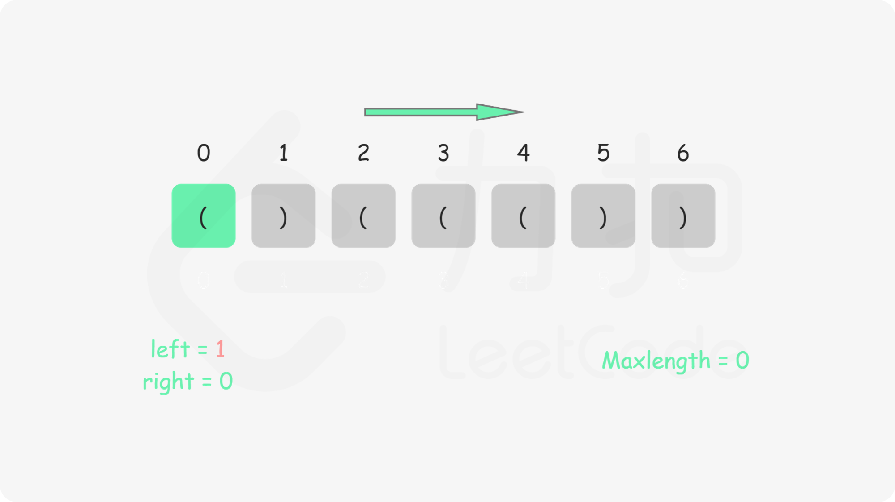
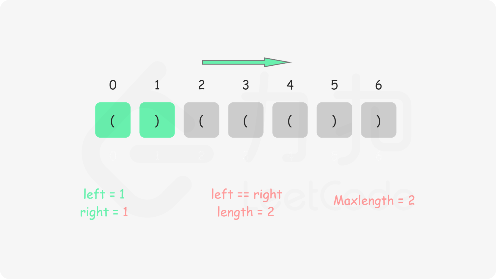
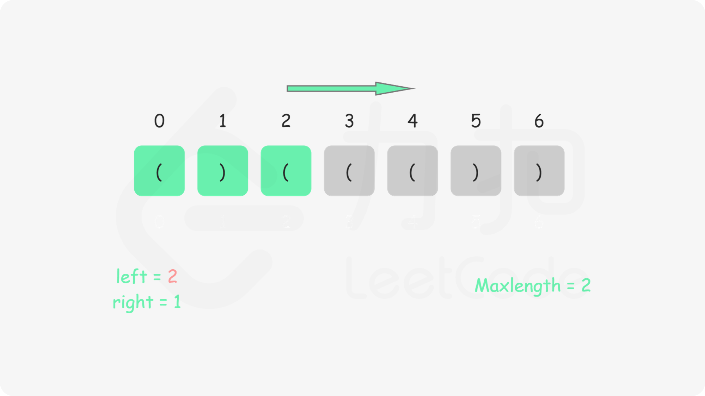
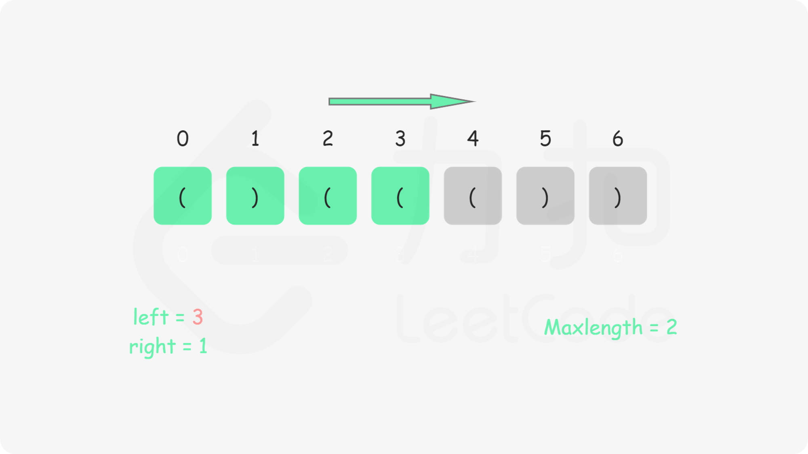
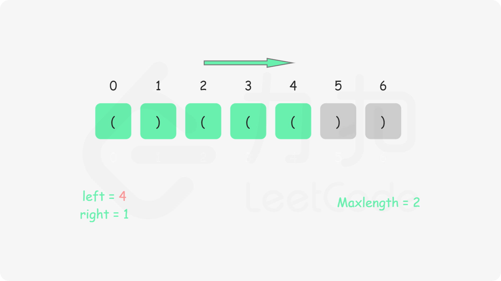
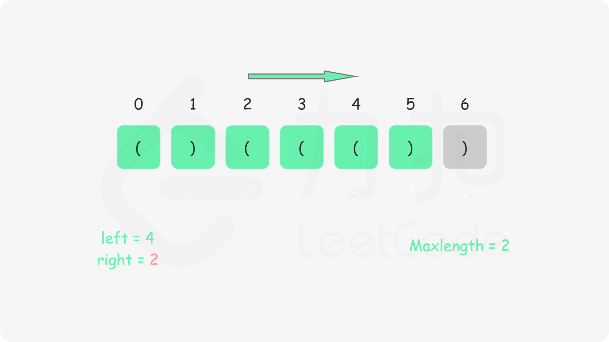
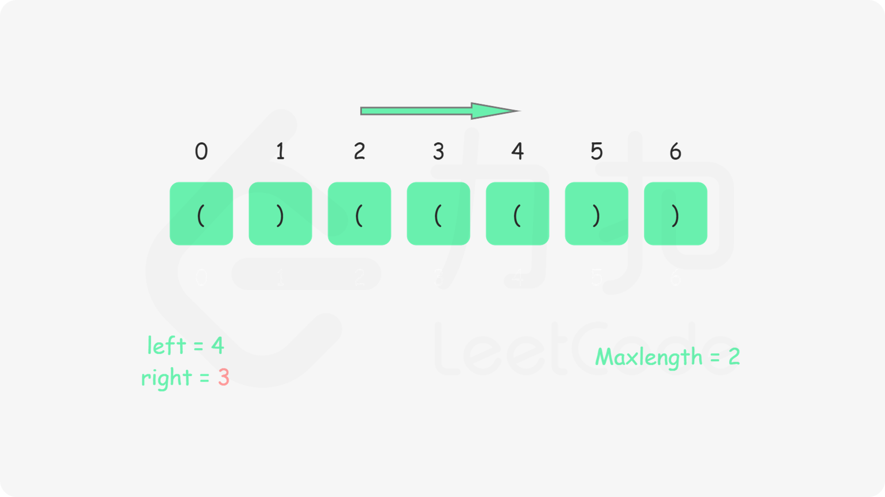
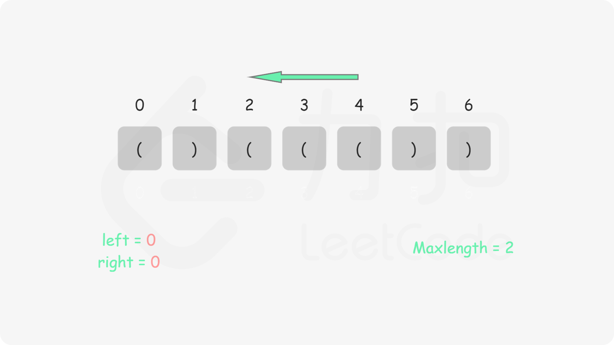
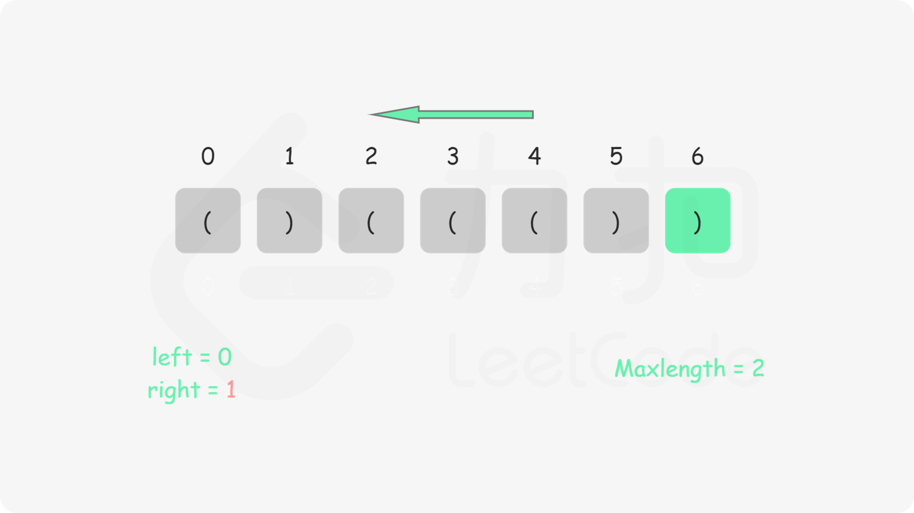
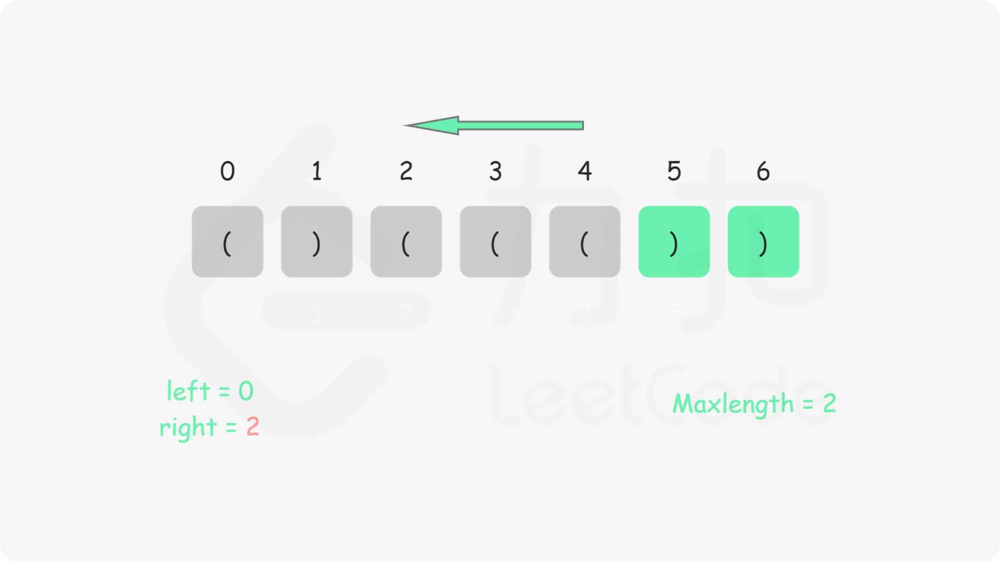
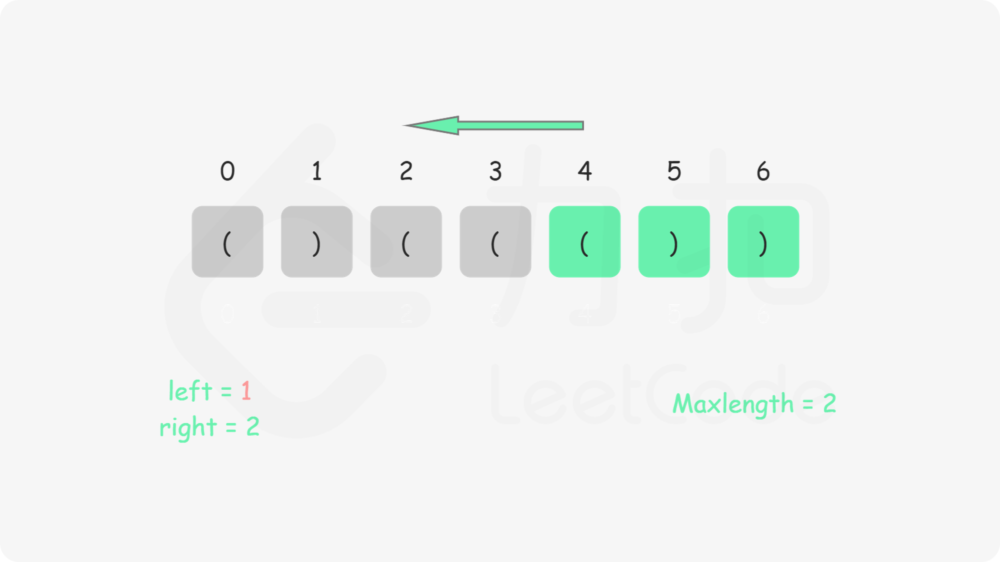
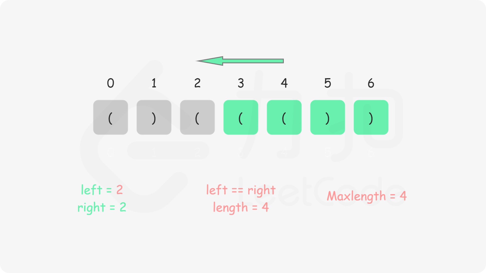
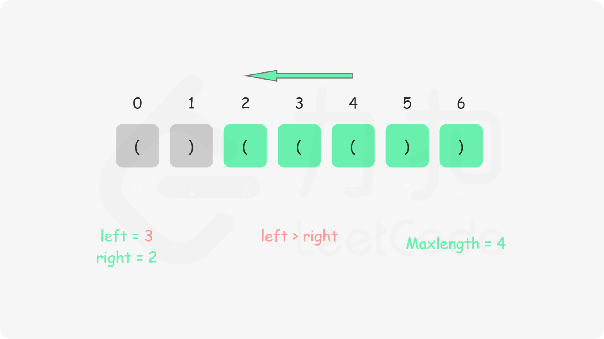

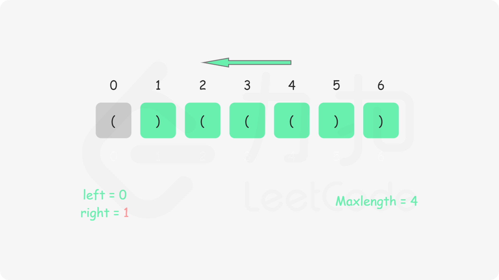
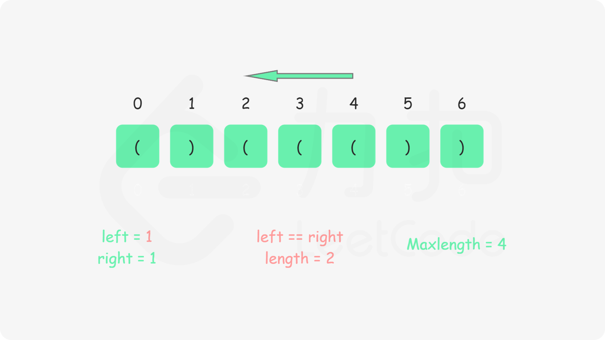

```java
class Solution {
    public int longestValidParentheses(String s) {
        int left = 0, right = 0, maxlength = 0;
        for (int i = 0; i < s.length(); i++) {
            if (s.charAt(i) == '(') {
                left++;
            } else {
                right++;
            }
            if (left == right) {
                maxlength = Math.max(maxlength, 2 * right);
            } else if (right > left) {
                left = right = 0;
            }
        }
        left = right = 0;
        for (int i = s.length() - 1; i >= 0; i--) {
            if (s.charAt(i) == '(') {
                left++;
            } else {
                right++;
            }
            if (left == right) {
                maxlength = Math.max(maxlength, 2 * left);
            } else if (left > right) {
                left = right = 0;
            }
        }
        return maxlength;
    }
}
```

```cpp
class Solution {
public:
    int longestValidParentheses(string s) {
        int left = 0, right = 0, maxlength = 0;
        for (int i = 0; i < s.length(); i++) {
            if (s[i] == '(') {
                left++;
            } else {
                right++;
            }
            if (left == right) {
                maxlength = max(maxlength, 2 * right);
            } else if (right > left) {
                left = right = 0;
            }
        }
        left = right = 0;
        for (int i = (int)s.length() - 1; i >= 0; i--) {
            if (s[i] == '(') {
                left++;
            } else {
                right++;
            }
            if (left == right) {
                maxlength = max(maxlength, 2 * left);
            } else if (left > right) {
                left = right = 0;
            }
        }
        return maxlength;
    }
};
```

```c
int longestValidParentheses(char* s) {
    int n = strlen(s);
    int left = 0, right = 0, maxlength = 0;
    for (int i = 0; i < n; i++) {
        if (s[i] == '(') {
            left++;
        } else {
            right++;
        }
        if (left == right) {
            maxlength = fmax(maxlength, 2 * right);
        } else if (right > left) {
            left = right = 0;
        }
    }
    left = right = 0;
    for (int i = n - 1; i >= 0; i--) {
        if (s[i] == '(') {
            left++;
        } else {
            right++;
        }
        if (left == right) {
            maxlength = fmax(maxlength, 2 * left);
        } else if (left > right) {
            left = right = 0;
        }
    }
    return maxlength;
}
```

```go
func longestValidParentheses(s string) int {
    left, right, maxLength := 0, 0, 0
    for i := 0; i < len(s); i++ {
        if s[i] == '(' {
            left++
        } else {
            right++
        }
        if left == right {
            maxLength = max(maxLength, 2 * right)
        } else if right > left {
            left, right = 0, 0
        }
    }
    left, right = 0, 0
    for i := len(s) - 1; i >= 0; i-- {
        if s[i] == '(' {
            left++
        } else {
            right++
        }
        if left == right {
            maxLength = max(maxLength, 2 * left)
        } else if left > right {
            left, right = 0, 0
        }
    }
    return maxLength
}

func max(x, y int) int {
    if x > y {
        return x
    }
    return y
}
```

**复杂度分析**

-   时间复杂度： O(n)，其中 n 为字符串长度。我们只要正反遍历两边字符串即可。
-   空间复杂度： O(1)。我们只需要常数空间存放若干变量。
