#### [方法一：二分查找](https://leetcode.cn/problems/find-first-and-last-position-of-element-in-sorted-array/solutions/504484/zai-pai-xu-shu-zu-zhong-cha-zhao-yuan-su-de-di-3-4/)

直观的思路肯定是从前往后遍历一遍。用两个变量记录第一次和最后一次遇见 target 的下标，但这个方法的时间复杂度为 O(n)，没有利用到数组**升序排列**的条件。

由于数组已经排序，因此整个数组是**单调递增**的，我们可以利用二分法来加速查找的过程。

考虑 target 开始和结束位置，其实我们要找的就是数组中「第一个等于 target 的位置」（记为 leftIdx）和「第一个大于 target 的位置**减一**」（记为 rightIdx）。

二分查找中，寻找 leftIdx 即为在数组中寻找第一个**大于等于** target 的下标，寻找 rightIdx 即为在数组中寻找第一个**大于** target 的下标，然后将下标减一。两者的判断条件不同，为了代码的复用，我们定义 `binarySearch(nums, target, lower)` 表示在 nums 数组中二分查找 target 的位置，如果 lower 为 true，则查找第一个**大于等于** target 的下标，否则查找第一个**大于** target 的下标。

最后，因为 target 可能不存在数组中，因此我们需要重新校验我们得到的两个下标 leftIdx 和 rightIdx，看是否符合条件，如果符合条件就返回 [leftIdx,rightIdx]，不符合就返回 [−1,−1]。

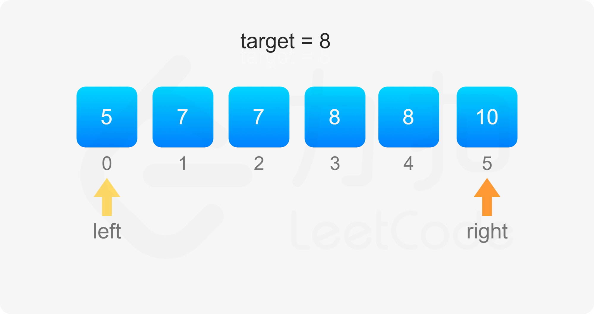
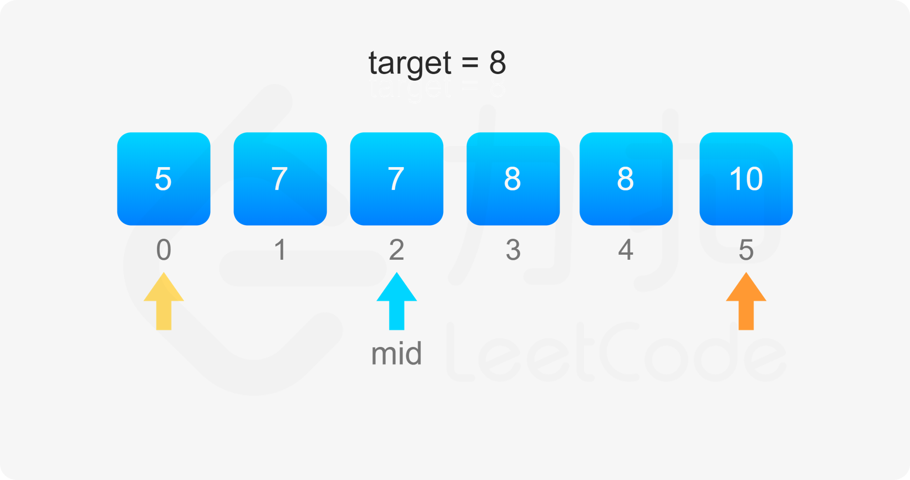
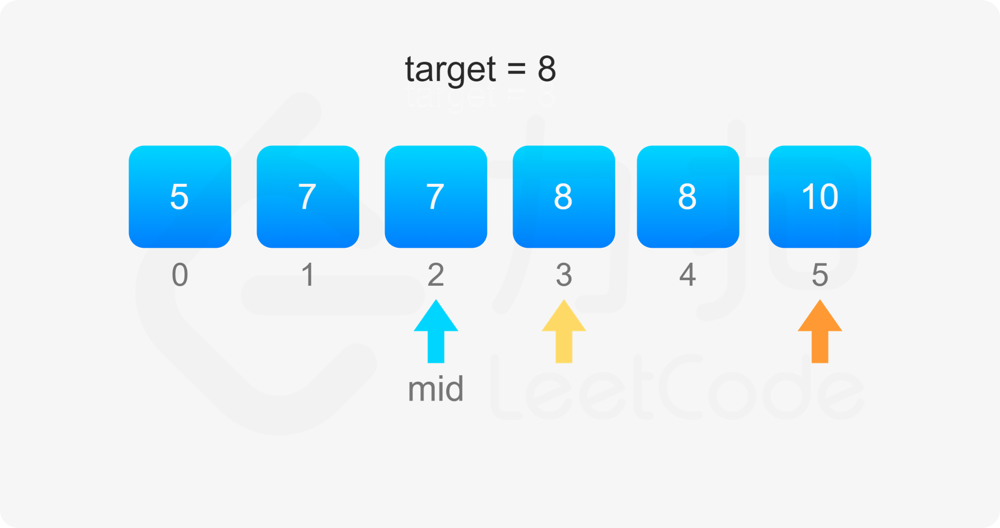
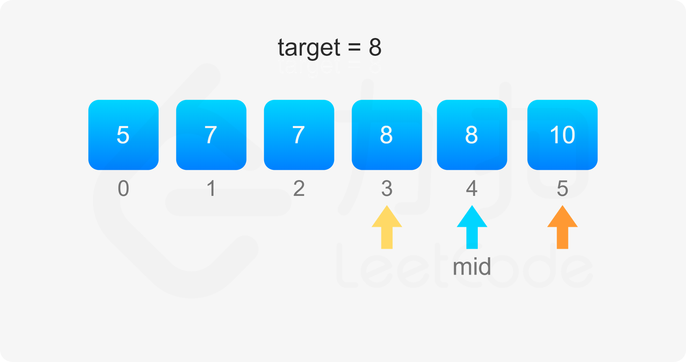
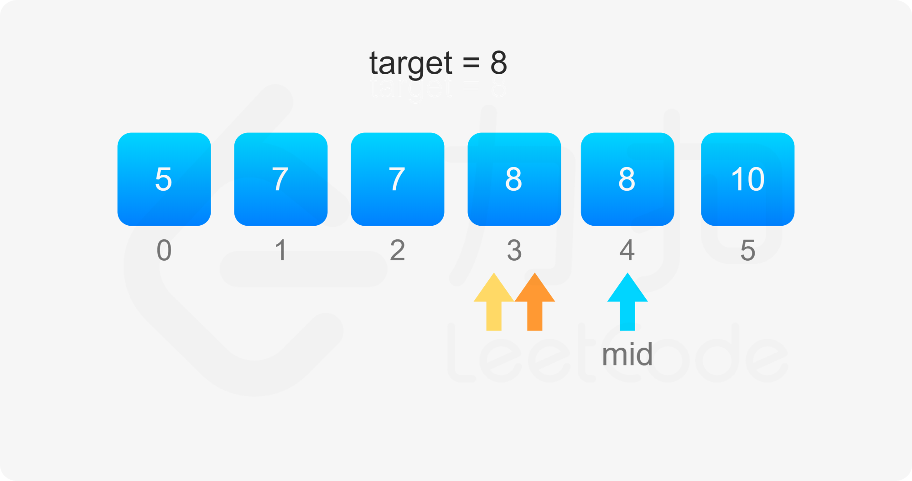
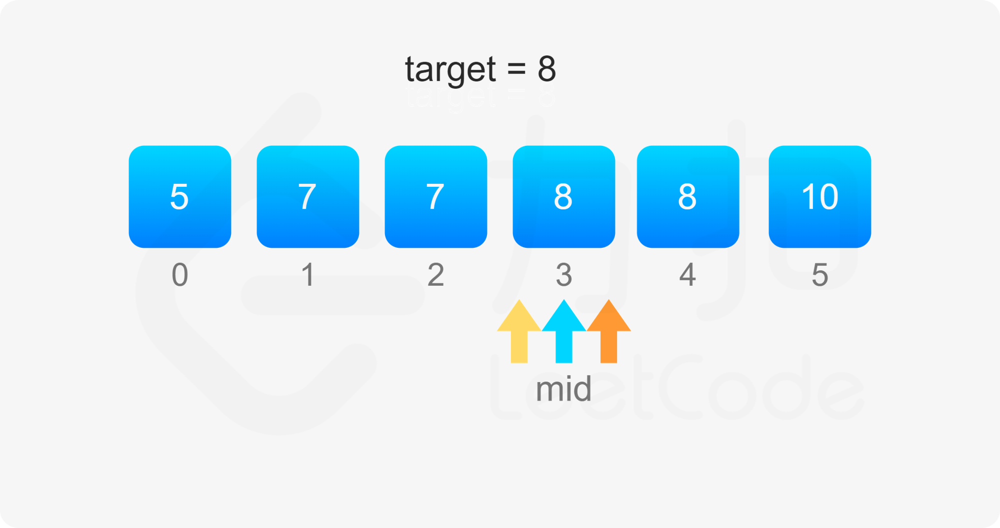
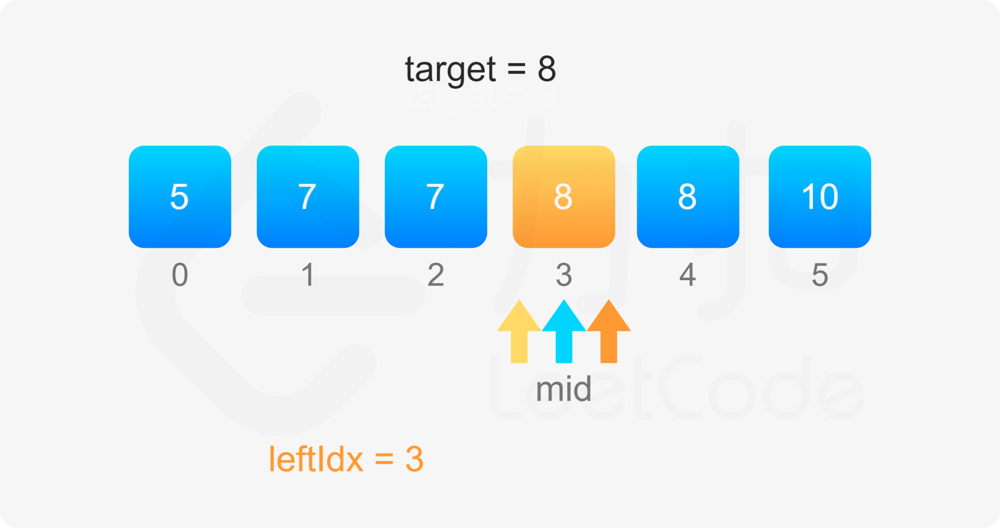
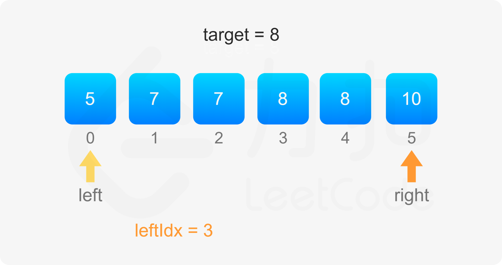
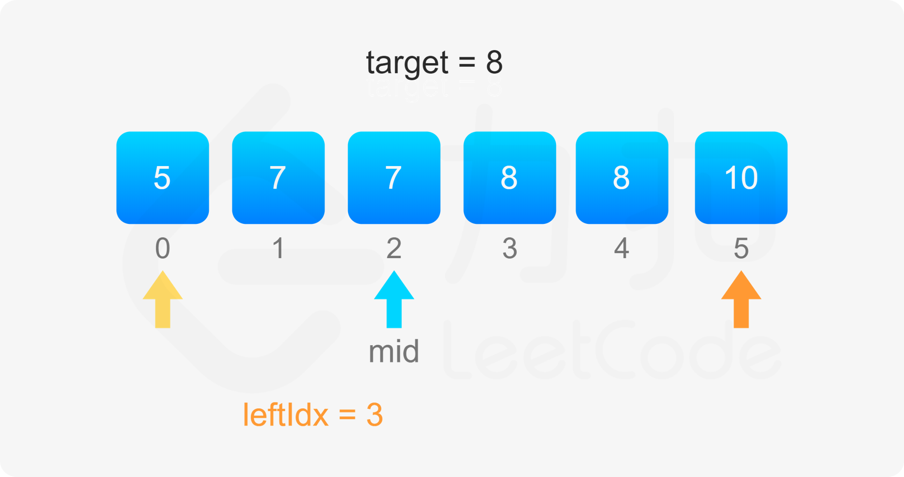
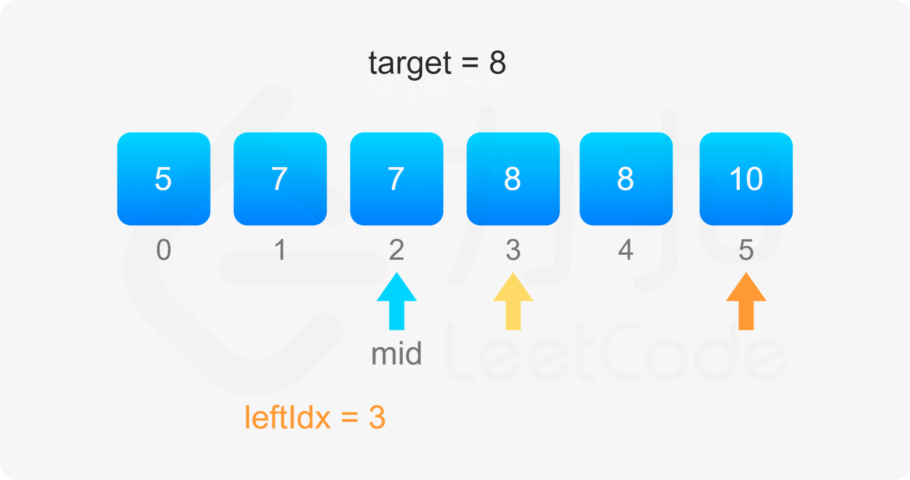
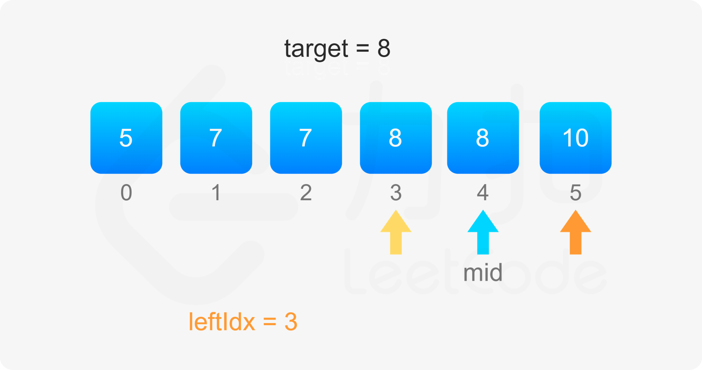
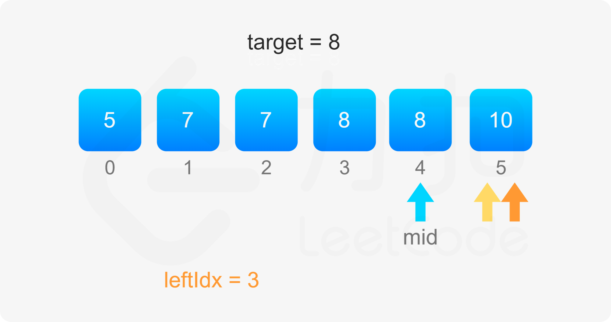
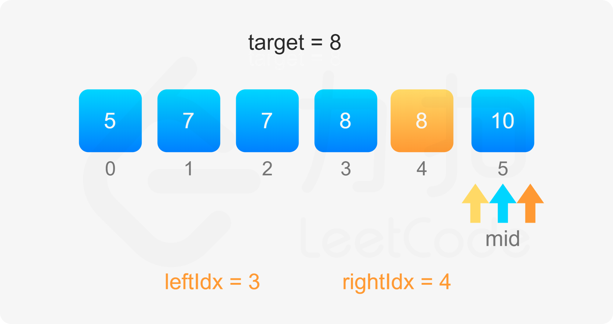
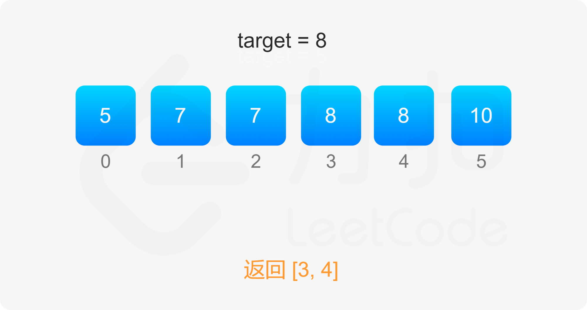

```cpp
class Solution { 
public:
    int binarySearch(vector<int>& nums, int target, bool lower) {
        int left = 0, right = (int)nums.size() - 1, ans = (int)nums.size();
        while (left <= right) {
            int mid = (left + right) / 2;
            if (nums[mid] > target || (lower && nums[mid] >= target)) {
                right = mid - 1;
                ans = mid;
            } else {
                left = mid + 1;
            }
        }
        return ans;
    }

    vector<int> searchRange(vector<int>& nums, int target) {
        int leftIdx = binarySearch(nums, target, true);
        int rightIdx = binarySearch(nums, target, false) - 1;
        if (leftIdx <= rightIdx && rightIdx < nums.size() && nums[leftIdx] == target && nums[rightIdx] == target) {
            return vector<int>{leftIdx, rightIdx};
        } 
        return vector<int>{-1, -1};
    }
};
```

```java
class Solution {
    public int[] searchRange(int[] nums, int target) {
        int leftIdx = binarySearch(nums, target, true);
        int rightIdx = binarySearch(nums, target, false) - 1;
        if (leftIdx <= rightIdx && rightIdx < nums.length && nums[leftIdx] == target && nums[rightIdx] == target) {
            return new int[]{leftIdx, rightIdx};
        } 
        return new int[]{-1, -1};
    }

    public int binarySearch(int[] nums, int target, boolean lower) {
        int left = 0, right = nums.length - 1, ans = nums.length;
        while (left <= right) {
            int mid = (left + right) / 2;
            if (nums[mid] > target || (lower && nums[mid] >= target)) {
                right = mid - 1;
                ans = mid;
            } else {
                left = mid + 1;
            }
        }
        return ans;
    }
}
```

```javascript
const binarySearch = (nums, target, lower) => {
    let left = 0, right = nums.length - 1, ans = nums.length;
    while (left <= right) {
        const mid = Math.floor((left + right) / 2);
        if (nums[mid] > target || (lower && nums[mid] >= target)) {
            right = mid - 1;
            ans = mid;
        } else {
            left = mid + 1;
        }
    }
    return ans;
}

var searchRange = function(nums, target) {
    let ans = [-1, -1];
    const leftIdx = binarySearch(nums, target, true);
    const rightIdx = binarySearch(nums, target, false) - 1;
    if (leftIdx <= rightIdx && rightIdx < nums.length && nums[leftIdx] === target && nums[rightIdx] === target) {
        ans = [leftIdx, rightIdx];
    } 
    return ans;
};
```

```go
func searchRange(nums []int, target int) []int {
    leftmost := sort.SearchInts(nums, target)
    if leftmost == len(nums) || nums[leftmost] != target {
        return []int{-1, -1}
    }
    rightmost := sort.SearchInts(nums, target + 1) - 1
    return []int{leftmost, rightmost}
}
```

```c
int binarySearch(int* nums, int numsSize, int target, bool lower) {
    int left = 0, right = numsSize - 1, ans = numsSize;
    while (left <= right) {
        int mid = (left + right) / 2;
        if (nums[mid] > target || (lower && nums[mid] >= target)) {
            right = mid - 1;
            ans = mid;
        } else {
            left = mid + 1;
        }
    }
    return ans;
}

int* searchRange(int* nums, int numsSize, int target, int* returnSize) {
    int leftIdx = binarySearch(nums, numsSize, target, true);
    int rightIdx = binarySearch(nums, numsSize, target, false) - 1;
    int* ret = malloc(sizeof(int) * 2);
    *returnSize = 2;
    if (leftIdx <= rightIdx && rightIdx < numsSize && nums[leftIdx] == target && nums[rightIdx] == target) {
        ret[0] = leftIdx, ret[1] = rightIdx;
        return ret;
    }
    ret[0] = -1, ret[1] = -1;
    return ret;
}
```

**复杂度分析**

-   时间复杂度： $O(\log n)$ ，其中 n 为数组的长度。二分查找的时间复杂度为 $O(\log n)$，一共会执行两次，因此总时间复杂度为 $O(\log n)$。
-   空间复杂度：O(1) 。只需要常数空间存放若干变量。
