#### 方法一：二分查找

**思路与算法**

假设题意是叫你在排序数组中寻找是否存在一个目标值，那么训练有素的读者肯定立马就能想到利用二分法在 O(log⁡n)O(\\log n)O(logn) 的时间内找到是否存在目标值。但这题还多了个额外的条件，即如果不存在数组中的时候需要返回按顺序插入的位置，那我们还能用二分法么？答案是可以的，我们只需要稍作修改即可。

考虑这个插入的位置 pos\\textit{pos}pos，它成立的条件为：

nums\[pos−1\]<target≤nums\[pos\]\\textit{nums}\[pos-1\]<\\textit{target}\\le \\textit{nums}\[pos\] nums\[pos−1\]<target≤nums\[pos\]

其中 nums\\textit{nums}nums 代表排序数组。由于如果存在这个目标值，我们返回的索引也是 pos\\textit{pos}pos，因此我们可以将两个条件合并得出最后的目标：「在一个有序数组中找第一个大于等于 target\\textit{target}target 的下标」。

问题转化到这里，直接套用二分法即可，即不断用二分法逼近查找第一个大于等于 target\\textit{target}target 的下标 。下文给出的代码是笔者习惯的二分写法，ans\\textit{ans}ans 初值设置为数组长度可以省略边界条件的判断，因为存在一种情况是 target\\textit{target}target 大于数组中的所有数，此时需要插入到数组长度的位置。


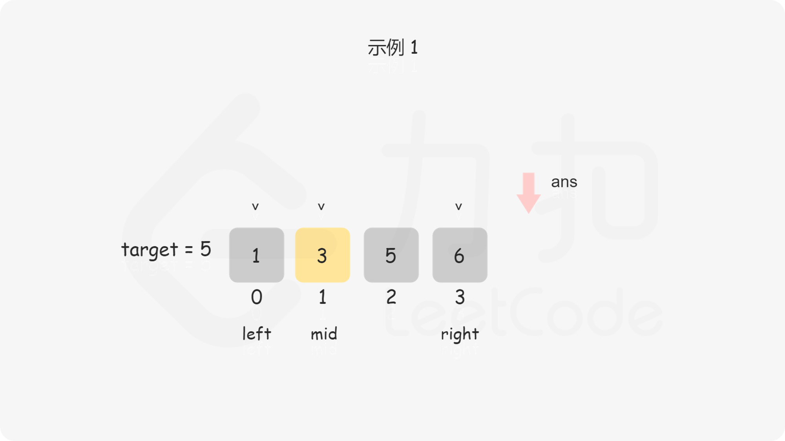
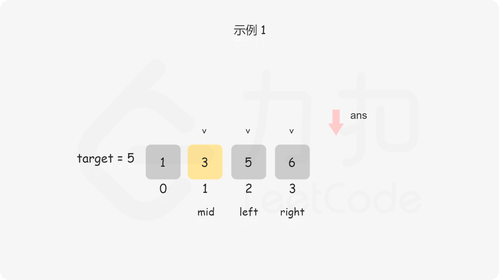
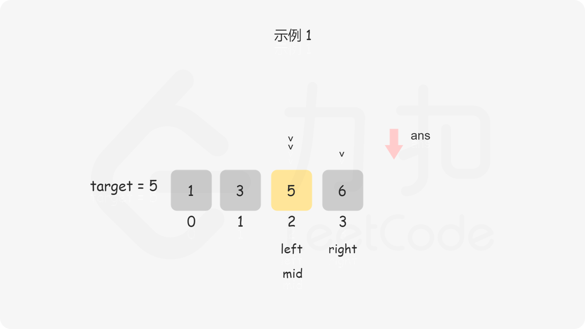
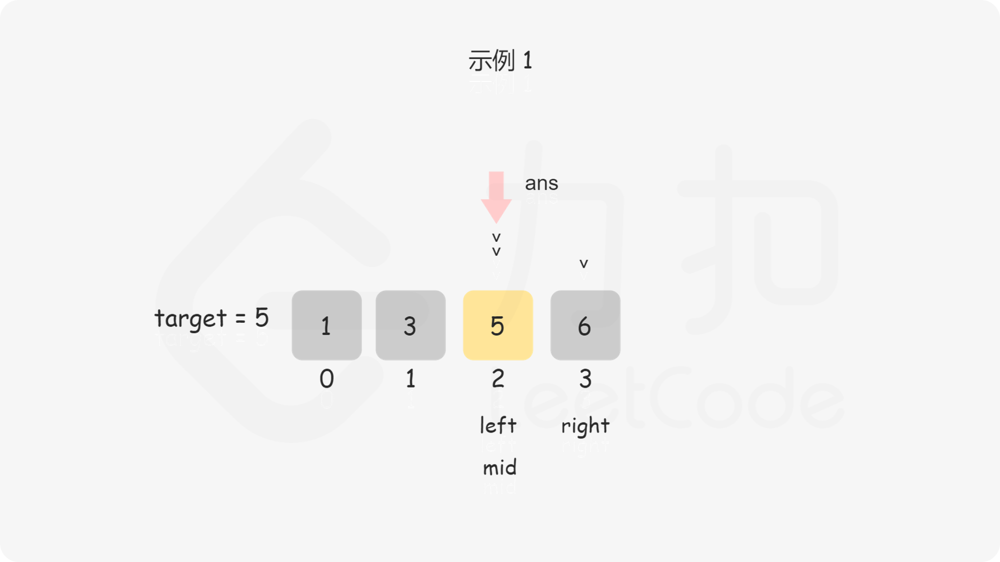
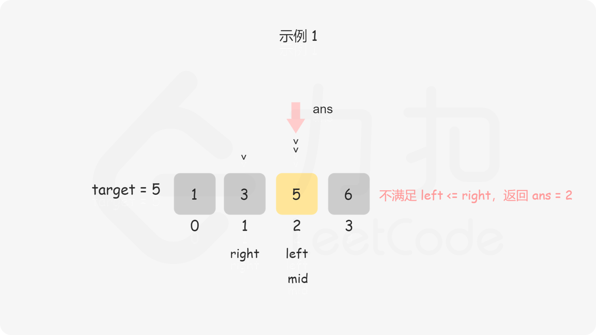
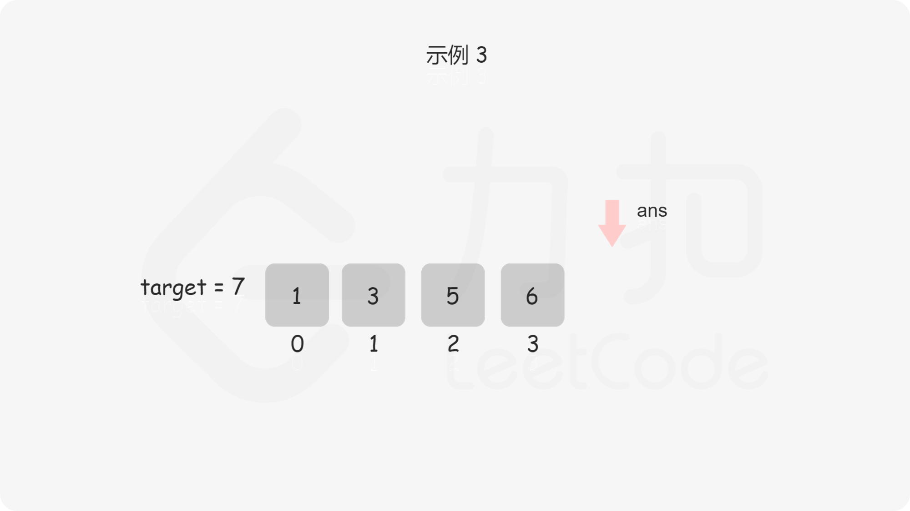
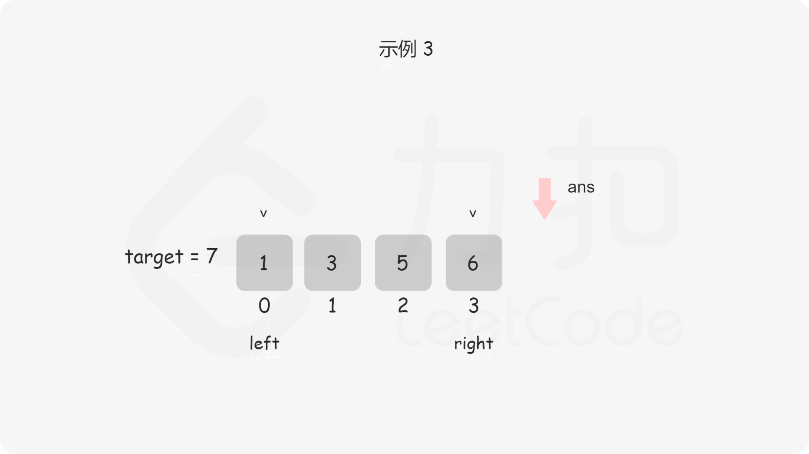
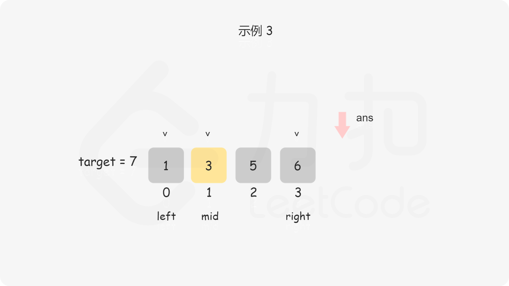

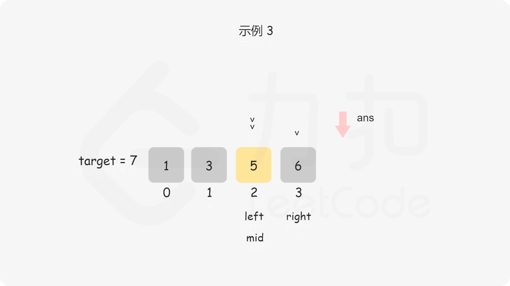
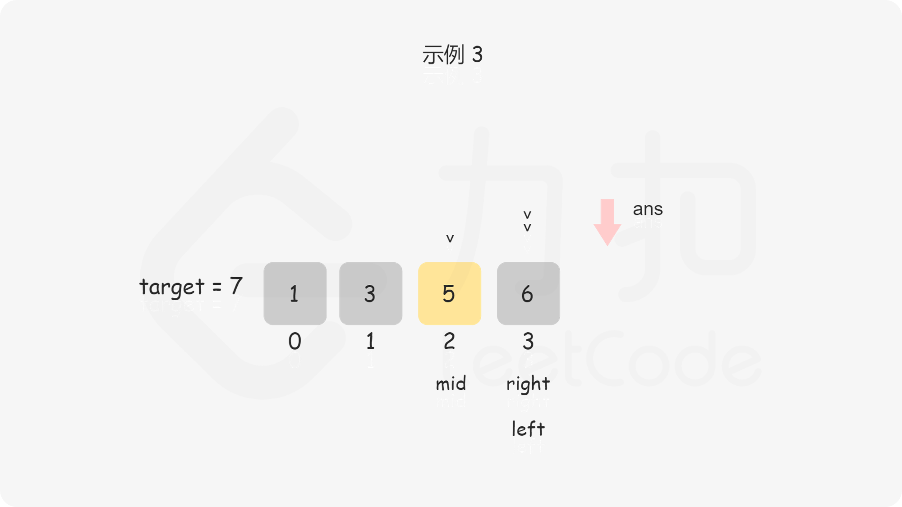
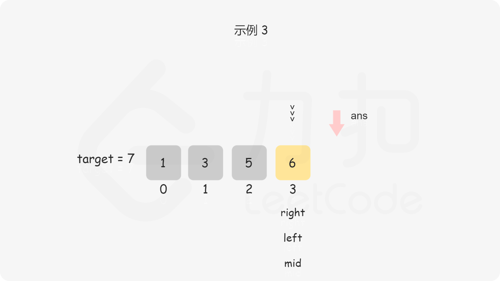
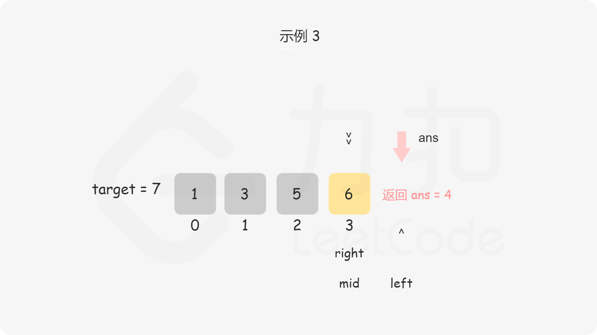

```Java
class Solution {
    public int searchInsert(int[] nums, int target) {
        int n = nums.length;
        int left = 0, right = n - 1, ans = n;
        while (left <= right) {
            int mid = ((right - left) >> 1) + left;
            if (target <= nums[mid]) {
                ans = mid;
                right = mid - 1;
            } else {
                left = mid + 1;
            }
        }
        return ans;
    }
}

```

```C++
class Solution {
public:
    int searchInsert(vector<int>& nums, int target) {
        int n = nums.size();
        int left = 0, right = n - 1, ans = n;
        while (left <= right) {
            int mid = ((right - left) >> 1) + left;
            if (target <= nums[mid]) {
                ans = mid;
                right = mid - 1;
            } else {
                left = mid + 1;
            }
        }
        return ans;
    }
};

```

```JavaScript
var searchInsert = function(nums, target) {
    const n = nums.length;
    let left = 0, right = n - 1, ans = n;
    while (left <= right) {
        let mid = ((right - left) >> 1) + left;
        if (target <= nums[mid]) {
            ans = mid;
            right = mid - 1;
        } else {
            left = mid + 1;
        }
    }
    return ans;
};

```

```C
int searchInsert(int* nums, int numsSize, int target) {
    int left = 0, right = numsSize - 1, ans = numsSize;
    while (left <= right) {
        int mid = ((right - left) >> 1) + left;
        if (target <= nums[mid]) {
            ans = mid;
            right = mid - 1;
        } else {
            left = mid + 1;
        }
    }
    return ans;
}

```

```Golang
func searchInsert(nums []int, target int) int {
    n := len(nums)
    left, right := 0, n - 1
    ans := n
    for left <= right {
        mid := (right - left) >> 1 + left
        if target <= nums[mid] {
            ans = mid
            right = mid - 1
        } else {
            left = mid + 1
        }
    }
    return ans
}

```

**复杂度分析**

-   时间复杂度：O(logn)，其中 n 为数组的长度。二分查找所需的时间复杂度为 O(logn)。
    
-   空间复杂度：O(1)。我们只需要常数空间存放若干变量。
