#### [](https://leetcode.cn/problems/binary-tree-preorder-traversal/solution/er-cha-shu-de-qian-xu-bian-li-by-leetcode-solution//#方法二：迭代)方法二：迭代

**思路与算法**

我们也可以用迭代的方式实现方法一的递归函数，两种方式是等价的，区别在于递归的时候隐式地维护了一个栈，而我们在迭代的时候需要显式地将这个栈模拟出来，其余的实现与细节都相同，具体可以参考下面的代码。

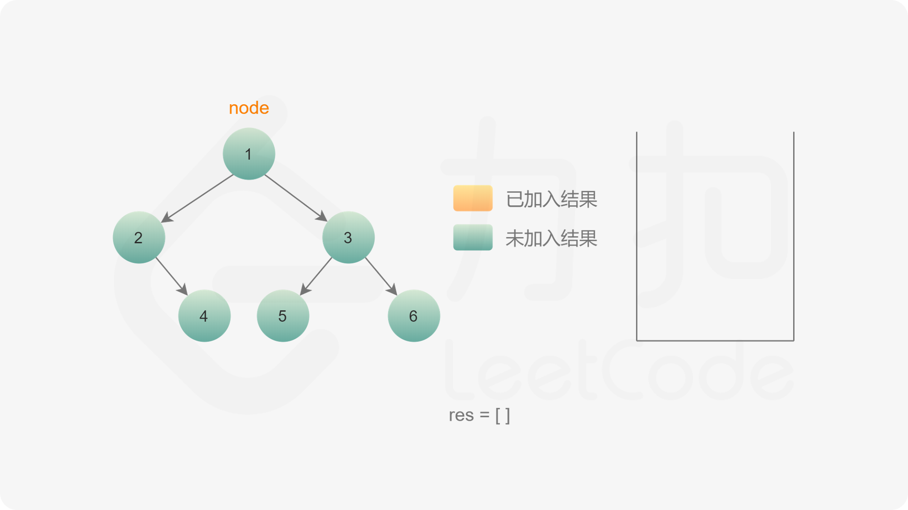
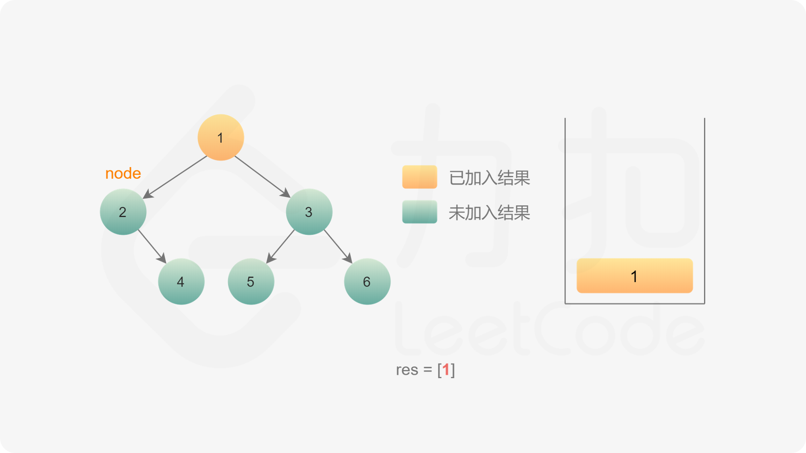
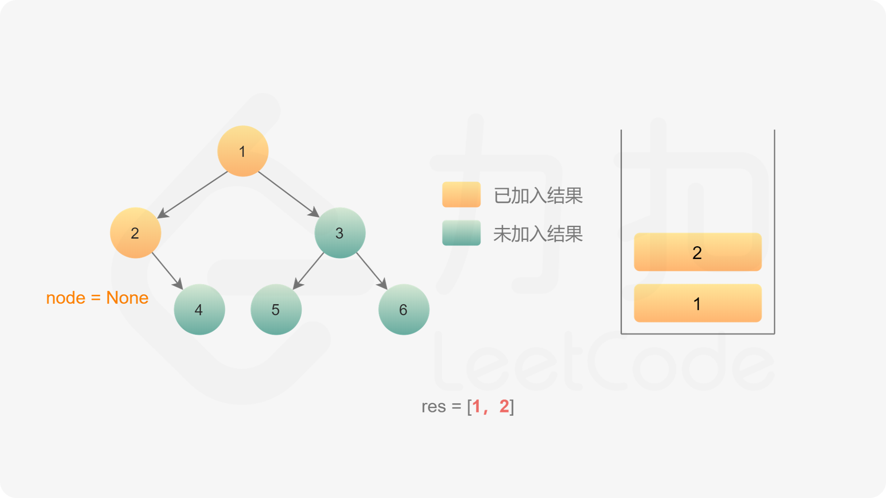
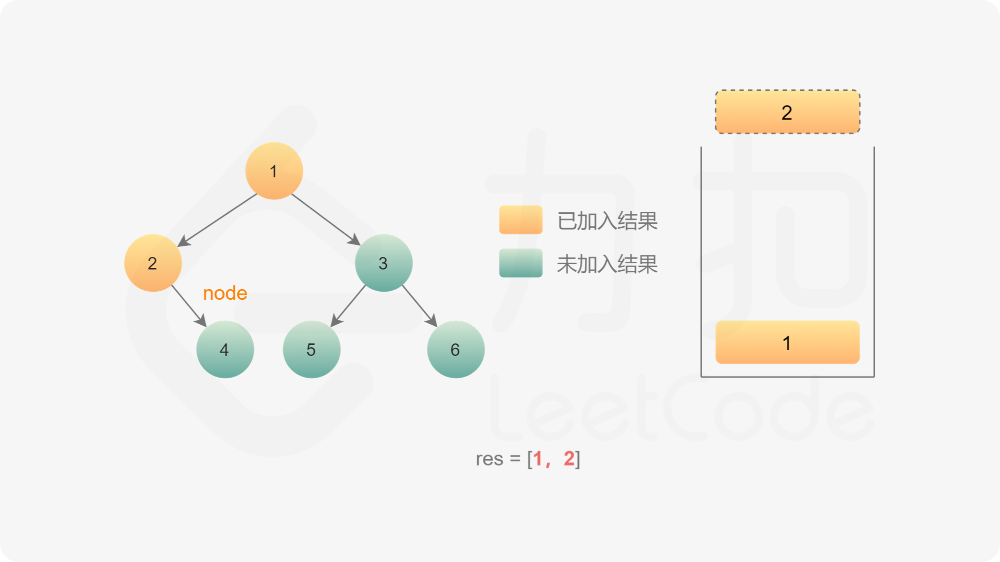
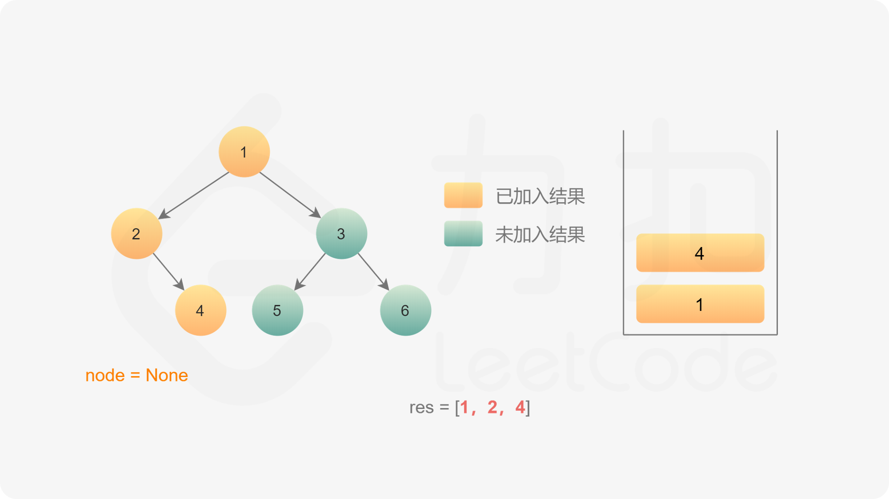
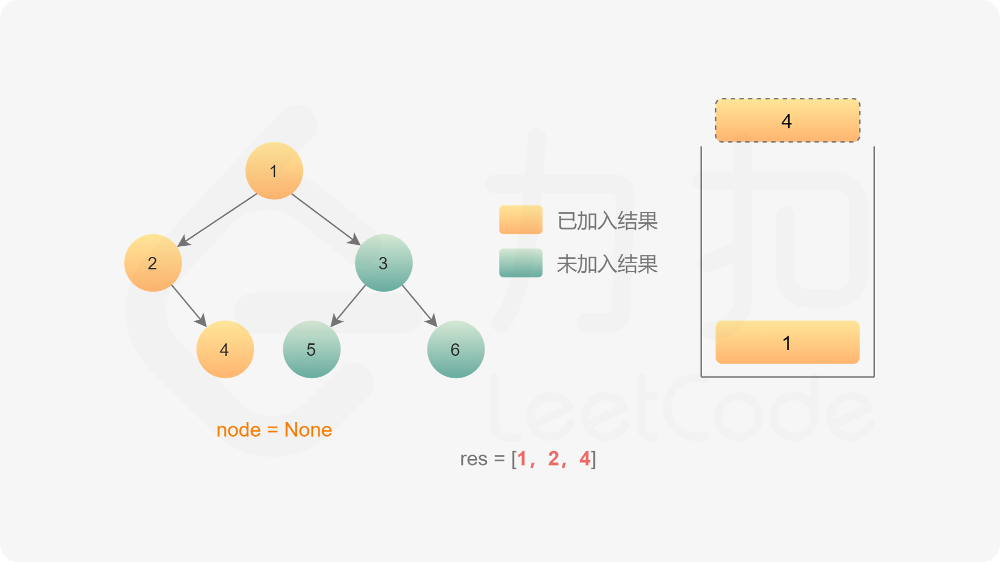
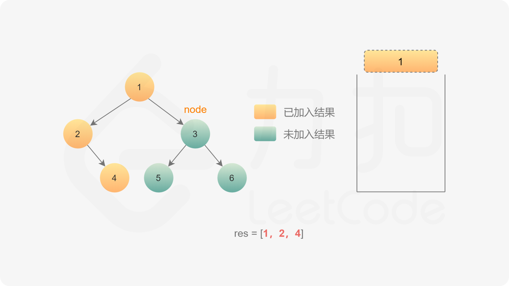
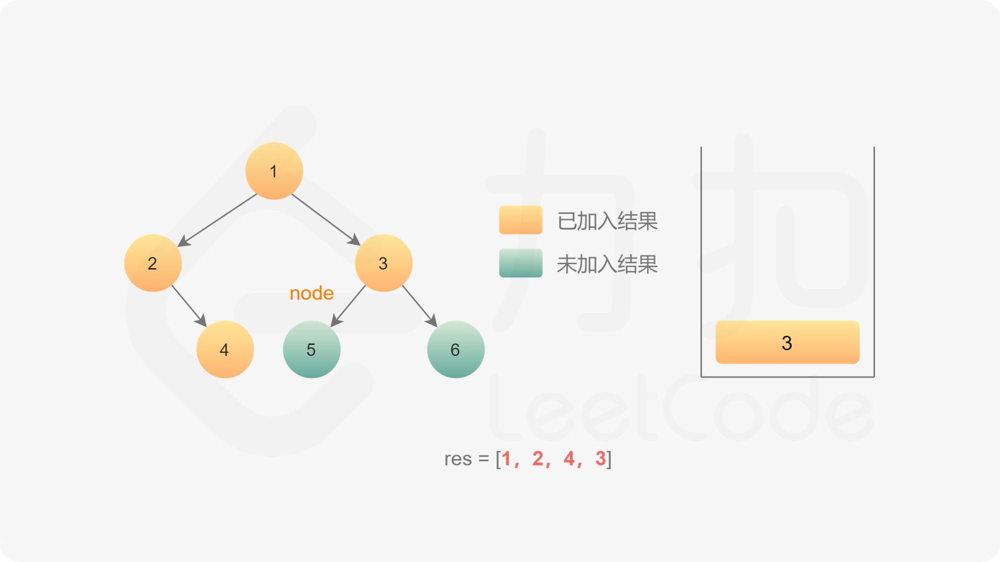
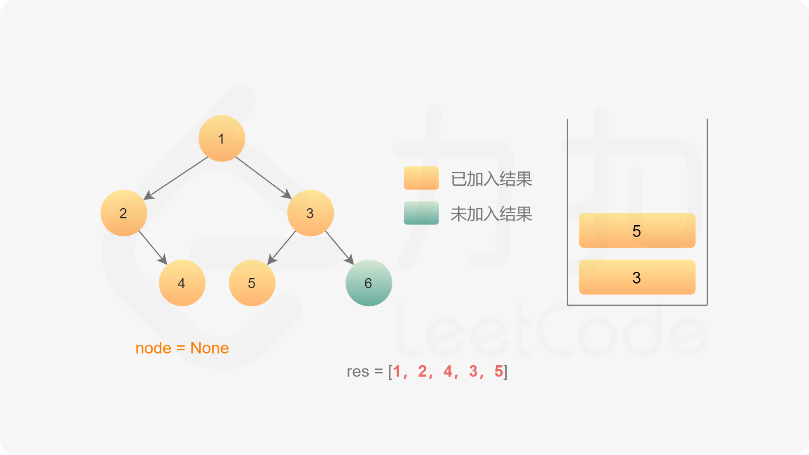
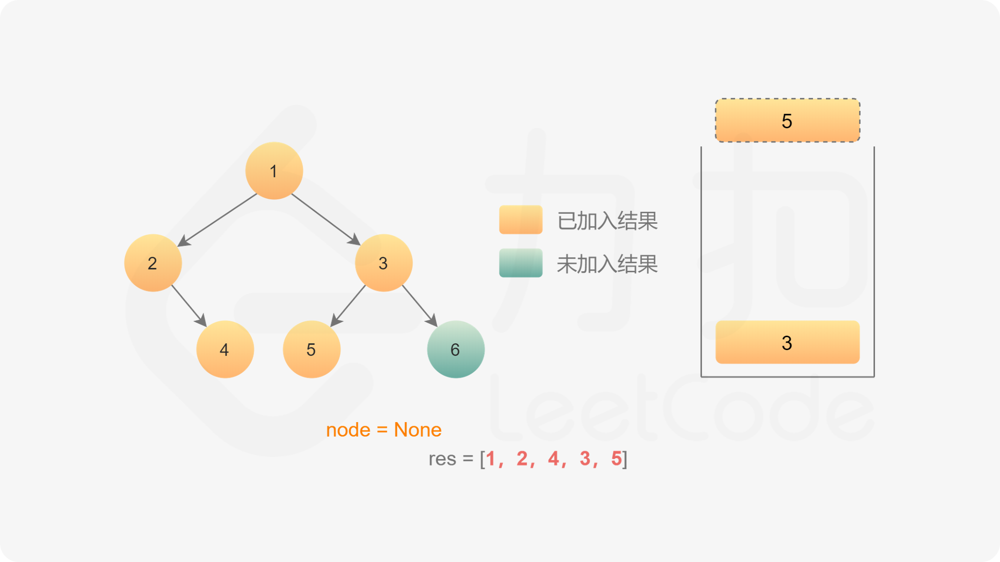
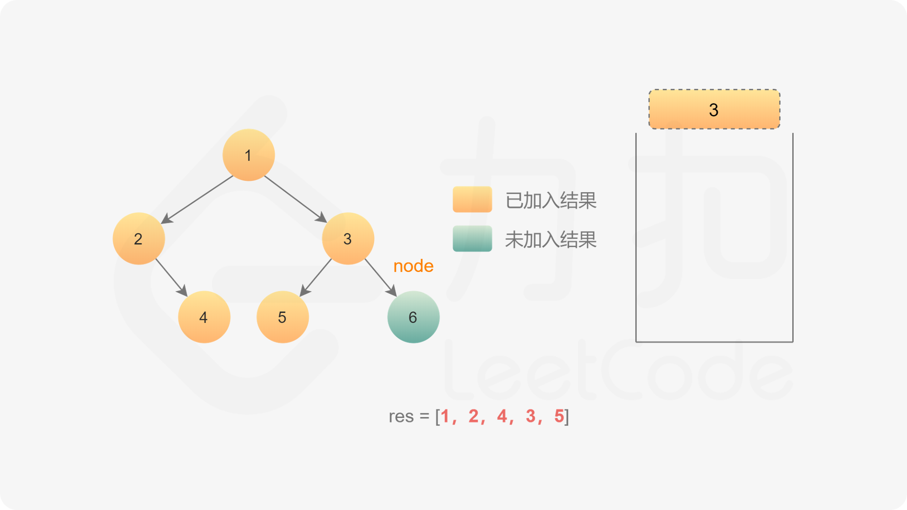
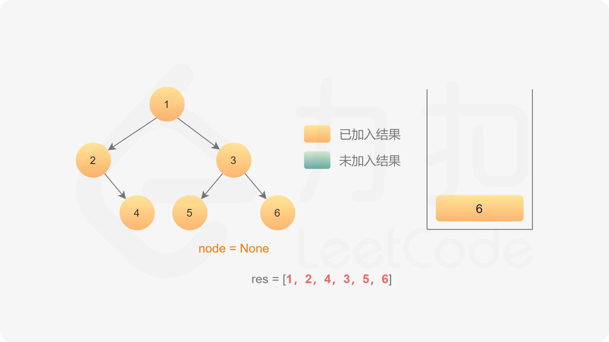
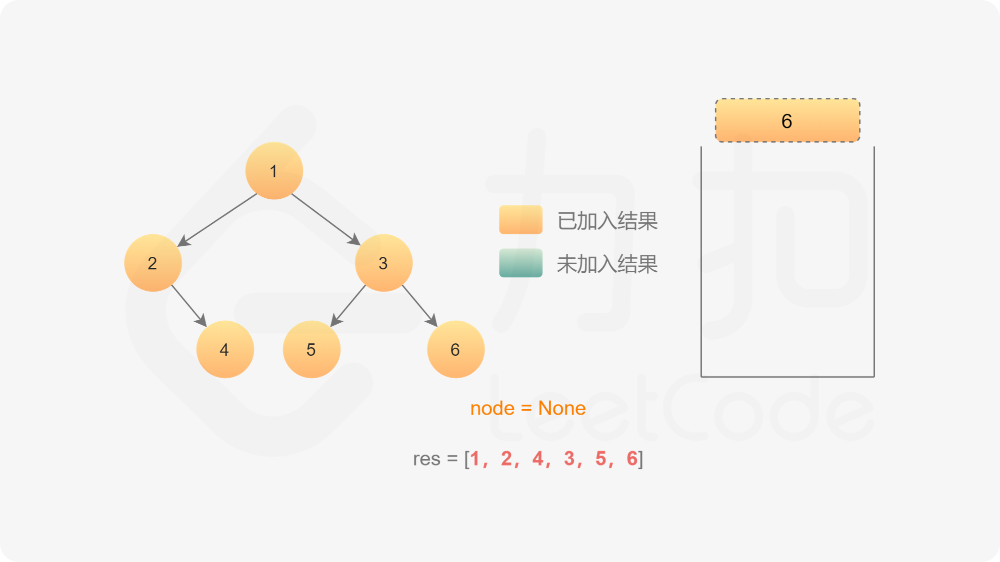
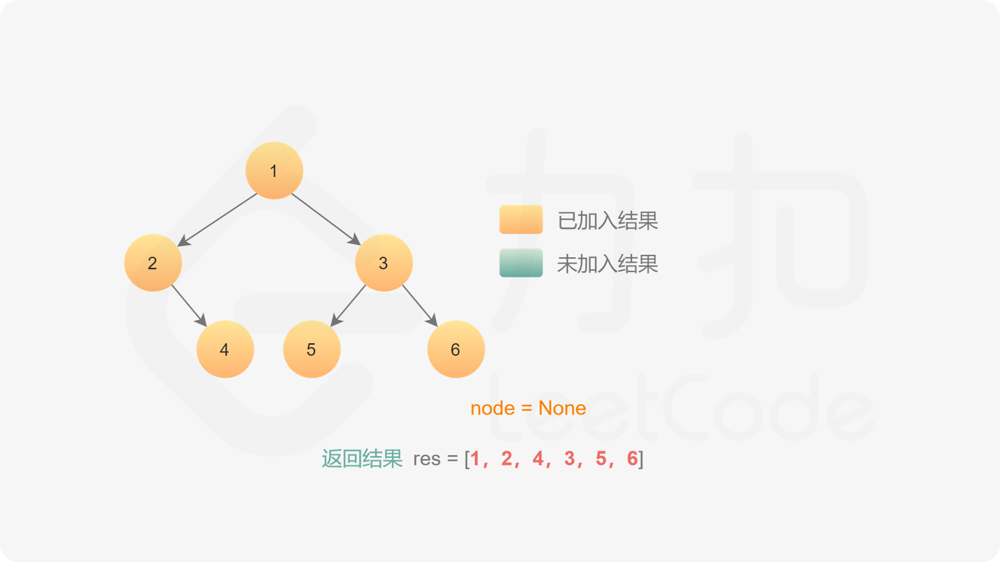

**代码**

```C++
class Solution {
public:
    vector<int> preorderTraversal(TreeNode* root) {
        vector<int> res;
        if (root == nullptr) {
            return res;
        }

        stack<TreeNode*> stk;
        TreeNode* node = root;
        while (!stk.empty() || node != nullptr) {
            while (node != nullptr) {
                res.emplace_back(node->val);
                stk.emplace(node);
                node = node->left;
            }
            node = stk.top();
            stk.pop();
            node = node->right;
        }
        return res;
    }
};
```

```Java
class Solution {
    public List<Integer> preorderTraversal(TreeNode root) {
        List<Integer> res = new ArrayList<Integer>();
        if (root == null) {
            return res;
        }

        Deque<TreeNode> stack = new LinkedList<TreeNode>();
        TreeNode node = root;
        while (!stack.isEmpty() || node != null) {
            while (node != null) {
                res.add(node.val);
                stack.push(node);
                node = node.left;
            }
            node = stack.pop();
            node = node.right;
        }
        return res;
    }
}
```

```Python3
class Solution:
    def preorderTraversal(self, root: TreeNode) -> List[int]:
        res = list()
        if not root:
            return res
        
        stack = []
        node = root
        while stack or node:
            while node:
                res.append(node.val)
                stack.append(node)
                node = node.left
            node = stack.pop()
            node = node.right
        return res
```

```Golang
func preorderTraversal(root *TreeNode) (vals []int) {
    stack := []*TreeNode{}
    node := root
    for node != nil || len(stack) > 0 {
        for node != nil {
            vals = append(vals, node.Val)
            stack = append(stack, node)
            node = node.Left
        }
        node = stack[len(stack)-1].Right
        stack = stack[:len(stack)-1]
    }
    return
}
```

```C
int* preorderTraversal(struct TreeNode* root, int* returnSize) {
    int* res = malloc(sizeof(int) * 2000);
    *returnSize = 0;
    if (root == NULL) {
        return res;
    }

    struct TreeNode* stk[2000];
    struct TreeNode* node = root;
    int stk_top = 0;
    while (stk_top > 0 || node != NULL) {
        while (node != NULL) {
            res[(*returnSize)++] = node->val;
            stk[stk_top++] = node;
            node = node->left;
        }
        node = stk[--stk_top];
        node = node->right;
    }
    return res;
}
```

**复杂度分析**

-   时间复杂度：O(n)，其中 n 是二叉树的节点数。每一个节点恰好被遍历一次。
-   空间复杂度：O(n)，为迭代过程中显式栈的开销，平均情况下为 O(log⁡n)，最坏情况下树呈现链状，为 O(n)。
