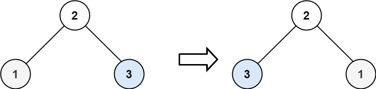

#### [226\. 翻转二叉树](https://leetcode.cn/problems/invert-binary-tree/)

难度：简单

给你一棵二叉树的根节点 `root` ，翻转这棵二叉树，并返回其根节点。

**示例 1：**


```
输入：root = [4,2,7,1,3,6,9]
输出：[4,7,2,9,6,3,1]

```

**示例 2：**



```
输入：root = [2,1,3]
输出：[2,3,1]

```

**示例 3：**

```
输入：root = []
输出：[]

```

**提示：**

-   树中节点数目范围在 `[0, 100]` 内
-   `-100 <= Node.val <= 100`
