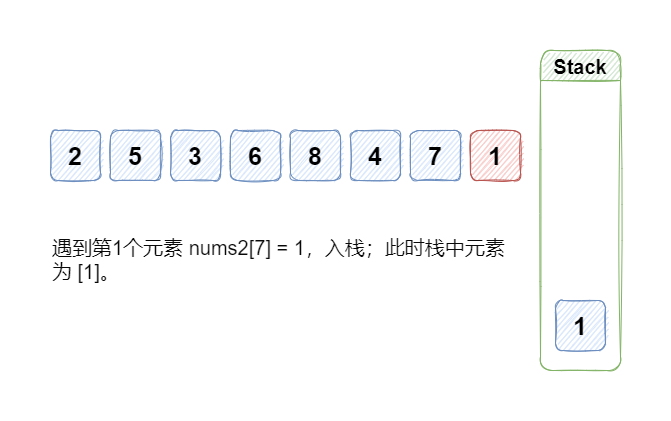
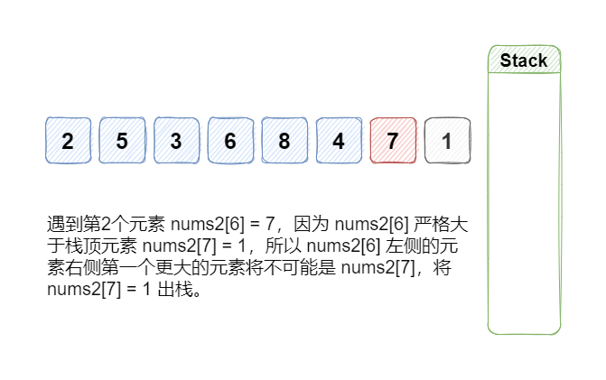
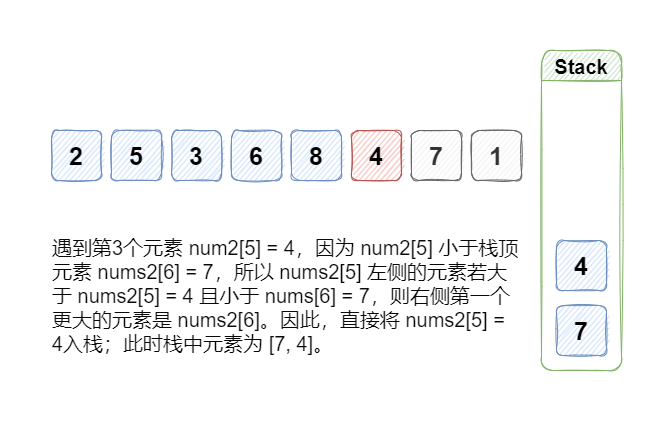
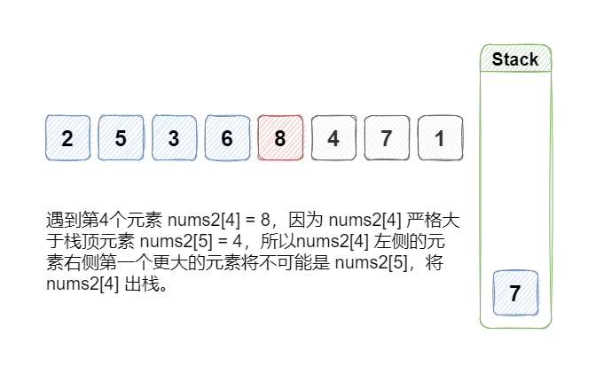
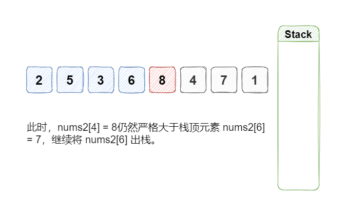
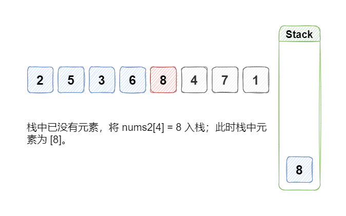
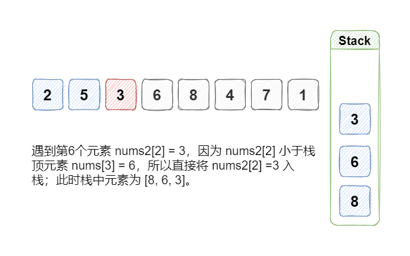
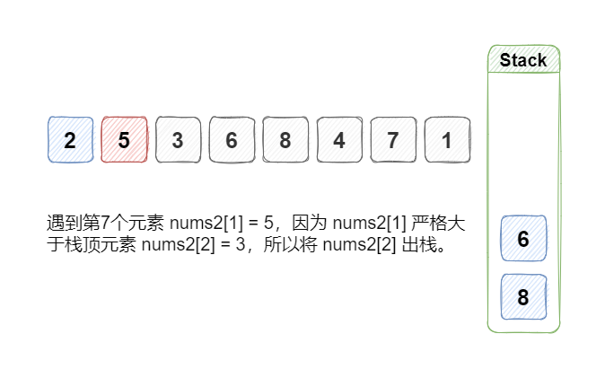
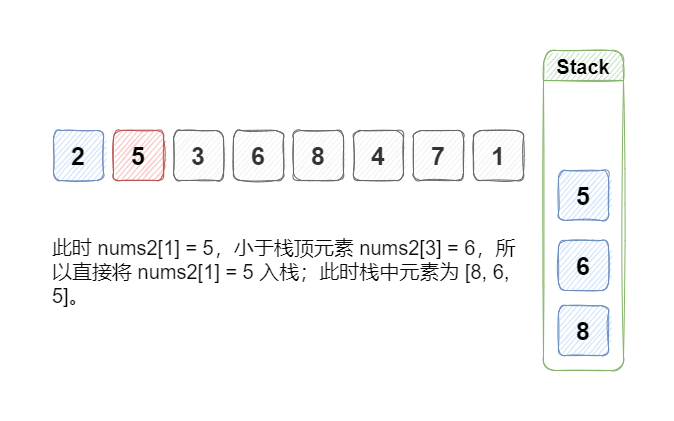
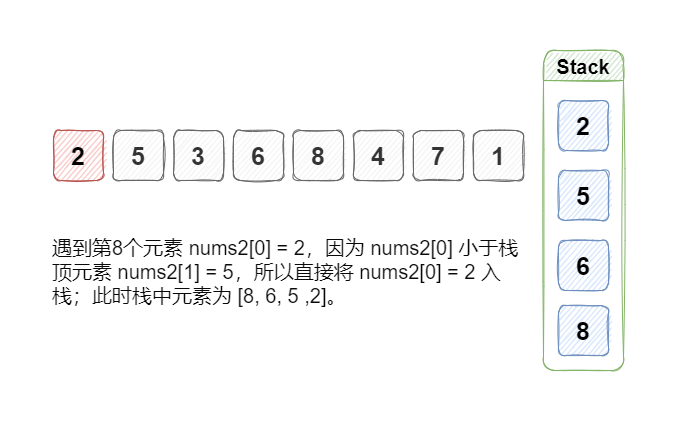

#### 方法二：单调栈 + 哈希表

**思路**

我们可以先预处理 nums2，使查询 nums1 中的每个元素在 nums2 中对应位置的右边的第一个更大的元素值时不需要再遍历 nums2。于是，我们将题目分解为两个子问题：

-   第 1 个子问题：如何更高效地计算 nums2 中每个元素右边的第一个更大的值；
-   第 2 个子问题：如何存储第 1 个子问题的结果。
    

**算法**

我们可以使用单调栈来解决第 1 个子问题。倒序遍历 nums2，并用单调栈中维护当前位置右边的更大的元素列表，从栈底到栈顶的元素是单调递减的。

具体地，每次我们移动到数组中一个新的位置 i，就将当前单调栈中所有小于 nums2\[i\] 的元素弹出单调栈，当前位置右边的第一个更大的元素即为栈顶元素，如果栈为空则说明当前位置右边没有更大的元素。随后我们将位置 iii 的元素入栈。

可以结合以下例子来理解。















因为题目规定了 nums2 是没有重复元素的，所以我们可以使用哈希表来解决第 2 个子问题，将元素值与其右边第一个更大的元素值的对应关系存入哈希表。

**细节**

因为在这道题中我们只需要用到 nums2 中元素的顺序而不需要用到下标，所以栈中直接存储 nums2 中元素的值即可。

**代码**

```Python
class Solution:
    def nextGreaterElement(self, nums1: List[int], nums2: List[int]) -> List[int]:
        res = {}
        stack = []
        for num in reversed(nums2):
            while stack and num >= stack[-1]:
                stack.pop()
            res[num] = stack[-1] if stack else -1
            stack.append(num)
        return [res[num] for num in nums1]
```

```Java
class Solution {
    public int[] nextGreaterElement(int[] nums1, int[] nums2) {
        Map<Integer, Integer> map = new HashMap<Integer, Integer>();
        Deque<Integer> stack = new ArrayDeque<Integer>();
        for (int i = nums2.length - 1; i >= 0; --i) {
            int num = nums2[i];
            while (!stack.isEmpty() && num >= stack.peek()) {
                stack.pop();
            }
            map.put(num, stack.isEmpty() ? -1 : stack.peek());
            stack.push(num);
        }
        int[] res = new int[nums1.length];
        for (int i = 0; i < nums1.length; ++i) {
            res[i] = map.get(nums1[i]);
        }
        return res;
    }
}
```

```C#
public class Solution {
    public int[] NextGreaterElement(int[] nums1, int[] nums2) {
        Dictionary<int, int> dictionary = new Dictionary<int, int>();
        Stack<int> stack = new Stack<int>();
        for (int i = nums2.Length - 1; i >= 0; --i) {
            int num = nums2[i];
            while (stack.Count > 0 && num >= stack.Peek()) {
                stack.Pop();
            }
            dictionary.Add(num, stack.Count > 0 ? stack.Peek() : -1);
            stack.Push(num);
        }
        int[] res = new int[nums1.Length];
        for (int i = 0; i < nums1.Length; ++i) {
            res[i] = dictionary[nums1[i]];
        }
        return res;
    }
}
```

```C++
class Solution {
public:
    vector<int> nextGreaterElement(vector<int>& nums1, vector<int>& nums2) {
        unordered_map<int,int> hashmap;
        stack<int> st;
        for (int i = nums2.size() - 1; i >= 0; --i) {
            int num = nums2[i];
            while (!st.empty() && num >= st.top()) {
                st.pop();
            }
            hashmap[num] = st.empty() ? -1 : st.top();
            st.push(num);
        }
        vector<int> res(nums1.size());
        for (int i = 0; i < nums1.size(); ++i) {
            res[i] = hashmap[nums1[i]];
        }
        return res;
    }
};
```

```JavaScript
var nextGreaterElement = function(nums1, nums2) {
    const map = new Map();
    const stack = [];
    for (let i = nums2.length - 1; i >= 0; --i) {
        const num = nums2[i];
        while (stack.length && num >= stack[stack.length - 1]) {
            stack.pop();
        }
        map.set(num, stack.length ? stack[stack.length - 1] : -1);
        stack.push(num);
    }
    const res = new Array(nums1.length).fill(0).map((_, i) => map.get(nums1[i]));
    return res;
};
```

```Go
func nextGreaterElement(nums1, nums2 []int) []int {
    mp := map[int]int{}
    stack := []int{}
    for i := len(nums2) - 1; i >= 0; i-- {
        num := nums2[i]
        for len(stack) > 0 && num >= stack[len(stack)-1] {
            stack = stack[:len(stack)-1]
        }
        if len(stack) > 0 {
            mp[num] = stack[len(stack)-1]
        } else {
            mp[num] = -1
        }
        stack = append(stack, num)
    }
    res := make([]int, len(nums1))
    for i, num := range nums1 {
        res[i] = mp[num]
    }
    return res
}
```

**复杂度分析**

-   时间复杂度：O(m+n)，其中 m 是 nums1 的长度，n 是 nums2 的长度。我们需要遍历 nums2 以计算 nums2 中每个元素右边的第一个更大的值；需要遍历 nums1 以生成查询结果。
-   空间复杂度：O(n)，用于存储哈希表。
