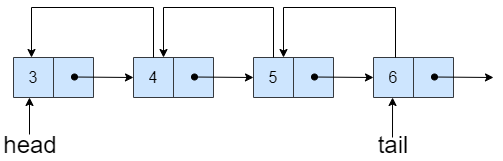

#### 方法二：链表

我们同样可以使用双向链表来模拟双端队列，实现双端队列队首与队尾元素的添加、删除。双向链表实现比较简单，双向链表支持 O(1)O(1)O(1) 时间复杂度内在指定节点的前后插入新的节点或者删除新的节点。



循环双端队列的属性如下:

-   head：队列的头节点；
-   tail：队列的尾节点
-   capacity：队列的容量大小。
-   size：队列当前的元素数量。

循环双端队列的接口方法如下：

-   MyCircularDeque：初始化队列，同时初始化队列元素数量 size 为 0。head,tail 初始化为空。
-   insertFront(int value)：队列未满时，在队首头结点 head 之前插入一个新的节点，并更新 head，并更新 size。
-   insertLast(int value)：队列未满时，在队w尾节点 tail 之后插入一个新的节点，并更新 tail，并更新 size。
-   deleteFront()：队列不为空时，删除头结点 head，并更新 head 为 head 的后一个节点，并更新 size。
-   deleteLast()：队列不为空时，删除尾结点 tail，并更新 tail 为 tail 的前一个节点，并更新 size。
-   getFront()：返回队首节点指向的值，需要检测队列是否为空。
-   getRear()：返回队尾节点指向的值，需要检测队列是否为空。
-   isEmpty()：检测当前 size 是否为 0。
-   isFull()：检测当前 size 是否为 capacity。

```Python
class Node:
    __slots__ = 'prev', 'next', 'val'

    def __init__(self, val):
        self.prev = self.next = None
        self.val = val


class MyCircularDeque:
    def __init__(self, k: int):
        self.head = self.tail = None
        self.capacity = k
        self.size = 0

    def insertFront(self, value: int) -> bool:
        if self.isFull():
            return False
        node = Node(value)
        if self.isEmpty():
            self.head = node
            self.tail = node
        else:
            node.next = self.head
            self.head.prev = node
            self.head = node
        self.size += 1
        return True

    def insertLast(self, value: int) -> bool:
        if self.isFull():
            return False
        node = Node(value)
        if self.isEmpty():
            self.head = node
            self.tail = node
        else:
            self.tail.next = node
            node.prev = self.tail
            self.tail = node
        self.size += 1
        return True

    def deleteFront(self) -> bool:
        if self.isEmpty():
            return False
        self.head = self.head.next
        if self.head:
            self.head.prev = None
        self.size -= 1
        return True

    def deleteLast(self) -> bool:
        if self.isEmpty():
            return False
        self.tail = self.tail.prev
        if self.tail:
            self.tail.next = None
        self.size -= 1
        return True

    def getFront(self) -> int:
        return -1 if self.isEmpty() else self.head.val

    def getRear(self) -> int:
        return -1 if self.isEmpty() else self.tail.val

    def isEmpty(self) -> bool:
        return self.size == 0

    def isFull(self) -> bool:
        return self.size == self.capacity
```

```C++
struct DLinkListNode {
    int val;
    DLinkListNode *prev, *next;
    DLinkListNode(int _val): val(_val), prev(nullptr), next(nullptr) {

    }
};

class MyCircularDeque {
private:
    DLinkListNode *head, *tail;
    int capacity;
    int size;

public:
    MyCircularDeque(int k): capacity(k), size(0), head(nullptr), tail(nullptr) {
        
    }

    bool insertFront(int value) {
        if (size == capacity) {
            return false;
        }
        DLinkListNode *node = new DLinkListNode(value);
        if (size == 0) {
            head = tail = node;
        } else {
            node->next = head;
            head->prev = node;
            head = node;
        }
        size++;
        return true;
    }

    bool insertLast(int value) {
        if (size == capacity) {
            return false;
        }
        DLinkListNode *node = new DLinkListNode(value);
        if (size == 0) {
            head = tail = node;
        } else {
            tail->next = node;
            node->prev = tail;
            tail = node;
        }
        size++;
        return true;
    }

    bool deleteFront() {
        if (size == 0) {
            return false;
        }
        DLinkListNode *node = head;
        head = head->next;
        if (head) {
            head->prev = nullptr;
        }
        delete node;
        size--;
        return true;
    }

    bool deleteLast() {
        if (size == 0) {
            return false;
        }
        DLinkListNode *node = tail;
        tail = tail->prev;
        if (tail) {
            tail->next = nullptr;
        }
        delete node;
        size--;
        return true;
    }

    int getFront() {
        if (size == 0) {
            return -1;
        }
        return head->val;
    }

    int getRear() {
        if (size == 0) {
            return -1;
        }
        return tail->val;
    }

    bool isEmpty() {
        return size == 0;
    }

    bool isFull() {
        return size == capacity;
    }
};
```

```Java
class MyCircularDeque {
    private class DLinkListNode {
        int val;
        DLinkListNode prev, next;

        DLinkListNode(int val) {
            this.val = val;
        }
    }

    private DLinkListNode head, tail;
    private int capacity;
    private int size;

    public MyCircularDeque(int k) {
        capacity = k;
        size = 0;
    }

    public boolean insertFront(int value) {
        if (size == capacity) {
            return false;
        }
        DLinkListNode node = new DLinkListNode(value);
        if (size == 0) {
            head = tail = node;
        } else {
            node.next = head;
            head.prev = node;
            head = node;
        }
        size++;
        return true;
    }

    public boolean insertLast(int value) {
        if (size == capacity) {
            return false;
        }
        DLinkListNode node = new DLinkListNode(value);
        if (size == 0) {
            head = tail = node;
        } else {
            tail.next = node;
            node.prev = tail;
            tail = node;
        }
        size++;
        return true;
    }

    public boolean deleteFront() {
        if (size == 0) {
            return false;
        }
        head = head.next;
        if (head != null) {
            head.prev = null;
        }
        size--;
        return true;
    }

    public boolean deleteLast() {
        if (size == 0) {
            return false;
        }
        tail = tail.prev;
        if (tail != null) {
            tail.next = null;
        }
        size--;
        return true;
    }

    public int getFront() {
        if (size == 0) {
            return -1;
        }
        return head.val;
    }

    public int getRear() {
        if (size == 0) {
            return -1;
        }
        return tail.val;
    }

    public boolean isEmpty() {
        return size == 0;
    }

    public boolean isFull() {
        return size == capacity;
    }
}
```

```C#
public class MyCircularDeque {
    private class DLinkListNode {
        public int val;
        public DLinkListNode prev, next;

        public DLinkListNode(int val) {
            this.val = val;
        }
    }

    private DLinkListNode head, tail;
    private int capacity;
    private int size;

    public MyCircularDeque(int k) {
        capacity = k;
        size = 0;
    }

    public bool InsertFront(int value) {
        if (size == capacity) {
            return false;
        }
        DLinkListNode node = new DLinkListNode(value);
        if (size == 0) {
            head = tail = node;
        } else {
            node.next = head;
            head.prev = node;
            head = node;
        }
        size++;
        return true;
    }

    public bool InsertLast(int value) {
        if (size == capacity) {
            return false;
        }
        DLinkListNode node = new DLinkListNode(value);
        if (size == 0) {
            head = tail = node;
        } else {
            tail.next = node;
            node.prev = tail;
            tail = node;
        }
        size++;
        return true;
    }

    public bool DeleteFront() {
        if (size == 0) {
            return false;
        }
        head = head.next;
        if (head != null) {
            head.prev = null;
        }
        size--;
        return true;
    }

    public bool DeleteLast() {
        if (size == 0) {
            return false;
        }
        tail = tail.prev;
        if (tail != null) {
            tail.next = null;
        }
        size--;
        return true;
    }

    public int GetFront() {
        if (size == 0) {
            return -1;
        }
        return head.val;
    }

    public int GetRear() {
        if (size == 0) {
            return -1;
        }
        return tail.val;
    }

    public bool IsEmpty() {
        return size == 0;
    }

    public bool IsFull() {
        return size == capacity;
    }
}
```

```C
typedef struct DLinkListNode {
    int val;
    struct DLinkListNode *prev, *next;
} DLinkListNode;

typedef struct {
    DLinkListNode *head, *tail;
    int capacity;
    int size;
} MyCircularDeque;

DLinkListNode * dLinkListNodeCreat(int val) {
    DLinkListNode *obj = (DLinkListNode *)malloc(sizeof(DLinkListNode));
    obj->val = val;
    obj->prev = NULL;
    obj->next = NULL;
    return obj;
} 

MyCircularDeque* myCircularDequeCreate(int k) {
    MyCircularDeque *obj = (MyCircularDeque *)malloc(sizeof(MyCircularDeque));
    obj->capacity = k;
    obj->size = 0;
    obj->head = obj->tail = NULL;
    return obj;
}

bool myCircularDequeInsertFront(MyCircularDeque* obj, int value) {
    if (obj->size == obj->capacity) {
        return false;
    }
    DLinkListNode *node = dLinkListNodeCreat(value);
    if (obj->size == 0) {
        obj->head = obj->tail = node;
    } else {
        node->next = obj->head;
        obj->head->prev = node;
        obj->head = node;
    }
    obj->size++;
    return true;
}

bool myCircularDequeInsertLast(MyCircularDeque* obj, int value) {
    if (obj->size == obj->capacity) {
        return false;
    }
    DLinkListNode *node = dLinkListNodeCreat(value);
    if (obj->size == 0) {
        obj->head = obj->tail = node;
    } else {
        obj->tail->next = node;
        node->prev = obj->tail;
        obj->tail = node;
    }
    obj->size++;
    return true;
}

bool myCircularDequeDeleteFront(MyCircularDeque* obj) {
    if (obj->size == 0) {
        return false;
    }
    DLinkListNode *node = obj->head;
    obj->head = obj->head->next;
    if (obj->head) {
        obj->head->prev = NULL;
    }
    free(node);
    obj->size--;
    return true;
}

bool myCircularDequeDeleteLast(MyCircularDeque* obj) {
    if (obj->size == 0) {
        return false;
    }
    DLinkListNode *node = obj->tail;
    obj->tail = obj->tail->prev;
    if (obj->tail) {
        obj->tail->next = NULL;
    }
    free(node);
    obj->size--;
    return true;
}

int myCircularDequeGetFront(MyCircularDeque* obj) {
    if (obj->size == 0) {
        return -1;
    }
    return obj->head->val;
}

int myCircularDequeGetRear(MyCircularDeque* obj) {
    if (obj->size == 0) {
        return -1;
    }
    return obj->tail->val;
}

bool myCircularDequeIsEmpty(MyCircularDeque* obj) {
    return obj->size == 0;
}

bool myCircularDequeIsFull(MyCircularDeque* obj) {
    return obj->size == obj->capacity;
}

void myCircularDequeFree(MyCircularDeque* obj) {
    for (DLinkListNode *curr = obj->head; curr;) {
        DLinkListNode *node = curr;
        curr = curr->next;
        free(node);
    }
    free(obj);
}
```

```Go
type node struct {
    prev, next *node
    val        int
}

type MyCircularDeque struct {
    head, tail     *node
    capacity, size int
}

func Constructor(k int) MyCircularDeque {
    return MyCircularDeque{capacity: k}
}

func (q *MyCircularDeque) InsertFront(value int) bool {
    if q.IsFull() {
        return false
    }
    node := &node{val: value}
    if q.IsEmpty() {
        q.head = node
        q.tail = node
    } else {
        node.next = q.head
        q.head.prev = node
        q.head = node
    }
    q.size++
    return true
}

func (q *MyCircularDeque) InsertLast(value int) bool {
    if q.IsFull() {
        return false
    }
    node := &node{val: value}
    if q.IsEmpty() {
        q.head = node
        q.tail = node
    } else {
        q.tail.next = node
        node.prev = q.tail
        q.tail = node
    }
    q.size++
    return true
}

func (q *MyCircularDeque) DeleteFront() bool {
    if q.IsEmpty() {
        return false
    }
    q.head = q.head.next
    if q.head != nil {
        q.head.prev = nil
    }
    q.size--
    return true
}

func (q *MyCircularDeque) DeleteLast() bool {
    if q.IsEmpty() {
        return false
    }
    q.tail = q.tail.prev
    if q.tail != nil {
        q.tail.next = nil
    }
    q.size--
    return true
}

func (q MyCircularDeque) GetFront() int {
    if q.IsEmpty() {
        return -1
    }
    return q.head.val
}

func (q MyCircularDeque) GetRear() int {
    if q.IsEmpty() {
        return -1
    }
    return q.tail.val
}

func (q MyCircularDeque) IsEmpty() bool {
    return q.size == 0
}

func (q MyCircularDeque) IsFull() bool {
    return q.size == q.capacity
}
```

**复杂度分析**

-   时间复杂度：初始化和每项操作的时间复杂度均为 O(1)。
-   空间复杂度：O(k)，其中 k 为给定的队列元素数目。
