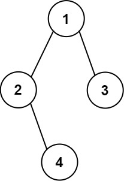

#### [655\. 输出二叉树](https://leetcode.cn/problems/print-binary-tree/)

难度中等144收藏分享切换为英文接收动态反馈

给你一棵二叉树的根节点 `root` ，请你构造一个下标从 **0** 开始、大小为 `m x n` 的字符串矩阵 `res` ，用以表示树的 **格式化布局** 。构造此格式化布局矩阵需要遵循以下规则：

-   树的 **高度** 为 `height` ，矩阵的行数 `m` 应该等于 `height + 1` 。
-   矩阵的列数 `n` 应该等于 `2^(height+1) - 1` 。
-   **根节点** 需要放置在 **顶行** 的 **正中间** ，对应位置为 `res[0][(n-1)/2]` 。
-   对于放置在矩阵中的每个节点，设对应位置为 `res[r][c]` ，将其左子节点放置在 `res[r+1][c-2^(height-r-1)]` ，右子节点放置在 `res[r+1][c+2^(height-r-1)]` 。
-   继续这一过程，直到树中的所有节点都妥善放置。
-   任意空单元格都应该包含空字符串 `""` 。

返回构造得到的矩阵 `res` 。

**示例 1：**


```
输入：root = [1,2]
输出：
[["","1",""],
 ["2","",""]]

```

**示例 2：**



```
输入：root = [1,2,3,null,4]
输出：
[["","","","1","","",""],
 ["","2","","","","3",""],
 ["","","4","","","",""]]

```

**提示：**

-   树中节点数在范围 `[1, 2^10]` 内
-   `-99 <= Node.val <= 99`
-   树的深度在范围 `[1, 10]` 内
