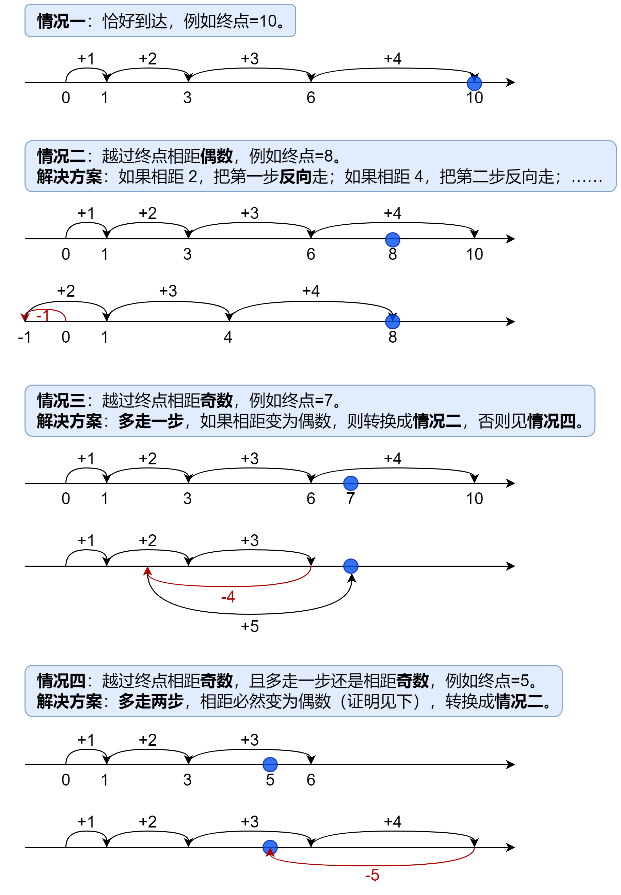

#### [分类讨论+详细证明+简洁写法+优化（Python/Java/C++/Go）](https://leetcode.cn/problems/reach-a-number/solutions/1947254/fen-lei-tao-lun-xiang-xi-zheng-ming-jian-sqj2/)

如果**不回头**地往终点走 nnn 步，并恰好能走到终点，那么答案就是 nnn。

如果无法恰好走到终点，就需要仔细讨论了：


#### 答疑

为方便描述，如果终点 target<0，根据对称性，可将其变为 −target，这不影响结果。
**问**：对于情况四，为什么多走两步一定可以把到终点的距离变为偶数？
**答**：此时相距为奇数，多走两步，奇数再加上两个相邻数字（必定一偶一奇），即奇数+偶数+奇数，可以得到偶数。

**问**：为什么相距为偶数时，一定可以通过把**某些**步反向，恰好到达终点？
**答**：设走了 n 步后，步长之和 $s=1+2+⋯+n=\frac{n(n+1)}{2}$。这里需要一个小结论：[1,s]内的每个数字都可以由若干个不同的 [1,n] 内的数组成。证明：n=1,2时显然。假设n=k(k≥2)时结论成立，此时已经得到了[1,s]内的每个数字（这里$s=\frac{k(k+1)}{2}$），我们可以用 [s−k,s] 内的数字加上 k+1，从而得到 [s+1,s+k+1] 内的每个数字，即得到了 [1,s+k+1] 内的每个数字，即证明了当 n=k+1 时结论也成立。根据数学归纳法，原结论成立。由于相距 d=s−target<s，根据结论，在 d 为偶数时，一定可以选择某些步，满足这些步长的和为 $\frac{d}{2}$，将这些步反向，就能恰好到达终点。

**问**：为什么按图中的方法，走的步数一定是最小的？
**答**：将原问题转换成一个等价问题「先一直往终点走，然后选择某些步反向，所需要的最小步数」，然后在该问题上讨论。情况一二可以用反证法，不走 n 步根本无法到达终点（这里第 n 步恰好到达或越过终点）。情况三四，由于反向操作只能将 s 减少偶数，无法处理相距奇数的情况，必须多走一两步，将相距变为偶数，才能处理。

代码实现时，我们可以不断循环，累加当前步长 n，当到达（越过）终点且相距偶数时停止。最后一步的步长即为答案。

```Python
class Solution:
    def reachNumber(self, target: int) -> int:
        target = abs(target)
        s = n = 0
        while s < target or (s - target) % 2:  # 没有到达（越过）终点，或者相距奇数
            n += 1
            s += n
        return n
```

```Java
class Solution {
    public int reachNumber(int target) {
        target = Math.abs(target);
        int s = 0, n = 0;
        while (s < target || (s - target) % 2 == 1) // 没有到达（越过）终点，或者相距奇数
            s += ++n;
        return n;
    }
}
```

```C++
class Solution {
public:
    int reachNumber(int target) {
        target = abs(target);
        int s = 0, n = 0;
        while (s < target || (s - target) % 2) // 没有到达（越过）终点，或者相距奇数
            s += ++n;
        return n;
    }
};
```

```Go
func reachNumber(target int) (n int) {
    if target < 0 {
        target = -target
    }
    s := 0
    for s < target || (s-target)%2 == 1 { // 没有到达（越过）终点，或者相距奇数
        n++
        s += n
    }
    return
}
```

#### 复杂度分析

-   时间复杂度：O(∣target∣)。
-   空间复杂度：O(1)，仅用到若干变量。

#### 优化

进一步地，由于 n 是最小的满足 $\frac{n(n+1)}{2} \ge \vert target\vert$ 的 n，解得
$n=\lceil \frac{-1+8 \times \vert target \vert + 1}{2} \rceil$

这样可以省去循环判断。

情况三四也可以进一步讨论：
-   如果是情况三，说明下一步 n+1 是奇数，即 n 为偶数，此时答案为 n+1；
-   如果是情况四，说明下一步 n+1 是偶数，即 n 为奇数，此时答案为 n+2。

因此情况三四可以合并为一个公式：
$n+1+(n mod 2)$

```Python
class Solution:
    def reachNumber(self, target: int) -> int:
        target = abs(target)
        n = ceil((-1 + (8 * target + 1) ** 0.5) / 2)
        return n if (n * (n + 1) // 2 - target) % 2 == 0 else n + 1 + n % 2
```

```Java
class Solution {
    public int reachNumber(int target) {
        target = Math.abs(target);
        int n = (int) Math.ceil((-1 + Math.sqrt(8L * target + 1)) / 2); // 注意 8*target 会超过 int 范围
        return (n * (n + 1) / 2 - target) % 2 == 0 ? n : n + 1 + n % 2;
    }
}
```

```C++
class Solution {
public:
    int reachNumber(int target) {
        target = abs(target);
        int n = ceil((-1 + sqrt(8L * target + 1)) / 2); // 注意 8*target 会超过 int 范围
        return (n * (n + 1) / 2 - target) % 2 == 0 ? n : n + 1 + n % 2;
    }
};
```

```Go
func reachNumber(target int) int {
    if target < 0 {
        target = -target
    }
    n := int(math.Ceil((-1 + math.Sqrt(float64(8*target+1))) / 2))
    if (n*(n+1)/2-target)%2 == 0 {
        return n
    }
    return n + 1 + n%2
}
```

#### 复杂度分析

-   时间复杂度：O(1)。
-   空间复杂度：O(1)，仅用到若干变量。
