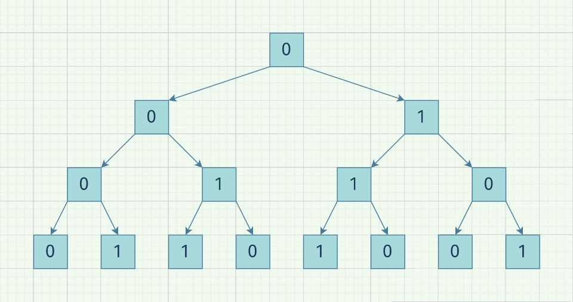

#### [](https://leetcode.cn/problems/k-th-symbol-in-grammar/solution/nao-jin-ji-zhuan-wan-by-heren1229-nvf5//#思路)思路

先做出前几行的图看一看，可以生成如下一棵**满二叉树**  
  
可以看出，某一个位置是1还是0，**只取决于它的父亲以及它是left还是right**。假如是左孩子，就与父亲相同；否则与父亲相反。所以，我们要判断某一个位置，**就要先求它的父亲**，然后**根据位置判断是否取反**即可。  
可以采用**递归**：如果是第一层，直接返回0，否则求它的父亲。`(n,k)`的父亲的位置，就是`(n-1,(k+1)/2)`，第二个参数代表k/2**向上取整**。而某个位置是左孩子还是右孩子，可以判断**k是否为奇数**，如果是奇数，就是左孩子，那就应该与父亲相同，否则相反。这可以通过**异或**实现。如果是奇数，`k%2==1`，否则`k%2==0`，而**0异或一个数不改变值**，所以我们将`k%2`取反再与父亲异或即可。

#### [](https://leetcode.cn/problems/k-th-symbol-in-grammar/solution/nao-jin-ji-zhuan-wan-by-heren1229-nvf5//#代码)代码

```C++
class Solution {
public:
    int kthGrammar(int n, int k) {
        return n==1?0:(!(k%2))^kthGrammar(n-1,(k+1)/2);
    }
};
```
