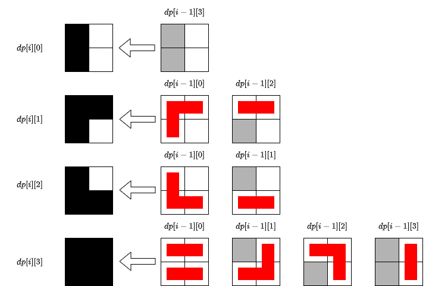

#### [方法一：动态规划](https://leetcode.cn/problems/domino-and-tromino-tiling/solutions/1962465/duo-mi-nuo-he-tuo-mi-nuo-ping-pu-by-leet-7n0j/)

考虑这么一种平铺的方式：在第 i 列前面的正方形都被瓷砖覆盖，在第 i 列后面的正方形都没有被瓷砖覆盖（i 从 1 开始计数）。那么第 i 列的正方形有四种被覆盖的情况：
-   一个正方形都没有被覆盖，记为状态 0；
-   只有上方的正方形被覆盖，记为状态 1；
-   只有下方的正方形被覆盖，记为状态 2；
-   上下两个正方形都被覆盖，记为状态 3。

使用 dp[i][s] 表示平铺到第 i 列时，各个状态 s 对应的平铺方法数量。考虑第 i−1 列和第 i 列正方形，它们之间的状态转移如下图（红色条表示新铺的瓷砖）：



初始时 $dp[0][0] = 0, dp[0][1] = 0, dp[0][2] = 0, dp[0][3] = 1$，对应的状态转移方程（$i \gt 0$）为：
$dp[i][0]=dp[i−1][3]$
$dp[i][1]=dp[i−1][0]+dp[i−1][2]$
$dp[i][2]=dp[i−1][0]+dp[i−1][1]$
$dp[i][3]=dp[i−1][0]+dp[i−1][1]+dp[i−1][2]+dp[i−1][3]$

最后平铺到第 n 列时，上下两个正方形都被覆盖的状态 dp[n][3] 对应的平铺方法数量就是总平铺方法数量。

```python
class Solution:
    def numTilings(self, n: int) -> int:
        MOD = 10 ** 9 + 7
        dp = [[0] * 4 for _ in range(n + 1)]
        dp[0][3] = 1
        for i in range(1, n + 1):
            dp[i][0] = dp[i - 1][3]
            dp[i][1] = (dp[i - 1][0] + dp[i - 1][2]) % MOD
            dp[i][2] = (dp[i - 1][0] + dp[i - 1][1]) % MOD
            dp[i][3] = (((dp[i - 1][0] + dp[i - 1][1]) % MOD + dp[i - 1][2]) % MOD + dp[i - 1][3]) % MOD
        return dp[n][3]
```

```cpp
const long long mod = 1e9 + 7;
class Solution {
public:
    int numTilings(int n) {
        vector<vector<long long>> dp(n + 1, vector<long long>(4));
        dp[0][3] = 1;
        for (int i = 1; i <= n; i++) {
            dp[i][0] = dp[i - 1][3];
            dp[i][1] = (dp[i - 1][0] + dp[i - 1][2]) % mod;
            dp[i][2] = (dp[i - 1][0] + dp[i - 1][1]) % mod;
            dp[i][3] = (dp[i - 1][0] + dp[i - 1][1] + dp[i - 1][2] + dp[i - 1][3]) % mod;
        }
        return dp[n][3];
    }
};
```

```java
class Solution {
    static final int MOD = 1000000007;

    public int numTilings(int n) {
        int[][] dp = new int[n + 1][4];
        dp[0][3] = 1;
        for (int i = 1; i <= n; i++) {
            dp[i][0] = dp[i - 1][3];
            dp[i][1] = (dp[i - 1][0] + dp[i - 1][2]) % MOD;
            dp[i][2] = (dp[i - 1][0] + dp[i - 1][1]) % MOD;
            dp[i][3] = (((dp[i - 1][0] + dp[i - 1][1]) % MOD + dp[i - 1][2]) % MOD + dp[i - 1][3]) % MOD;
        }
        return dp[n][3];
    }
}
```

```c#
public class Solution {
    const int MOD = 1000000007;

    public int NumTilings(int n) {
        int[][] dp = new int[n + 1][];
        for (int i = 0; i <= n; i++) {
            dp[i] = new int[4];
        }
        dp[0][3] = 1;
        for (int i = 1; i <= n; i++) {
            dp[i][0] = dp[i - 1][3];
            dp[i][1] = (dp[i - 1][0] + dp[i - 1][2]) % MOD;
            dp[i][2] = (dp[i - 1][0] + dp[i - 1][1]) % MOD;
            dp[i][3] = (((dp[i - 1][0] + dp[i - 1][1]) % MOD + dp[i - 1][2]) % MOD + dp[i - 1][3]) % MOD;
        }
        return dp[n][3];
    }
}
```

```javascript
var numTilings = function(n) {
    const mod = 1e9 + 7;
    const dp = new Array(n + 1).fill(0).map(() => new Array(4).fill(0));
    dp[0][3] = 1;
    for (let i = 1; i <= n; i++) {
        dp[i][0] = dp[i - 1][3];
        dp[i][1] = (dp[i - 1][0] + dp[i - 1][2]) % mod;
        dp[i][2] = (dp[i - 1][0] + dp[i - 1][1]) % mod;
        dp[i][3] = (dp[i - 1][0] + dp[i - 1][1] + dp[i - 1][2] + dp[i - 1][3]) % mod;
    }
    return dp[n][3];
};
```

```c
const long long mod = 1e9 + 7;

int numTilings(int n) {
    long long dp[n + 1][4];
    memset(dp, 0, sizeof(dp));
    dp[0][3] = 1;
    for (int i = 1; i <= n; i++) {
        dp[i][0] = dp[i - 1][3];
        dp[i][1] = (dp[i - 1][0] + dp[i - 1][2]) % mod;
        dp[i][2] = (dp[i - 1][0] + dp[i - 1][1]) % mod;
        dp[i][3] = (dp[i - 1][0] + dp[i - 1][1] + dp[i - 1][2] + dp[i - 1][3]) % mod;
    }
    return dp[n][3];
}
```

```go
func numTilings(n int) int {
    const mod int = 1e9 + 7
    dp := make([][4]int, n+1)
    dp[0][3] = 1
    for i := 1; i <= n; i++ {
        dp[i][0] = dp[i-1][3]
        dp[i][1] = (dp[i-1][0] + dp[i-1][2]) % mod
        dp[i][2] = (dp[i-1][0] + dp[i-1][1]) % mod
        dp[i][3] = (((dp[i-1][0]+dp[i-1][1])%mod+dp[i-1][2])%mod + dp[i-1][3]) % mod
    }
    return dp[n][3]
}
```

**复杂度分析**

-   时间复杂度：O(n)，其中 n 是总列数。
-   空间复杂度：O(n)。保存 dp 数组需要 O(n) 的空间。
