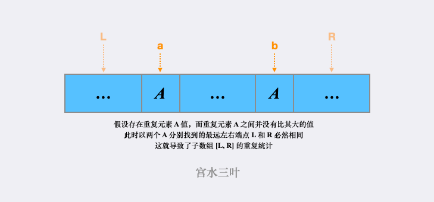

#### [单调栈](https://leetcode.cn/problems/number-of-subarrays-with-bounded-maximum/solutions/1988320/by-ac_oier-gmpt/)

为了方便，我们令 $[left, right]$ 为 $[a, b]$。

一个容易想到的思路是使用「单调栈」。

**统计所有最大值范围在 $[a, b]$ 之间的子数组个数，可等价为统计每一个范围落在 $[a, b]$ 之间的 $nums[i]$ 作为最大值时子数组的个数。**

由此可以进一步将问题转换为：求解每个 $nums[i]$ 作为子数组最大值时，最远的合法左右端点的位置。也就是求解每一个 $nums[i]$ 左右最近一个比其“大”的位置，这可以使用「单调栈」来进行求解。

> 对于单调栈不了解的同学，可以看前置 🧀 : [【RMQ 专题】关于 RMQ 的若干解法](https://leetcode.cn/link/?target=https%3A%2F%2Fmp.weixin.qq.com%2Fs%3F__biz%3DMzU4NDE3MTEyMA%3D%3D%26mid%3D2247493262%26idx%3D1%26sn%3D2d8e192a5767b49b9a13a6192ab3b833)

**统计所有 $nums[i]$ 对答案的贡献即是最终答案，但我们忽略了「当 `nums` 存在重复元素，且该元素作为子数组最大值时，最远左右端点的边界越过重复元素时，导致重复统计子数组」的问题。**

我们不失一般性的举个 🌰 来理解（下图）：



为了消除这种重复统计，我们可以将「最远左右边界」的一端，从「严格小于」调整为「小于等于」，从而实现半开半闭的效果。

代码：

```java
class Solution {
    public int numSubarrayBoundedMax(int[] nums, int a, int b) {
        int n = nums.length, ans = 0;
        int[] l = new int[n + 10], r = new int[n + 10];
        Arrays.fill(l, -1); Arrays.fill(r, n);
        Deque<Integer> d = new ArrayDeque<>();
        for (int i = 0; i < n; i++) {
            while (!d.isEmpty() && nums[d.peekLast()] < nums[i]) r[d.pollLast()] = i;
            d.addLast(i);
        }
        d.clear();
        for (int i = n - 1; i >= 0; i--) {
            while (!d.isEmpty() && nums[d.peekLast()] <= nums[i]) l[d.pollLast()] = i;
            d.addLast(i);
        }
        for (int i = 0; i < n; i++) {
            if (nums[i] < a || nums[i] > b) continue;
            ans += (i - l[i]) * (r[i] - i);
        }
        return ans;
    }
}
```

```typescript
function numSubarrayBoundedMax(nums: number[], a: number, b: number): number {
    let n = nums.length, ans = 0
    const l = new Array<number>(n).fill(-1), r = new Array<number>(n).fill(n)
    let stk = new Array<number>()
    for (let i = 0; i < n; i++) {
        while (stk.length > 0 && nums[stk[stk.length - 1]] < nums[i]) r[stk.pop()] = i
        stk.push(i)
    }
    stk = new Array<number>()
    for (let i = n - 1; i >= 0; i--) {
        while (stk.length > 0 && nums[stk[stk.length - 1]] <= nums[i]) l[stk.pop()] = i
        stk.push(i)
    }
    for (let i = 0; i < n; i++) {
        if (nums[i] < a || nums[i] > b) continue
        ans += (i - l[i]) * (r[i] - i)
    }
    return ans
}
```

```python
class Solution:
    def numSubarrayBoundedMax(self, nums: List[int], a: int, b: int) -> int:
        n, ans = len(nums), 0
        l, r = [-1] * n, [n] * n
        stk = []
        for i in range(n):
            while stk and nums[stk[-1]] < nums[i]:
                r[stk.pop()] = i
            stk.append(i)
        stk = []
        for i in range(n - 1, -1, -1):
            while stk and nums[stk[-1]] <= nums[i]:
                l[stk.pop()] = i
            stk.append(i)
        for i in range(n):
            if a <= nums[i] <= b:
                ans += (i - l[i]) * (r[i] - i)
        return ans
        
```

-   时间复杂度：$O(n)$
-   空间复杂度：$O(n)$
