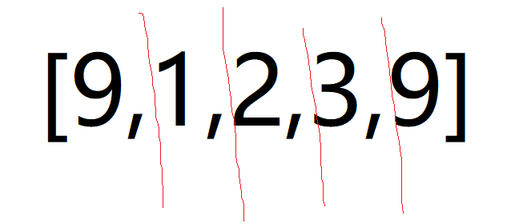
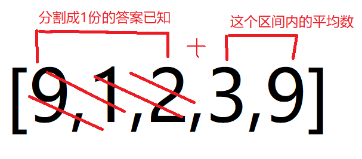
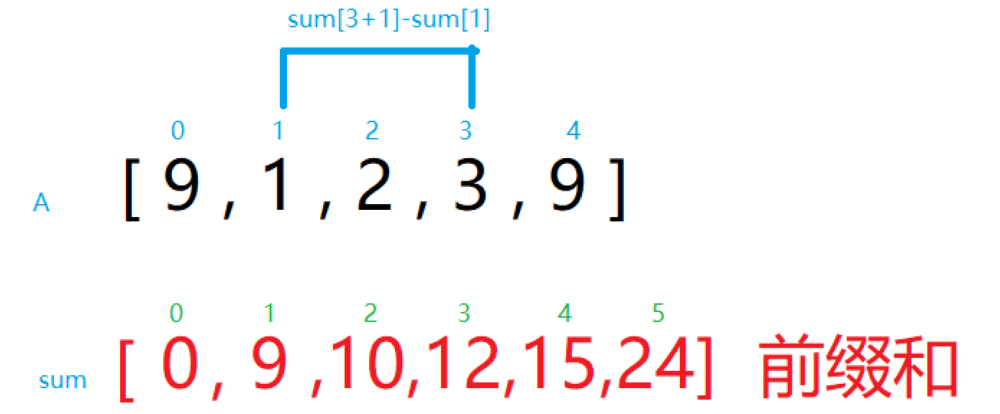

#### [动态规划详解](https://leetcode.cn/problems/largest-sum-of-averages/solutions/630637/dong-tai-gui-hua-xiang-jie-by-wang-nmana-v1vk/)

**一、理清题意**

> 我们将给定的数组 A 分成 K 个相邻的非空子数组 ，我们的分数由每个子数组内的平均值的总和构成。计算我们所能得到的最大分数是多少。 注意我们必须使用 A 数组中的每一个数进行分组，并且分数不一定需要是整数。

其实题目很清晰了，还不清楚的看题目给的例子吧。

___

**二、根据状态列出穷举框架**

这个题目的状态是：

> 给定的A数组的每个元素 分割成k个相邻的非空子数组

状态决定了dp的维数。换句话说,有了A的每个元素和k这2个状态，才能确定这个问题。少了一个,这个问题都不成立。

**套路：** 将数组分成k个相邻的子数组，可以直接知道是这样定义dp的含义。

**这样，就得出dp的定义：**

> dp[i][k] : 将前i个元素（包含i）分成k份，所能得到的最大分数

___

**三、动手动脑思考转移方程**

看着分割成k个，感觉好诡异，无从下手。那我们就动手简单暴力思考下。

> 输入: A = [9,1,2,3,9] K = 3 输出: 20

___

**先考虑最简单的情况：分割成1** 如果只分割成1份，那结果就很简单了，只需要取A数组的平均值：（9+1+2+3+9）/5

___

**分割成2** 如果分割成2份呢？？？，其实很简单，只需要枚举出所有可能的分割就行了。



每次分割，选择一条红线，把数组切成2部分，就简单地求出所有分割的可能，然后在所有可能中取最大值就是结果：（例如分割成2份有如下**4**种可能可能）

```csharp
[9]、[1,2,3,9] = 9 +（1+2+3+9）/4 = a
[9,1]、[2,3,9] = b
[9,1,2]、[3,9] = c
[9,1,2,3]、[9] = d
```

结果是max（a，b，c，d）

___

**分割成3同理分割成2**

___

上面是暴力的思路。那这怎么和dp扯上关系呢? 换句话说，如果知道把A分成1份的答案，怎么推出把A分成2份，怎么把上面的写法改成含dp的形式？

已知分割成2份有4种可能（上面列举了）。现在随便取其中的一种可能举例：如果当前的情况是：把A分成2份：[9,1,2]、[3,9]的情形。细心观察就会发现：


如果可以把左边部分看作一个已知的分割结果，那么

**分割成k份 = 分割成k-1份 + 后面那一份**

> 为什么是k-1+后面那一份？ 其实也很符合常理 3 是不是等于2+1.

**所以，可以将上面的暴力分割改写成下面这种含dp的形式（注意看括号的解释）：**

> 输入: A = [9,1,2,3,9] K = 3

**分割成2份：**

```csharp
[9]、[1,2,3,9] = dp[0][1]+avg(1,2,3,9) = a （9分割成1份的答案+9后面的那份 = 整体分割成2份的答案）
[9,1]、[2,3,9] = dp[1][1]+avg(2,3,9)   = b （[9,1]分割成1份的答案+[9,1]后面的那份 = 整体分割成2份的答案）
[9,1,2]、[3,9] = dp[2][1]+avg(3,9)     = c （[9,1,2]分割成1份的答案+[9,1,2]后面的那份 = 整体分割成2份的答案）
[9,1,2,3]、[9] = dp[3][1]+avg(9)       = d （[9,1,2,3]分割成1份的答案+[9,1,2,3]后面的那份 = 整体分割成2份的答案）

所以：dp[3][2] = max( a,b,c,d ) 
其实也就是（[9,1,2,3,9]分割成2份 = max（a,b,c,d））
这里你可以认为dp[0][1]、dp[1][1]、dp[2][1]、dp[3][1]已经求出了。
```

**分割成3份的情况：**

```csharp
[9]、[1,2,3,9] = dp[0][2]+avg(1,2,3,9) = a （9分割成2份的答案+9后面的那份 = 整体分割成3份的答案）
[9,1]、[2,3,9] = dp[1][2]+avg(2,3,9)   = b （[9,1]分割成2份的答案+[9,1]后面的那份 = 整体分割成3份的答案）
[9,1,2]、[3,9] = dp[2][2]+avg(3,9)     = c （[9,1,2]分割成2份的答案+[9,1,2]后面的那份 = 整体分割成3份的答案）
[9,1,2,3]、[9] = dp[3][2]+avg(9)       = d （[9,1,2,3]分割成2份的答案+[9,1,2,3]后面的那份 = 整体分割成3份的答案）

所以dp[3][3] = max( a,b,c,d )
这里你可以认为dp[0][2]、dp[1][2]、dp[2][2]、dp[3][2]已经求出了。
```

___

**如果按程序遍历的过程，上面dp实际是已经求出了** **实际是对数组的每个元素先求出所有的分割。** **也就是A数组遍历到谁，就求出以当前元素结尾，从1...k的所有分割**

> 例如：A = [9,1,2,3,9] ,K = 3
> 遍历A是从9开始，遍历到9，我就要求以9结尾，分割为1的结果是多少，分割为2的结果是多少，分割为3的结果是多少。（实际上分割为1就是9本身，分割为2和3都是0，一个元素怎么分割成2份和3份呢）
> 遍历到1，就求出以1结尾（其实也就是[9,1]这个子数组），分割1是多少，分割2是多少，分割3是多少。
> 遍历到2..
> ...

avg求平均数可以用前缀和来处理。简单来说就是开一个数组求出累计和，利用该数组可以快速求出A数组任意段区间的和,这里就不赘述了（建议百度）这里要非常注意边界问题。


**四、实现**

```cpp
class Solution {
public:
    //21.3.2 Tuesday
    double largestSumOfAverages(vector<int>& A, int K) {
        /*
            状态：数组A的每个元素，分割为K个相邻的数组
            选择：枚举所有分割k的可能性，分割成k份 == 分割成k-1份+最后一份
        */

        vector<double> sum(A.size()+1,0.0);
        vector<vector<double>> dp(A.size()+1,vector<double>(K+1,0));

        for(int i =1;i<=A.size();++i){
            sum[i] = sum[i-1]+A[i-1];
        }
        for(int i =1;i<=A.size();++i){
            dp[i][1] = sum[i] / i;
            for(int k=2;k<=K && k<=i;++k){
                for(int j = 1;j<i;++j){
                    dp[i][k] = max( dp[i][k],dp[j][k-1] + (sum[i]-sum[j])/(i-j));
                }
            }
        }
        return dp[A.size()][K];
    }
};
```

简单解释： 前2层循环是枚举所有A元素，和k个子序列 由于每次分割都可以分好多种，取所有可能的最大值。（像上面举例的，分割成2分，可以分4种了，取4种情况的最大值） 所以多了第三层循环 实现起来要注意边界。
