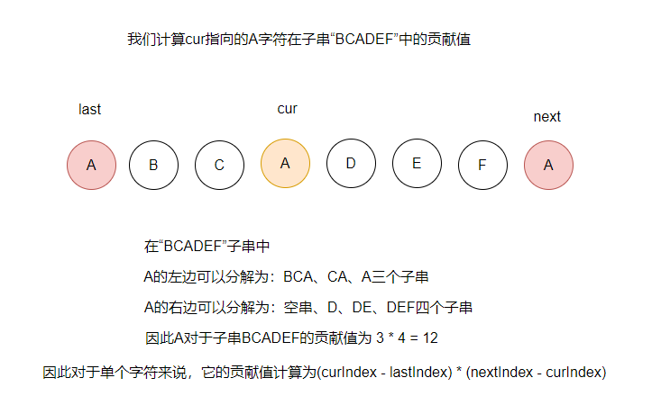

#### 方法一：计算贡献值

**题外**：本题千万不要被`countUniqueChars`这个函数误导，为了优化这个方法想了好久才发现不需要实现这个方法。  
**思路**：想要计算子串中唯一字符，我们可以计算每个字符的贡献值，然后相加即可。  
为了计算某个字符的贡献值，我们需要找到它的前相同一个字符的位置`lastIndex`和后一个相同字符的位置`nextIndex`，然后计算他对`lastIndex + 1`到`nextIndex - 1`这个子串的贡献值。然后我们遍历整个字符串，计算所有字符的贡献值累加即可。  
  
由于只有26个大写字母，为了方便：  
我们用一个数组`lastIndexMap`存放前一个相同字符的位置，用一个数组`curIndexMap`存放当前字符的位置，找到`next`字符后计算`cur`字符的贡献值。  
**代码如下**

```Java
public int uniqueLetterString(String s) {
    // 存储last字符前一个字符所在位置
    int[] lastIndexMap = new int[26];
    // 存储cur字符当前所处位置
    int[] curIndexMap = new int[26];
    Arrays.fill(lastIndexMap, -1);
    Arrays.fill(curIndexMap, -1);
    char[] chars = s.toCharArray();
    int ans = 0;
    for (int i = 0; i < chars.length; i++) {
        // next字符
        int index = chars[i] - 'A';
        // cur字符的索引不是-1，计算cur字符的贡献值
        if (curIndexMap[index] > -1) {
            ans += (i - curIndexMap[index]) * (curIndexMap[index] - lastIndexMap[index]);
        }
        // 滚动存放cur和last
        lastIndexMap[index] = curIndexMap[index];
        curIndexMap[index] = i;
    }
    // 计算最后next字符的贡献值，最后一个位置就是s.length()
    for (int i = 0; i < 26; i++) {
        if (curIndexMap[i] > -1) {
            ans += (curIndexMap[i] - lastIndexMap[i]) * (s.length() - curIndexMap[i]);
        }
    }
    return ans;
}
```
