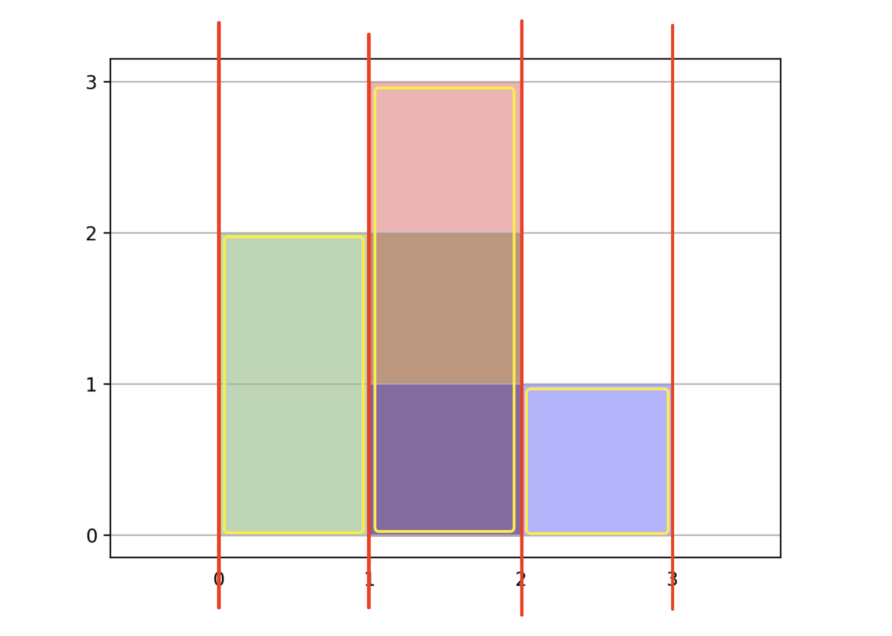
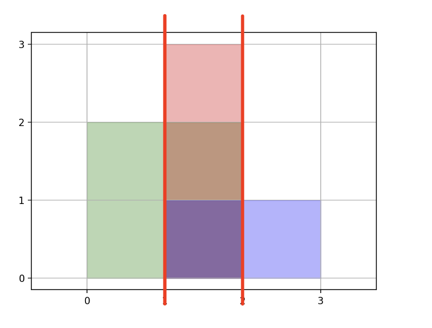

#### [](https://leetcode.cn/problems/rectangle-area-ii/solution/ju-xing-mian-ji-ii-by-leetcode-solution-ulqz//#扫描线)扫描线

这是一道「扫描线」模板题。

将所有给定的矩形的左右边对应的 `x` 端点提取出来并排序，每个端点可看作是一条竖直的线段（红色），问题转换为求解「由多条竖直线段分割开」的多个矩形的面积总和（黄色）：



相邻线段之间的宽度为单个矩形的「宽度」（通过 `x` 差值直接算得），问题转换为求该区间内高度的并集（即矩形的高度）。

由于数据范围只有 200，我们可以对给定的所有矩形进行遍历，统计所有对该矩形有贡献的 `y` 值线段（即有哪些 `rs[i]` 落在该矩形中），再对线段进行求交集（总长度），即可计算出该矩形的「高度」，从而计算出来该矩形的面积。



**代码（感谢 [@Benhao](https://leetcode.cn/u/himymben/) 总提供的其他语言版本）：**

```Java
class Solution {
    int MOD = (int)1e9+7;
    public int rectangleArea(int[][] rs) {
        List<Integer> list = new ArrayList<>();
        for (int[] info : rs) {
            list.add(info[0]); list.add(info[2]);
        }
        Collections.sort(list);
        long ans = 0;
        for (int i = 1; i < list.size(); i++) {
            int a = list.get(i - 1), b = list.get(i), len = b - a;
            if (len == 0) continue;
            List<int[]> lines = new ArrayList<>();
            for (int[] info : rs) {
                if (info[0] <= a && b <= info[2]) lines.add(new int[]{info[1], info[3]});
            }
            Collections.sort(lines, (l1, l2)->{
                return l1[0] != l2[0] ? l1[0] - l2[0] : l1[1] - l2[1];
            });
            long tot = 0, l = -1, r = -1;
            for (int[] cur : lines) {
                if (cur[0] > r) {
                    tot += r - l;
                    l = cur[0]; r = cur[1];
                } else if (cur[1] > r) {
                    r = cur[1];
                }
            }
            tot += r - l;
            ans += tot * len;
            ans %= MOD;
        }
        return (int) ans;
    }
}
```

```TypeScript
const MOD = BigInt(1e9+7)
function rectangleArea(rs: number[][]): number {
    const list = new Array<number>()
    for (let info of rs) {
        list.push(info[0]); list.push(info[2]);
    }
    list.sort((a,b)=>a-b)
    let ans = 0n
    for (let i = 1; i < list.length; i++) {
        const a = list[i - 1], b = list[i], len = b - a
        if (len == 0) continue
        const lines = new Array<number[]>()
        for (let info of rs) {
            if (info[0] <= a && b <= info[2]) lines.push([info[1], info[3]])
        }
        lines.sort((l1,l2)=>{
            return l1[0] != l2[0] ? l1[0] - l2[0] : l1[1] - l2[1]
        })
        let tot = 0n, l = -1, r = -1
        for (let cur of lines) {
            if (cur[0] > r) {
                tot += BigInt(r - l)
                l = cur[0]; r = cur[1]
            } else if (cur[1] > r) {
                r = cur[1]
            }
        }
        tot += BigInt(r - l)
        ans += tot * BigInt(len)
        ans %= MOD
    }
    return Number(ans)
};
```

```Python
class Solution:
    def rectangleArea(self, rs: List[List[int]]) -> int:
        ps = []
        for info in rs:
            ps.append(info[0])
            ps.append(info[2])
        ps.sort()
        ans = 0
        for i in range(1, len(ps)):
            a, b = ps[i - 1], ps[i]
            width = b - a
            if width == 0:
                continue
            lines = [(info[1], info[3]) for info in rs if info[0] <= a and b <= info[2]]
            lines.sort()
            height, l, r = 0, -1, -1
            for cur in lines:
                if cur[0] > r:
                    height += r - l
                    l, r = cur
                elif cur[1] > r:
                    r = cur[1]
            height += r - l
            ans += height * width
        return ans % 1000000007
```

```Go
const MOD = int64(1e9 + 7)
func rectangleArea(rectangles [][]int) int {
    list := []int{}
    for _, info := range rectangles {
        list = append(list, info[0])
        list = append(list, info[2])
    }
    sort.Ints(list)
    ans := int64(0)
    for i := 1; i < len(list); i++ {
        a, b, length := list[i - 1], list[i], list[i] - list[i - 1]
        if length == 0 {
            continue
        }
        lines := [][]int{}
        for _, info := range rectangles {
            if info[0] <= a && b <= info[2] {
                lines = append(lines, []int{info[1], info[3]})
            }
        }
        sort.Slice(lines, func(i,j int) bool {
            if lines[i][0] != lines[j][0] {
                return lines[i][0] - lines[j][0] < 0
            }
            return lines[i][1] - lines[j][1] < 0
        })
        total, l, r := int64(0), -1, -1
        for _, cur := range lines {
            if cur[0] > r {
                total += int64(r - l)
                l, r = cur[0], cur[1]
            } else if cur[1] > r {
                r = cur[1]
            }
        }
        total += int64(r - l)
        ans += total * int64(length)
        ans %= MOD
    }
    return int(ans)
}
```

-   时间复杂度：预处理所有扫描线的复杂度为 O(nlog⁡n)；处理所有相邻的扫描线，并计算相邻扫描线形成的矩形面积复杂度为 O(nlog⁡n) 。整体复杂度为 O(n^2^logn)
-   空间复杂度：O(n)
