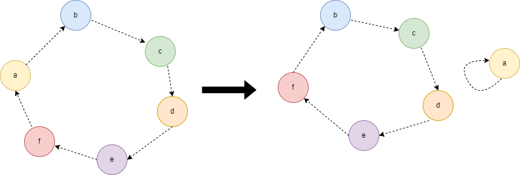

#### [](https://leetcode.cn/problems/k-similar-strings/solution/xiang-si-du-wei-k-de-zi-fu-chuan-by-leet-8z10//#方法四：动态规划)方法四：动态规划

该解法思维难度较大且时间复杂度较高，可作为参考题解，同样的解题思路可以参考「[zj-future04. 门店商品调配](https://leetcode.cn/contest/zj-future2022/problems/NBCXIp/)」。

解法二中提到过长度为 n 两个相似的字符串的最大交换次数为 n−1，最小的交换次数为 $floor(\frac{n+1}{2})$。我们可以观察一下什么样的字符串交换次数为 n−1，比如长度以下字符串:

> "abcdef", "bcdefa"
> "ab", "ba"
> "abcd", "bcda"

在上述字符中无法如何交换，每次均只能将一个字符调整到位，因此需要的交换次数为 n−1。对于部分字符串需要的交换次数少于 n−1，比如下列字符串:

> "abcdef", "ecdbfa"
> "acd", "cad"
> "abcd", "dcba"

对于字符串 s="abcdef" 可以拆分为两个分别与字符串 "ecdbfa" 的子串 "\_cdb\_\_", "e\_\_\_fa" 相似的字符串 p = "a\_\_\_ef", q = "\_bcd\_\_"。设 ks(s) 表示字符串 s 的转换为目标字符串的最小交换次数，则 ks(s)=ks(p)+ks(q)=2+2。我们可以看到字符串 "abcdef" 的交换次数也即等于相同位置相似的子串的交换次之和，即 ks(t)=ks(p)+ks(q)。设初始值 ks(t)=len(t)−1，其中 len(t) 表示字符串 t 的长度，ks(p)+ks(q)=len(p)+len(q)−2=len(t)−2。我们可以观察到字符串 t 每进行一次相似子字符串拆分，则其交换次会减 1，字符串 s 可拆分为的相似的子串的个数越多，则其交换次数最小。我们设字符串 s 可以被拆分成 k 个相似的子字符串，长度分别为 C1,C2,⋯ ,Ck，则 $ks(s)=\sum_{i=1}^{k}(C_{i}-1)=len(s)-k$，由此只需求出字符串可拆分的最大次数即可求出最小交换步数。

> 字符串相似：即两个字符串中含有的字符和数量完全相等。我们应当将字符串尽可能的拆分成相似的子串，直到不能拆分为止。求字符串的最小交换次数则转换为求该字符串最多的相似子字符串的拆分次数。如果字符串不可拆分，则该字符串的最小交换次数即为字符串的长度减 1。

因此我们可以使用动态规划来解决这个问题，令 dp(s) 表示字符串 s 最多拆分为相似子字符串 t 的数目，如果 s 不能继续拆分，则令 dp(s) = 1。枚举 s 的所有相似的子串 t，状态转移方程为 dp(s)=max⁡(dp(t)+dp(s−t))。由于题目中字符的长度串最多为 20，为了计算方便使用位图来表示字符串 s 的子串，如果字符串 t 为 s 的子串，则一定满足 (s&t)=t，对于字符串 t 我们枚举其所有的子集即可。当然可以直接遍历所有子串的子集，则时间复杂度为 $3^n$，在题目给定的测试用例下会超时。此时需要进行减枝以降低时间复杂度，减枝技巧如下：

-   由于子串中只含有 6 种字符，因此长度大于 6 的字符串则其一定可以拆分为长度小于等于 6 的相似子串，此时字符串中一定含有相同的字符。我们可以将所有长度大于 6 的字符串删选出来，依次尝试将其拆分出一个长度小于等于 6 的子字符串。

-   通过筛选，只筛选出所有相似的子字符串，对于非相似的字符串直接忽略，因为只有相似的字符串才可以拆分成相似的子串。

-   对于所有筛选出来的相似的子字符串按照字符的个数进行排序，这样就能保证字符的子串一定排列在前面而保证最优的子状态现行进行计算。对于题目中给定的字符串 s1 一定是与 s2 相似的，我们求出 s1 进行最多的拆分次数即可，最终返回结果即为 len(s1)−dp(s1)。


从图论的角度来分析相似字符串，设相似字符串 s1,s2，我们用有向图来表示相似字符串，每个字符为有向图中的一个节点，s1 中的字符指向 s2 中同一个位置的字符表示一条有向边 s1[i]→s2[i]，则该有向图一定由多个环组成，且每个节点都在环上。我们进行一次“有效”的字符交换（即将其中一个字符交换到最终位置），等价于把有向图中两条首尾相连的边变成一条新边和被一个节点的自环。我们最终的目标是把 s1 中的所有字符都变成自环。一个长度为 k 的环则我们需要 k−1 次交换才能把所有的节点都变为自环。设长度为 n 的字符串 s1 可以拆分为 m 个环，则此时需要的有效交换次数为 n−m。因此，求最少的交换次数即等价于 s1 拆分成环的最大数目。

比如相似字符为：

> s1="abcdef",s2="bcdefa"

将其交换一次后则变为：

> s1="fbcdea",s2="bcdefa"

如下图所示可以看到交换后被拆分为一个新的环和一个字符的自环。  
  
由于此时字符串只包含 6 种不同的字符，因此长度超过 6 的字符串构成的有向图一定含有入度和出度大于 1 的节点，则此时该有向图一定可以拆分为多个环。

```C++
class Solution {
public:
    int kSimilarity(string s1, string s2) {
        string str1, str2;
        for (int i = 0; i < s1.size(); i++) {
            if (s1[i] != s2[i]) {
                str1.push_back(s1[i]);
                str2.push_back(s2[i]);
            }
        }
        int n = str1.size();
        if (n == 0) {
            return 0;
        }
        vector<int> smallCycles;
        vector<int> largeCycles;
        for (int i = 1; i < (1 << n); i++) {
            vector<int> cnt(6);
            for (int j = 0; j < n; j++) {
                if (i & (1 << j)) {
                    cnt[str1[j] - 'a']++;
                    cnt[str2[j] - 'a']--;
                }
            }
            bool isCycle = true;
            for (int j = 0; j < 6; j++) {
                if (cnt[j] != 0) {
                    isCycle = false;
                    break;
                }
            }
            if (isCycle) {
                int size = __builtin_popcount(i);
                if (size <= 6) {
                    smallCycles.emplace_back(i);
                } else {
                    largeCycles.emplace_back(i);
                }
            }
        }
        auto cmp = [](const int &a, const int &b)->bool {
            return __builtin_popcount(a) < __builtin_popcount(b);
        };
        sort(smallCycles.begin(), smallCycles.end(), cmp);
        sort(largeCycles.begin(), largeCycles.end(), cmp);
        vector<int> dp(1 << n, 1);
        dp[0] = 0;
        for (int i = 0; i < smallCycles.size(); i++) {
            for (int j = 0; j < i; j++) {
                int x = smallCycles[i], y = smallCycles[j];
                if ((x & y) == y) {
                    dp[x] = max(dp[x], dp[y] + dp[x ^ y]);
                }
            }
        }
        for (auto &x : largeCycles) {
            for (auto &y : smallCycles) {
                if ((x & y) == y) {
                    dp[x] = max(dp[x], dp[y] + dp[x ^ y]);
                }
            }
        }
        return n - dp[(1 << n) - 1];
    }
};

```

```Java
class Solution {
    public int kSimilarity(String s1, String s2) {
        StringBuilder str1 = new StringBuilder();
        StringBuilder str2 = new StringBuilder();
        for (int i = 0; i < s1.length(); i++) {
            if (s1.charAt(i) != s2.charAt(i)) {
                str1.append(s1.charAt(i));
                str2.append(s2.charAt(i));
            }
        }
        int n = str1.length();
        if (n == 0) {
            return 0;
        }
        List<Integer> smallCycles = new ArrayList<Integer>();
        List<Integer> largeCycles = new ArrayList<Integer>();
        for (int i = 1; i < (1 << n); i++) {
            int[] cnt = new int[6];
            for (int j = 0; j < n; j++) {
                if ((i & (1 << j)) != 0) {
                    cnt[str1.charAt(j) - 'a']++;
                    cnt[str2.charAt(j) - 'a']--;
                }
            }
            boolean isCycle = true;
            for (int j = 0; j < 6; j++) {
                if (cnt[j] != 0) {
                    isCycle = false;
                    break;
                }
            }
            if (isCycle) {
                int size = Integer.bitCount(i);
                if (size <= 6) {
                    smallCycles.add(i);
                } else {
                    largeCycles.add(i);
                }
            }
        }
        Collections.sort(smallCycles, (a, b) -> Integer.bitCount(a) - Integer.bitCount(b));
        Collections.sort(largeCycles, (a, b) -> Integer.bitCount(a) - Integer.bitCount(b));
        int[] dp = new int[1 << n];
        Arrays.fill(dp, 1);
        dp[0] = 0;
        for (int i = 0; i < smallCycles.size(); i++) {
            for (int j = 0; j < i; j++) {
                int x = smallCycles.get(i), y = smallCycles.get(j);
                if ((x & y) == y) {
                    dp[x] = Math.max(dp[x], dp[y] + dp[x ^ y]);
                }
            }
        }
        for (int x : largeCycles) {
            for (int y : smallCycles) {
                if ((x & y) == y) {
                    dp[x] = Math.max(dp[x], dp[y] + dp[x ^ y]);
                }
            }
        }
        return n - dp[(1 << n) - 1];
    }
}

```

```C
#define MAX_STR_LEN 24
#define MAX_CYCLE_SIZE 15000
#define MIN(a, b) ((a) < (b) ? (a) : (b))
#define MAX(a, b) ((a) > (b) ? (a) : (b));

static inline int cmp(const void *pa, const void *pb) {
    return __builtin_popcount(*(int *)pa) - __builtin_popcount(*(int *)pb);
}

int kSimilarity(char * s1, char * s2) {
    char str1[MAX_STR_LEN], str2[MAX_STR_LEN];
    int len = strlen(s1), n = 0;
    for (int i = 0; i < len; i++) {
        if (s1[i] != s2[i]) {
            str1[n] = s1[i];
            str2[n] = s2[i];
            n++;
        }
    }
    if (n == 0) {
        return 0;
    }
    int *smallCycles = (int *)malloc(sizeof(int) * MAX_CYCLE_SIZE);
    int *largeCycles = (int *)malloc(sizeof(int) * MAX_CYCLE_SIZE);
    int smallCyclesSize = 0, largeCyclesSize = 0;
    int *dp = (int *)malloc(sizeof(int) * (1 << n));
    for (int i = 1; i < (1 << n); i++) {
        int cnt[6] = {0};
        for (int j = 0; j < n; j++) {
            if (i & (1 << j)) {
                cnt[str1[j] - 'a']++;
                cnt[str2[j] - 'a']--;
            }
        }
        bool isCycle = true;
        for (int j = 0; j < 6; j++) {
            if (cnt[j] != 0) {
                isCycle = false;
                break;
            }
        }
        if (isCycle) {
            int size = __builtin_popcount(i);
            dp[i] = 1;
            if (size <= 6) {
                smallCycles[smallCyclesSize++] = i;
            } else {
                largeCycles[largeCyclesSize++] = i;
            }
        }
    }
    qsort(smallCycles, smallCyclesSize, sizeof(int), cmp);
    qsort(largeCycles, largeCyclesSize, sizeof(int), cmp);
    dp[0] = 0;
    for (int i = 0; i < smallCyclesSize; i++) {
        int maskx = smallCycles[i];
        for (int j = 0; j < i; j++) {
            int masky = smallCycles[j];
            if ((maskx & masky) == masky) {
                dp[maskx] = MAX(dp[maskx], dp[masky] + dp[maskx ^ masky]);
            }
        }
    }
    for (int i = 0; i < largeCyclesSize; i++) {
        for (int j = 0; j < smallCyclesSize; j++) {
            int maskx = largeCycles[i];
            int masky = smallCycles[j];
            if ((maskx & masky) == masky) {
                dp[maskx] = MAX(dp[maskx], dp[masky] + dp[maskx ^ masky]);
            }
        }
    }
    int ans = n - dp[(1 << n) - 1];
    free(smallCycles);
    free(largeCycles);
    free(dp);
    return ans;
}

```

```JavaScript
var kSimilarity = function(s1, s2) {
    let str1 = '';
    let str2 = '';
    for (let i = 0; i < s1.length; i++) {
        if (s1[i] !== s2[i]) {
            str1 += s1[i];
            str2 += s2[i];
        }
    }
    const n = str1.length;
    if (n === 0) {
        return 0;
    }
    const smallCycles = [];
    const largeCycles = [];
    for (let i = 1; i < (1 << n); i++) {
        const cnt = new Array(6).fill(0);
        for (let j = 0; j < n; j++) {
            if ((i & (1 << j)) !== 0) {
                cnt[str1[j].charCodeAt() - 'a'.charCodeAt()]++;
                cnt[str2[j].charCodeAt() - 'a'.charCodeAt()]--;
            }
        }
        let isCycle = true;
        for (let j = 0; j < 6; j++) {
            if (cnt[j] !== 0) {
                isCycle = false;
                break;
            }
        }
        if (isCycle) {
            const size = bitCount(i);
            if (size <= 6) {
                smallCycles.push(i);
            } else {
                largeCycles.push(i);
            }
        }
    }
    smallCycles.sort((a, b) => bitCount(a) - bitCount(b));
    largeCycles.sort((a, b) => bitCount(a) - bitCount(b));
    const dp = new Array(1 << n).fill(1);
    dp[0] = 0;
    for (let i = 0; i < smallCycles.length; i++) {
        for (let j = 0; j < i; j++) {
            const x = smallCycles[i], y = smallCycles[j];
            if ((x & y) === y) {
                dp[x] = Math.max(dp[x], dp[y] + dp[x ^ y]);
            }
        }
    }
    for (const x of largeCycles) {
        for (const y of smallCycles) {
            if ((x & y) === y) {
                dp[x] = Math.max(dp[x], dp[y] + dp[x ^ y]);
            }
        }
    }
    return n - dp[(1 << n) - 1];
}

const bitCount = (num) => {
    return num.toString(2).split('0').join('').length;
}

```

**复杂度分析**

-   时间复杂度：$O(2^{n}*|\sum|+3^{n})$，其中 n 为字符串的长度，∣Σ∣表示字符集，在此题中字符集为 ‘a’,‘b’,‘c’,‘d’,‘e’,‘f’，本题中 ∣Σ∣=6。需要遍历并检测所有可能成环的子串，需要的时间为 $O(2^{n}*|\sum|)$，检测每个环的最小交换次数需要的时间上限为 $O(3^{n})$，因此时间复杂度为 $O(2^{n}*|\sum|+3^{n})$。

-   空间复杂度：$O(2^n)$，其中 n 为字符串的长度。需要记录字符串所有的子串的状态，因此需要的存储空间为 $2^n$。
