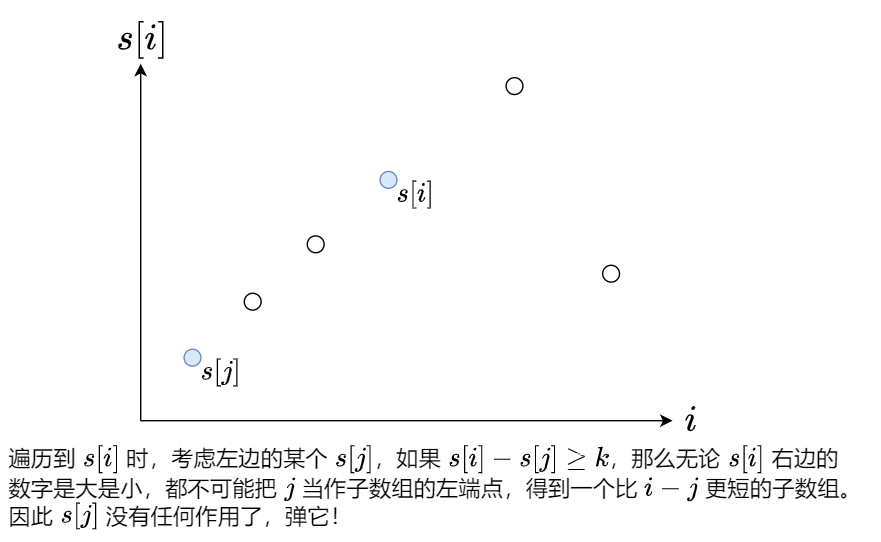
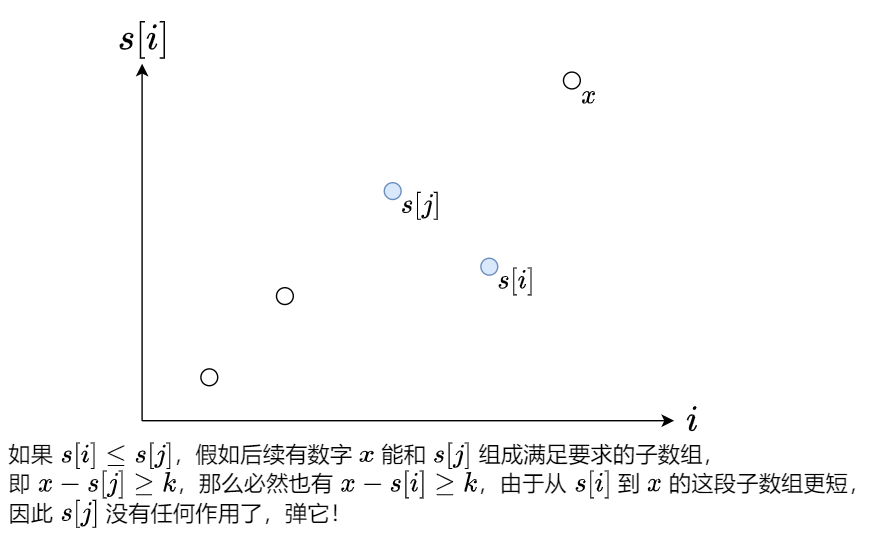

#### [](https://leetcode.cn/problems/shortest-subarray-with-sum-at-least-k/solution/liang-zhang-tu-miao-dong-dan-diao-dui-li-9fvh//#前置知识：前缀和)前置知识：前缀和

定义前缀和 s[0]=0，$s[i+1]=\sum\limits_{j=0}^{i}nums[j]$。

例如 nums=[1,2,−1,2]，对应的前缀和数组为 s=[0,1,3,2,4]。

通过前缀和，我们可以把**子数组的和转换成两个前缀和的差**，即
$\sum\limits_{j=left}^{right}nums[j]=\sum\limits_{j=0}^{right}nums[j]-\sum\limits_{j=0}^{left-1}nums[j]=s[right+1]-s[left]$

例如 nums 的子数组 [2,−1,2] 的和就可以用 s[4]−s[1]=4−1=3 算出来。

> 注：为方便计算，常用左闭右开区间 [left,right) 来表示子数组，此时子数组的和为 s[right]−s[left]，子数组的长度为 right−left。

___

求出 nums 的前缀和 s 后，我们可以写一个暴力算法，枚举所有满足 i>j 且 s[i]−s[j]≥k 的子数组 [j,i)，取其中最小的 i−j 作为答案。

但这个暴力算法是 $O(n^2)$ 的，如何优化呢？

我们可以遍历 s，同时用某个合适的数据结构来维护遍历过的 s[i]，并**及时移除无用的 s[i]**。

优化一：



优化二：



做完这两个优化后，再把 s[i] 加到这个数据结构中。

由于优化二保证了数据结构中的 s[i] 会形成一个递增的序列，因此优化一移除的是序列最左侧的若干元素，优化二移除的是序列最右侧的若干元素。我们需要一个数据结构，它支持移除最左端的元素和最右端的元素，以及在最右端添加元素，故选用**双端队列**。

> 注：由于双端队列的元素始终保持单调递增，因此这种数据结构也叫做**单调队列**。

```Python
class Solution:
    def shortestSubarray(self, nums: List[int], k: int) -> int:
        ans = inf
        s = list(accumulate(nums, initial=0))  # 计算前缀和
        q = deque()
        for i, cur_s in enumerate(s):
            while q and cur_s - s[q[0]] >= k:
                ans = min(ans, i - q.popleft())  # 优化一
            while q and s[q[-1]] >= cur_s:
                q.pop()  # 优化二
            q.append(i)
        return ans if ans < inf else -1
```

```Java
class Solution {
    public int shortestSubarray(int[] nums, int k) {
        int n = nums.length, ans = n + 1;
        var s = new long[n + 1];
        for (var i = 0; i < n; ++i)
            s[i + 1] = s[i] + nums[i]; // 计算前缀和
        var q = new ArrayDeque<Integer>();
        for (var i = 0; i <= n; ++i) {
            var curS = s[i];
            while (!q.isEmpty() && curS - s[q.peekFirst()] >= k)
                ans = Math.min(ans, i - q.pollFirst()); // 优化一
            while (!q.isEmpty() && s[q.peekLast()] >= curS)
                q.pollLast(); // 优化二
            q.addLast(i);
        }
        return ans > n ? -1 : ans;
    }
}
```

```C++
class Solution {
public:
    int shortestSubarray(vector<int> &nums, int k) {
        int n = nums.size(), ans = n + 1;
        long s[n + 1];
        s[0] = 0L;
        for (int i = 0; i < n; ++i)
            s[i + 1] = s[i] + nums[i]; // 计算前缀和
        deque<int> q;
        for (int i = 0; i <= n; ++i) {
            long cur_s = s[i];
            while (!q.empty() && cur_s - s[q.front()] >= k) {
                ans = min(ans, i - q.front());
                q.pop_front(); // 优化一
            }
            while (!q.empty() && s[q.back()] >= cur_s)
                q.pop_back(); // 优化二
            q.push_back(i);
        }
        return ans > n ? -1 : ans;
    }
};
```

```Go
func shortestSubarray(nums []int, k int) int {
    n := len(nums)
    s := make([]int, n+1)
    for i, x := range nums {
        s[i+1] = s[i] + x // 计算前缀和
    }
    ans := n + 1
    q := []int{}
    for i, curS := range s {
        for len(q) > 0 && curS-s[q[0]] >= k {
            ans = min(ans, i-q[0])
            q = q[1:] // 优化一
        }
        for len(q) > 0 && s[q[len(q)-1]] >= curS {
            q = q[:len(q)-1] // 优化二
        }
        q = append(q, i)
    }
    if ans > n {
        return -1
    }
    return ans
}

func min(a, b int) int { if a > b { return b }; return a }
```

另一种写法是，在计算前缀和的同时去计算答案，这需要在双端队列中额外存储前缀和的值。

由于前缀和的初始值 0 在遍历 nums 之前就算出来了，因此需要在遍历之前，往双端队列中插入前缀和 0 及其下标 −1。

> 注 1：为什么是 −1？因为上面遍历的是 s，下面遍历的是 nums，这两者的下标偏移了一位。
> 注 2：该写法在 nums 是一个**流**的时候也适用。

```Python
class Solution:
    def shortestSubarray(self, nums: List[int], k: int) -> int:
        ans = inf
        cur_s = 0
        q = deque([(0, -1)])
        for i, x in enumerate(nums):
            cur_s += x  # 计算前缀和
            while q and cur_s - q[0][0] >= k:
                ans = min(ans, i - q.popleft()[1])  # 优化一
            while q and q[-1][0] >= cur_s:
                q.pop()  # 优化二
            q.append((cur_s, i))
        return ans if ans < inf else -1
```

```Java
class Solution {
    public int shortestSubarray(int[] nums, int k) {
        var ans = Integer.MAX_VALUE;
        var q = new ArrayDeque<Pair<Long, Integer>>();
        q.addLast(new Pair<>(0L, -1));
        var curS = 0L;
        for (var i = 0; i < nums.length; ++i) {
            curS += nums[i]; // 计算前缀和
            while (!q.isEmpty() && curS - q.peekFirst().getKey() >= k)
                ans = Math.min(ans, i - q.pollFirst().getValue()); // 优化一
            while (!q.isEmpty() && q.peekLast().getKey() >= curS)
                q.pollLast(); // 优化二
            q.addLast(new Pair<>(curS, i));
        }
        return ans == Integer.MAX_VALUE ? -1 : ans;
    }
}
```

```C++
class Solution {
public:
    int shortestSubarray(vector<int> &nums, int k) {
        int ans = INT_MAX;
        deque<pair<long, int>> q;
        q.emplace_back(0, -1);
        long cur_s = 0L;
        for (int i = 0; i < nums.size(); ++i) {
            cur_s += nums[i]; // 计算前缀和
            while (!q.empty() && cur_s - q.front().first >= k) {
                ans = min(ans, i - q.front().second);
                q.pop_front(); // 优化一
            }
            while (!q.empty() && q.back().first >= cur_s)
                q.pop_back(); // 优化二
            q.emplace_back(cur_s, i);
        }
        return ans == INT_MAX ? -1 : ans;
    }
};
```

```Go
func shortestSubarray(nums []int, k int) int {
    type pair struct{ s, i int }
    q := []pair{{0, -1}}
    ans, curS := math.MaxInt32, 0
    for i, x := range nums {
        curS += x // 计算前缀和
        for len(q) > 0 && curS-q[0].s >= k {
            ans = min(ans, i-q[0].i)
            q = q[1:] // 优化一
        }
        for len(q) > 0 && q[len(q)-1].s >= curS {
            q = q[:len(q)-1] // 优化二
        }
        q = append(q, pair{curS, i})
    }
    if ans == math.MaxInt32 {
        return -1
    }
    return ans
}

func min(a, b int) int { if a > b { return b }; return a }
```

#### [](https://leetcode.cn/problems/shortest-subarray-with-sum-at-least-k/solution/liang-zhang-tu-miao-dong-dan-diao-dui-li-9fvh//#复杂度分析)复杂度分析

-   时间复杂度：O(n)。虽然我们写了个二重循环，但站在 nums[i] 的视角看，它在二重循环中最多入队出队各一次，因此整个二重循环的时间复杂度为 O(n)。
-   空间复杂度：O(n)。最坏情况下单调队列中会存储 O(n) 个元素。
