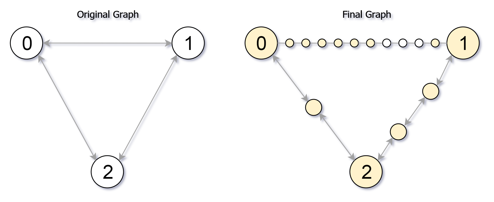

#### [882\. 细分图中的可到达节点](https://leetcode.cn/problems/reachable-nodes-in-subdivided-graph/)

难度：困难

给你一个无向图（**原始图**），图中有 $n$ 个节点，编号从 $0$ 到 $n - 1$ 。你决定将图中的每条边 **细分** 为一条节点链，每条边之间的新节点数各不相同。

图用由边组成的二维数组 $edges$ 表示，其中 $edges[i] = [u_i, v_i, cnt_i]$ 表示原始图中节点 $u_i$ 和 $v_i$ 之间存在一条边，$cnt_i$ 是将边 **细分** 后的新节点总数。注意，$cnt_i == 0$ 表示边不可细分。

要 **细分** 边 $[u_i, v_i]$ ，需要将其替换为 $(cnt_i + 1)$ 条新边，和 $cnt_i$ 个新节点。新节点为 $x_1$, $x_2$, ..., $x_{cnt_{i}}$ ，新边为 $[u_i, x_1]$, $[x_1, x_2]$, $[x_2, x_3]$, ..., $[x_{cnt_{i-1}}, x_{cnt_{i}}]$, $[x_{cnt_{i}}, v_i]$。

现在得到一个 **新的细分图** ，请你计算从节点 $0$ 出发，可以到达多少个节点？如果节点间距离是 $maxMoves$ 或更少，则视为 **可以到达** 。

给你原始图和 $maxMoves$ ，返回 _新的细分图中从节点 $0$ 出发_ **_可到达的节点数_** 。

**示例 1：**



```
输入：edges = [[0,1,10],[0,2,1],[1,2,2]], maxMoves = 6, n = 3
输出：13
解释：边的细分情况如上图所示。
可以到达的节点已经用黄色标注出来。
```

**示例 2：**

```
输入：edges = [[0,1,4],[1,2,6],[0,2,8],[1,3,1]], maxMoves = 10, n = 4
输出：23
```

**示例 3：**

```
输入：edges = [[1,2,4],[1,4,5],[1,3,1],[2,3,4],[3,4,5]], maxMoves = 17, n = 5
输出：1
解释：节点 0 与图的其余部分没有连通，所以只有节点 0 可以到达。
```

**提示：**

-   $0 <= edges.length <= min(n \times (n - 1) / 2, 10^4)$
-   $edges[i].length == 3$
-   $0 <= u_i < v_i < n$
-   图中 **不存在平行边**
-   $0 <= cnt_i <= 10^4$
-   $0 <= maxMoves <= 10^9$
-   $1 <= n <= 3000$
