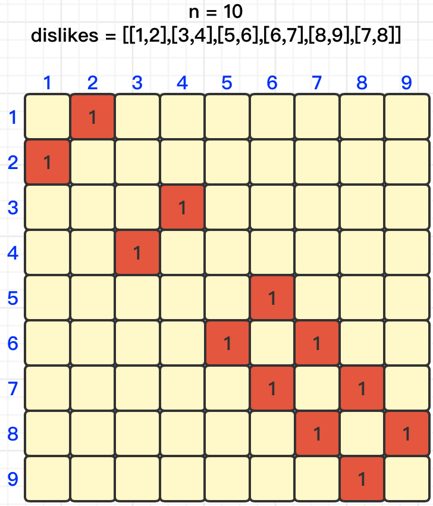
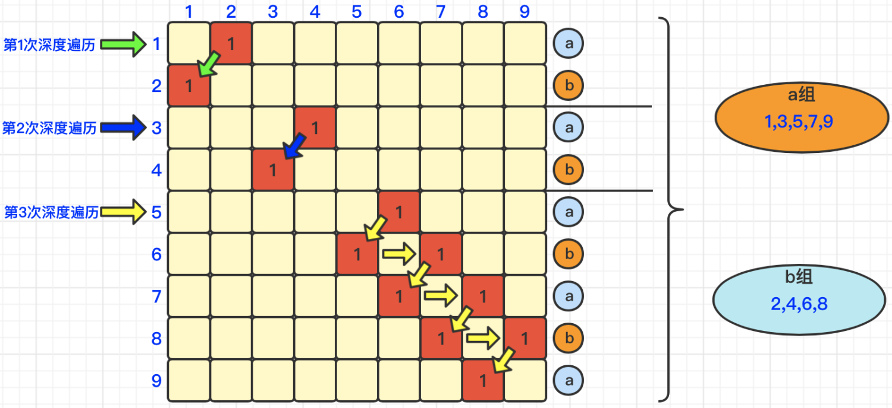

#### [](https://leetcode.cn/problems/possible-bipartition/solution/zhua-wa-mou-si-tu-jie-leetcode-by-muse-7-ac1o//#解题思路)解题思路

首先，创建一个二维数组，用来记录1到n个数之间的互斥关系。我们以n = `10`，dislikes = `[[1,2],[3,4],[5,6],[6,7],[8,9],[7,8]]`为例，那么我们就可以得出如下矩阵图，如下图所示：



然后我们从第1行（row1）开始遍历，如果发现有“**红色**”，即表示发生了**排斥**，那么我们在对其进行深度遍历，如下图所示，我们遍历第1行的时候，发现2与其排斥，那么我们深度遍历第2行，由于第二行中没有与2排斥的数字了，所以我们得出结论，即：`1在a组`，`2在b组`。

我们继续遍历其他行，由于2已经被分配给了b组，所以第2行（row2）不遍历。

我们遍历第3行，由于发现与4发生了排斥，那么深度遍历到第4行，发现没有其他数组与4发生排斥，所以我们得出结论，即：`3在a组`，`4在b组`。

由于4已经被分配给了b组，所以第4行（row4）不遍历。我们遍历到第5行，发生如下遍历情况：

> **row5**发现`数字6`与它发生排斥，深度遍历到`row6`  
> **row6**发现`数字7`与它发生排斥，深度遍历到`row7`  
> **row7**发现`数字8`与它发生排斥，深度遍历到`row8`  
> **row8**发现`数字9`与它发生排斥，深度遍历到`row9`  
> **row9**发现没有数字与其排斥，所得得出分组结论：即：`5在a组`，`6在b组`，`7在a组`，`8在b组`，`9在a组`

最终结论就是，**a组里有[1,3,5,7,9]**，**b组里有[2,4,6,8]**，具体详情请见下图：



#### [](https://leetcode.cn/problems/possible-bipartition/solution/zhua-wa-mou-si-tu-jie-leetcode-by-muse-7-ac1o//#代码实现)代码实现

```
class Solution {
    public boolean possibleBipartition(int n, int[][] dislikes) {
        int[][] matrix = new int[n + 1][n + 1];
        for (int[] item : dislikes)
            matrix[item[0]][item[1]] = matrix[item[1]][item[0]] = 1;
        int[] record = new int[n + 1]; // 记录分组情况
        for (int i = 1; i <= n ; i++) 
            if (record[i] == 0 && ! dfs(matrix, record, i, 1, n)) return false;
        return true;
    }

    public boolean dfs(int[][] matrix, int[] record, int index, int group, int n) {
        record[index] = group;
        for (int i = 1; i <= n ; i++) {
            if(i == index) continue;
            if (matrix[index][i] == 1 && record[i] == group) return false;
            if (matrix[index][i] == 1 && record[i] == 0 && !dfs(matrix, record, i, group * -1, n)) return false;
        }
        return true;
    }
}
```

```
class Solution {
    public boolean possibleBipartition(int n, int[][] dislikes) {
        List<Integer>[] matrix = new ArrayList[n + 1];
        for (int i = 1; i < matrix.length; i++) matrix[i] = new ArrayList(n + 1);
        for (int[] item : dislikes) {
            matrix[item[0]].add(item[1]);
            matrix[item[1]].add(item[0]);
        }
        int[] record = new int[n + 1]; // 记录分组情况
        for (int i = 1; i < matrix.length ; i ++)
            if (record[i] == 0 && !dfs(matrix, record, i, 1)) return false;
        return true;
    }

    private boolean dfs(List<Integer>[] matrix, int[] record, int index, int group) {
        record[index] = group;
        for (int i = 0; i < matrix[index].size() ; i++) {
            int num = matrix[index].get(i);
            if (record[num] == group) return false;
            if (record[num] == 0 && !dfs(matrix, record, num, group * -1)) return false;
        }
        return true;
    }
}
```
