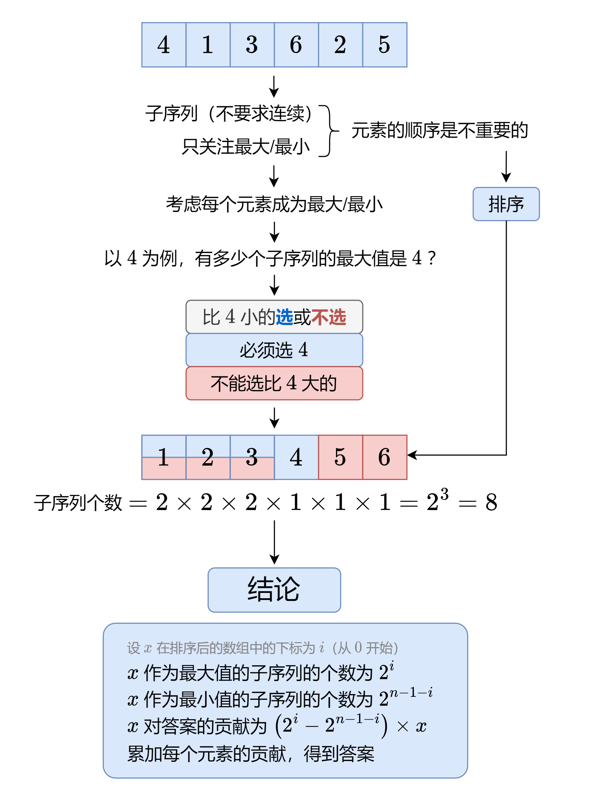

#### [计算每个元素对答案的贡献，多解法（Python/Java/C++/Go）](https://leetcode.cn/problems/sum-of-subsequence-widths/solutions/1977682/by-endlesscheng-upd1/)



#### 答疑

**问**：对于数组中有重复元素的情况，这种做法不会重复统计吗？

**答**：不会。例如计算最大值时，如果有多个相同元素 x，那么每个 x 都只会考虑在它**左侧**的元素，而不会计入在它**右侧**的元素，所以不会有重复统计发生。

**问**：为什么 x 作为最小值的子序列的个数为 $2^{n-1-i}$？

**答**：因为排序后，x 右侧有 n−1−i 个元素，每个元素都可以选或不选，这有 $2^{n-1-i}$ 种方案，也就对应着 $2^{n-1-i}$ 个子序列。

```python
class Solution:
    def sumSubseqWidths(self, nums: List[int]) -> int:
        MOD = 10 ** 9 + 7
        nums.sort()
        n = len(nums)
        pow2 = [0] * n
        pow2[0] = 1
        for i in range(1, n):
            pow2[i] = pow2[i - 1] * 2 % MOD  # 预处理 2 的幂次
        return sum((pow2[i] - pow2[-1 - i]) * x
                   for i, x in enumerate(nums)) % MOD
```

```java
class Solution {
    private static final int MOD = (int) 1e9 + 7;

    public int sumSubseqWidths(int[] nums) {
        Arrays.sort(nums);
        var n = nums.length;
        var pow2 = new int[n];
        pow2[0] = 1;
        for (var i = 1; i < n; ++i)
            pow2[i] = pow2[i - 1] * 2 % MOD; // 预处理 2 的幂次
        var ans = 0L;
        for (var i = 0; i < n; ++i)
            ans += (long) (pow2[i] - pow2[n - 1 - i]) * nums[i]; // 在题目的数据范围下，这不会溢出
        return (int) (ans % MOD + MOD) % MOD; // 注意上面有减法，ans 可能为负数
    }
}
```

```cpp
class Solution {
    const int MOD = 1e9 + 7;
public:
    int sumSubseqWidths(vector<int> &nums) {
        sort(nums.begin(), nums.end());
        int n = nums.size(), pow2[n];
        pow2[0] = 1;
        for (int i = 1; i < n; ++i)
            pow2[i] = pow2[i - 1] * 2 % MOD; // 预处理 2 的幂次
        long ans = 0L;
        for (int i = 0; i < n; ++i)
            ans += long(pow2[i] - pow2[n - 1 - i]) * nums[i]; // 在题目的数据范围下，这不会溢出
        return (ans % MOD + MOD) % MOD; // 注意上面有减法，ans 可能为负数
    }
};
```

```go
func sumSubseqWidths(nums []int) (ans int) {
    const mod int = 1e9 + 7
    sort.Ints(nums)
    n := len(nums)
    pow2 := make([]int, n)
    pow2[0] = 1
    for i := 1; i < n; i++ {
        pow2[i] = pow2[i-1] * 2 % mod // 预处理 2 的幂次
    }
    for i, x := range nums {
        ans += (pow2[i] - pow2[n-1-i]) * x // 在题目的数据范围下，这不会溢出
    }
    return (ans%mod + mod) % mod // 注意上面有减法，ans 可能为负数
}
```

也可以用 [快速幂](https://leetcode.cn/problems/powx-n/solutions/238559/powx-n-by-leetcode-solution/) 计算 2 的幂次。

```python
class Solution:
    def sumSubseqWidths(self, nums: List[int]) -> int:
        MOD = 10 ** 9 + 7
        nums.sort()
        return sum((pow(2, i, MOD) - pow(2, len(nums) - 1 - i, MOD)) * x
                   for i, x in enumerate(nums)) % MOD
```

```java
class Solution {
    private static final int MOD = (int) 1e9 + 7;

    public int sumSubseqWidths(int[] nums) {
        Arrays.sort(nums);
        var n = nums.length;
        var ans = 0L;
        for (var i = 0; i < n; ++i)
            ans += (pow(2L, i) - pow(2L, n - 1 - i)) * nums[i]; // 在题目的数据范围下，这不会溢出
        return (int) (ans % MOD + MOD) % MOD; // 注意上面有减法，ans 可能为负数
    }

    private long pow(long x, int n) {
        var res = 1L;
        for (; n > 0; n /= 2) {
            if (n % 2 > 0) res = res * x % MOD;
            x = x * x % MOD;
        }
        return res;
    }
}
```

```cpp
class Solution {
    const int MOD = 1e9 + 7;

    long pow(long x, int n) {
        long res = 1L;
        for (; n; n /= 2) {
            if (n % 2) res = res * x % MOD;
            x = x * x % MOD;
        }
        return res;
    }

public:
    int sumSubseqWidths(vector<int> &nums) {
        sort(nums.begin(), nums.end());
        int n = nums.size();
        long ans = 0L;
        for (int i = 0; i < n; ++i)
            ans += (pow(2L, i) - pow(2L, n - 1 - i)) * nums[i]; // 在题目的数据范围下，这不会溢出
        return (ans % MOD + MOD) % MOD; // 注意上面有减法，ans 可能为负数
    }
};
```

```go
const mod int = 1e9 + 7

func sumSubseqWidths(nums []int) (ans int) {
    sort.Ints(nums)
    n := len(nums)
    for i, x := range nums {
        ans += (pow(2, i) - pow(2, n-1-i)) * x // 在题目的数据范围下，这不会溢出
    }
    return (ans%mod + mod) % mod // 注意上面有减法，ans 可能为负数
}

func pow(x, n int) int {
    res := 1
    for ; n > 0; n /= 2 {
        if n%2 > 0 {
            res = res * x % mod
        }
        x = x * x % mod
    }
    return res
}
```

还可以递推算出 $2^i$ 和 $2^{n-1-i}$（后者需要用到 [逆元](https://leetcode.cn/link/?target=https%3A%2F%2Foi-wiki.org%2Fmath%2Fnumber-theory%2Finverse%2F)）。

对于本题而言，可以直接用 $\dfrac{10^9+7+1}{2}=500000004$ 当作 2 关于 $10^9+7$ 的逆元。

```python
class Solution:
    def sumSubseqWidths(self, nums: List[int]) -> int:
        MOD = 10 ** 9 + 7
        MOD2 = (MOD + 1) // 2
        nums.sort()
        ans, pow2, pow2r = 0, 1, pow(2, len(nums) - 1, MOD)
        for x in nums:
            ans += (pow2 - pow2r) * x
            pow2 = pow2 * 2 % MOD
            pow2r = pow2r * MOD2 % MOD
        return ans % MOD
```

```java
class Solution {
    private static final int MOD = (int) 1e9 + 7, MOD2 = (MOD + 1) / 2;

    public int sumSubseqWidths(int[] nums) {
        Arrays.sort(nums);
        long ans = 0L, pow2 = 1L, pow2r = pow(2L, nums.length - 1);
        for (var x : nums) {
            ans += (pow2 - pow2r) * x; // 在题目的数据范围下，这不会溢出
            pow2 = pow2 * 2 % MOD;
            pow2r = pow2r * MOD2 % MOD;
        }
        return (int) (ans % MOD + MOD) % MOD; // 注意上面有减法，ans 可能为负数
    }

    private long pow(long x, int n) {
        var res = 1L;
        for (; n > 0; n /= 2) {
            if (n % 2 > 0) res = res * x % MOD;
            x = x * x % MOD;
        }
        return res;
    }
}
```

```cpp
class Solution {
    const int MOD = 1e9 + 7, MOD2 = (MOD + 1) / 2;

    long pow(long x, int n) {
        long res = 1L;
        for (; n; n /= 2) {
            if (n % 2) res = res * x % MOD;
            x = x * x % MOD;
        }
        return res;
    }

public:
    int sumSubseqWidths(vector<int> &nums) {
        sort(nums.begin(), nums.end());
        long ans = 0L, pow2 = 1L, pow2r = pow(2L, nums.size() - 1);
        for (int x : nums) {
            ans += (pow2 - pow2r) * x; // 在题目的数据范围下，这不会溢出
            pow2 = pow2 * 2 % MOD;
            pow2r = pow2r * MOD2 % MOD;
        }
        return (ans % MOD + MOD) % MOD; // 注意上面有减法，ans 可能为负数
    }
};
```

```go
const mod int = 1e9 + 7
const mod2 = (mod + 1) / 2

func sumSubseqWidths(nums []int) (ans int) {
    sort.Ints(nums)
    pow2, pow2r := 1, pow(2, len(nums)-1)
    for _, x := range nums {
        ans += (pow2 - pow2r) * x // 在题目的数据范围下，这不会溢出
        pow2 = pow2 * 2 % mod
        pow2r = pow2r * mod2 % mod
    }
    return (ans%mod + mod) % mod // 注意上面有减法，ans 可能为负数
}

func pow(x, n int) int {
    res := 1
    for ; n > 0; n /= 2 {
        if n%2 > 0 {
            res = res * x % mod
        }
        x = x * x % mod
    }
    return res
}
```

另外一种思路是计算 $2^i$ 对答案的贡献，即 $(nums[i]-nums[n-1-i])\times 2^i$。

```python
class Solution:
    def sumSubseqWidths(self, nums: List[int]) -> int:
        MOD = 10 ** 9 + 7
        nums.sort()
        ans, pow2 = 0, 1
        for x, y in zip(nums, reversed(nums)):
            ans += (x - y) * pow2
            pow2 = pow2 * 2 % MOD
        return ans % MOD
```

```java
class Solution {
    private static final int MOD = (int) 1e9 + 7;

    public int sumSubseqWidths(int[] nums) {
        Arrays.sort(nums);
        long ans = 0L, pow2 = 1L;
        var n = nums.length;
        for (var i = 0; i < n; ++i) {
            ans += (nums[i] - nums[n - 1 - i]) * pow2; // 在题目的数据范围下，这不会溢出
            pow2 = pow2 * 2 % MOD;
        }
        return (int) (ans % MOD + MOD) % MOD; // 注意上面有减法，ans 可能为负数
    }
}
```

```cpp
class Solution {
    const int MOD = 1e9 + 7;
public:
    int sumSubseqWidths(vector<int> &nums) {
        sort(nums.begin(), nums.end());
        long ans = 0L, pow2 = 1L;
        int n = nums.size();
        for (int i = 0; i < n; ++i) {
            ans += (nums[i] - nums[n - 1 - i]) * pow2; // 在题目的数据范围下，这不会溢出
            pow2 = pow2 * 2 % MOD;
        }
        return (ans % MOD + MOD) % MOD; // 注意上面有减法，ans 可能为负数
    }
};
```

```go
func sumSubseqWidths(nums []int) (ans int) {
    const mod int = 1e9 + 7
    sort.Ints(nums)
    pow2 := 1
    for i, x := range nums {
        ans += (x - nums[len(nums)-1-i]) * pow2 // 在题目的数据范围下，这不会溢出
        pow2 = pow2 * 2 % mod
    }
    return (ans%mod + mod) % mod // 注意上面有减法，ans 可能为负数
}
```

#### 复杂度分析

-   时间复杂度：O(nlog⁡n)O(n\\log n)O(nlogn)，其中 nnn 为 nums\\textit{nums}nums 的长度。瓶颈在排序上。
-   空间复杂度：O(1)O(1)O(1)，忽略排序时的栈开销，仅用到若干变量。
