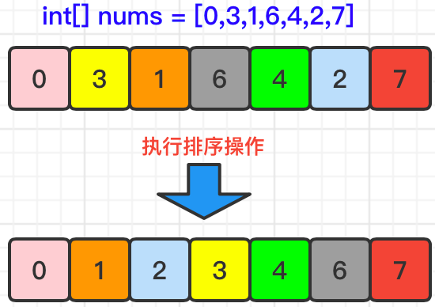
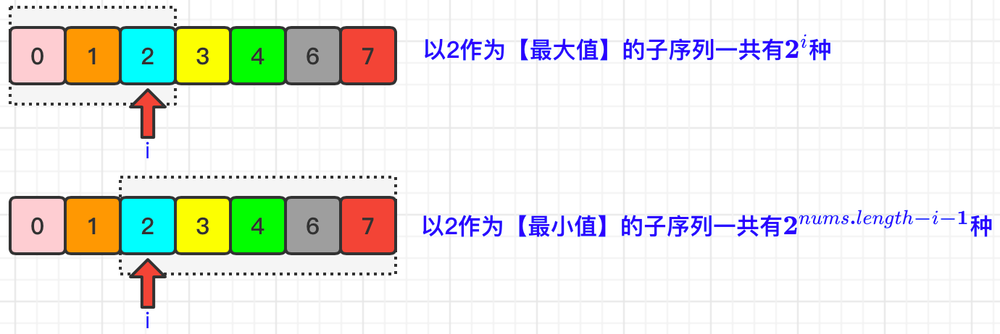
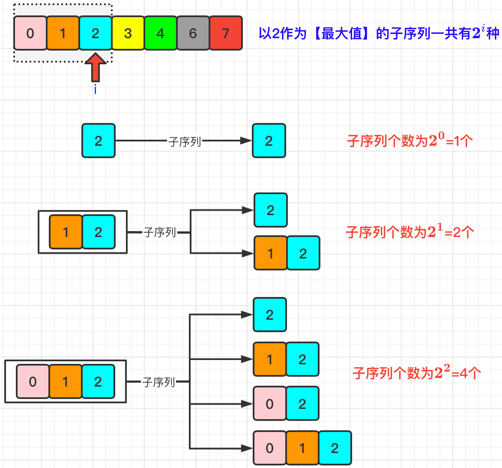

#### [解题思路](https://leetcode.cn/problems/sum-of-subsequence-widths/solutions/1977772/by-muse-77-f6s5/)

根据题目描述我们可以知道，计算宽度的时候，只是需要计算序列中【`最大元素`】与【`最小元素`】的差值。那么我们**只需要关心数组nums中数字的大小而不需要关心它所在的位置**了，即：子序列`[2,4]`与子序列`[4,2]`差值都是2。

那么，既然我们主要关注点是数组`nums`中的每个元素值大小，为了方便计算，我们首先可以对`nums`进行排序操作。



排序之后，我们随便找一个下标为`i`的元素，可以找到以下规律：



下面是以`nums[i]`和`其左侧所有元素`拼装组合成的**子序列**示例：



那么，针对于`nums[i]`来说，它的`宽度总和`就是：

> **$(2^i-2^{(nums.length-i-1)}) \times nums[i]$**

那么我们遍历所有nums数组中的元素，逐一计算每个元素的宽度总和，那么最终结果就是本题的答案。

# 代码实现

```cpp
class Solution {
    public int sumSubseqWidths(int[] nums) {
        Arrays.sort(nums); // 排序
        int mod = (int)1e9 + 7, n = nums.length;
        long result = 0;
        long[] pow = new long[n];
        pow[0] = 1;
        for (int i = 1; i < n; i++) 
            pow[i] = (pow[i - 1] << 1) % mod; // 初始化2^n的值

        for (int i = 0; i < n; i++)
            result = (result + (pow[i] - pow[n-i-1]) * nums[i] % mod) % mod; // 计算总和          
        return (int)result;
    }
}
```
