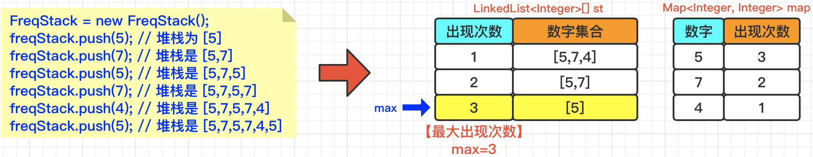
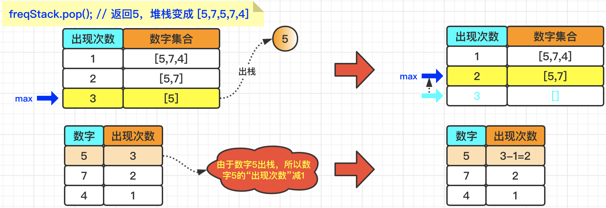
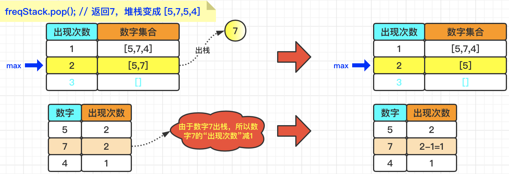

#### [解题思路](https://leetcode.cn/problems/maximum-frequency-stack/solutions/1998468/-by-muse-77-bzg6/)

根据题目描述，我们需要解决两个问题：

> 【**问题1**】如何保存某个**数字**的**出现次数**？――采用**Map<Integer, Integer> map**维护 【**问题2**】如何保存**相同出现次数**情况下，多个**数字集合**的“`入栈`”和“`出栈`”顺序？――采用**LinkedList[] st**维护

我们以`示例1`为例，来看一下对于**插入操作**，是如何处理的：



> 【解释】
> -   **freqStack.push(5)**： 在`map`中{key=5, value=1}； 在`st`中{key=1, value=[5]}；
> -   **freqStack.push(7)**： 在`map`中{key=5, value=1},{key=7, value=1}； 在`st`中{key=1, value=[5, 7]}；
> -   **freqStack.push(5)**： 在`map`中{key=5, value=2},{key=7, value=1}； 在`st`中{key=1, value=[5, 7]}, {key=2，value=[5]}；
> -   **freqStack.push(7)**： 在`map`中{key=5, value=2},{key=7, value=2}； 在`st`中{key=1, value=[5, 7]}, {key=2，value=[5, 7]}；
> -   **freqStack.push(4)**： 在`map`中{key=5, value=2},{key=7, value=2},{key=4, value=1}； 在`st`中{key=1, value=[5, 7, 4]}, {key=2，value=[5, 7]}；
> -   **freqStack.push(5)** ： 在`map`中{key=5, value=3},{key=7, value=2},{key=4, value=1}； 在`st`中{key=1, value=[5, 7, 4]}, {key=2，value=[5, 7]}, {key=3，value=[5]}；

我们还是以`示例1`为例，来看一下对于**出栈操作**，是如何处理的：



> 【解释】
> -   由于当前最大出现次数**max等于3**，所以，我们可以通过`st[3]`获得数字集合为：`[5]`；
> -   **将5出栈**之后，数字集合变为`[]`；
> -   由于数字集合为空，所以**max减1等于2**，并且将`map`中`数字5`的出现次数**减1**，即：`3-1=2`；

我们再次执行**出栈操作**，再来看一下是如何处理的：



> 【解释】
> -   由于当前最大出现次数**max等于2**，所以，我们可以通过`st[2]`获得数字集合为：`[5，7]`；
> -   **将7出栈**之后，数字集合变为`[5]`；
> -   由于数字集合不为空，所以**max依然等于2**，然后将`map`中`数字7`的出现次数**减1**，即：`2-1=1`；

后续的出栈操作，以此类推，此处就不再赘述了。

#### 代码实现

```java
class FreqStack {
    Map<Integer, Integer> map = new HashMap(); // key：数字N  value：数字N出现的次数
    LinkedList<Integer>[] st = new LinkedList[2 * (int) 1e4]; // key：出现M次 value：出现M次的数字集合
    int max = 0; // 当前最大出现次数

    public FreqStack() {}

    public void push(int val) {
        int times = map.getOrDefault(val, 0) + 1; // 数字val的出现次数+1
        map.put(val, times);
        if (st[times] == null) st[times] = new LinkedList();
        st[times].add(val); // 将数字val放到以times为key的value集合中
        max = Math.max(max, times); // 尝试更新最大出现次数
    }

    public int pop() {
        int result = -1; // 待出栈数字
        while (max > 0) {
            if (st[max].size() == 0) max--; // 如果max次数对应的数字集合都已经出栈了，则max减1
            else {
                result = st[max].removeLast(); // 移除出现times次的数字集合中“末尾”的数字result
                break;
            }
        }
        map.put(result, map.getOrDefault(result, 0) - 1); // 将数字result的出现次数-1
        return result;
    }
}
```
