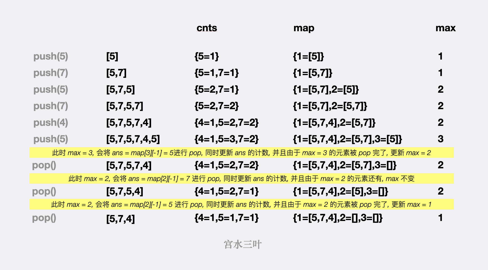

#### [哈希表](https://leetcode.cn/problems/maximum-frequency-stack/solutions/1998454/by-ac_oier-tquk/)

这是一道很纯的哈希表题儿。

首先，我们容易想到建立 **第一个哈希表 `cnts` 用于记录某个数值的出现次数，`cnts[val] = c` 含义为数值 `val` 当前在栈中的出现次数为 `c`。我们称该哈希表为「计数哈希表」**。

再结合每次 `pop` 需要返回「频率最大的元素，若有多个则返回最考虑栈顶的一个」的要求，我们还可以 **建立第二个哈希 `map`，该哈希表以「出现次数 `c`」为键，以「出现次数均为 `c` 的元素序列」为值，`map[c] = A = [...]` 含义为出现次数为 `c` 的序列为 `A`，并且序列 `A` 中的结尾元素为出现次数为 `c` 的所有元素中最靠近栈顶的元素。我们称该哈希表为「分桶哈希表」**。

最后再额外使用一个变量 `max` 记录当前最大出现频数，不难发现，`max` 必然是以步长 ±1\\pm 1±1 进行变化（当出现次数为 `max` 的元素被 `pop` 掉了一个后，必然剩下 `max - 1` 个），因此当我们在某次 `pop` 操作后发现出现次数为 `max` 的集合为空时，对 `max` 进行自减操作即可。

将题目给的样例作为 🌰 ，大家可以看看 `cnts`、`map` 和 `max` 三者如何变化，以及 `pop` 的更新逻辑：



代码：
```java
class FreqStack {
    Map<Integer, List<Integer>> map = new HashMap<>();
    Map<Integer, Integer> cnts = new HashMap<>();
    int max;
    public void push(int val) {
        cnts.put(val, cnts.getOrDefault(val, 0) + 1);
        int c = cnts.get(val);
        List<Integer> list = map.getOrDefault(c, new ArrayList<>());
        list.add(val);
        map.put(c, list);
        max = Math.max(max, c);
    }
    public int pop() {
        List<Integer> list = map.get(max);
        int ans = list.remove(list.size() - 1);
        cnts.put(ans, cnts.get(ans) - 1);
        if (list.size() == 0) max--;
        return ans;
    }
}
```

```typescript
class FreqStack {
    map: Map<number, Array<number>> = new Map<number, Array<number>>()
    cnst: Map<number, number> = new Map<number, number>()
    max: number = 0
    push(val: number): void {
        if (!this.cnst.has(val)) this.cnst.set(val, 0)
        this.cnst.set(val, this.cnst.get(val) + 1)
        const c = this.cnst.get(val)
        if (!this.map.has(c)) this.map.set(c, new Array<number>())
        this.map.get(c).push(val)
        this.max = Math.max(this.max, c)
    }
    pop(): number {
        const ans = this.map.get(this.max).pop()
        if (this.map.get(this.max).length == 0) this.max--
        this.cnst.set(ans, this.cnst.get(ans) - 1)
        return ans
    }
}
```

```python
class FreqStack:
    def __init__(self):
        self.cnts = defaultdict(int)
        self.map = defaultdict(list)
        self.mv = 0

    def push(self, val: int) -> None:
        self.cnts[val] += 1
        c = self.cnts[val]
        self.map[c].append(val)
        self.mv = max(self.mv, c)

    def pop(self) -> int:
        ans = self.map[self.mv].pop()
        self.cnts[ans] -= 1
        self.mv -= 0 if self.map[self.mv] else 1
        return ans
```

-   时间复杂度：所有操作均为 $O(1)$
-   空间复杂度：所有入栈的节点最多会被存储两次，一次在计数哈希表中，一次在分桶哈希表中，复杂度为 $O(n)$
