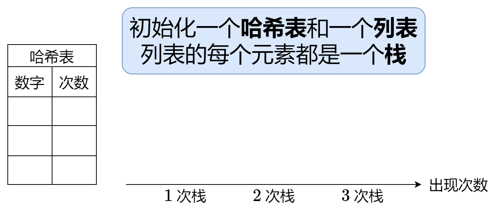
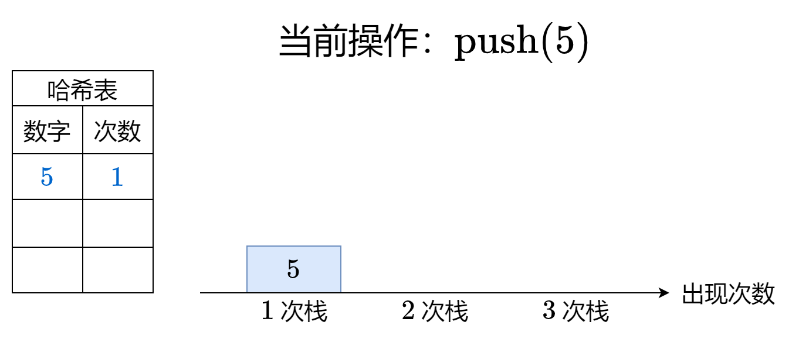
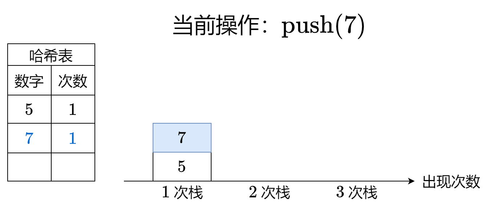
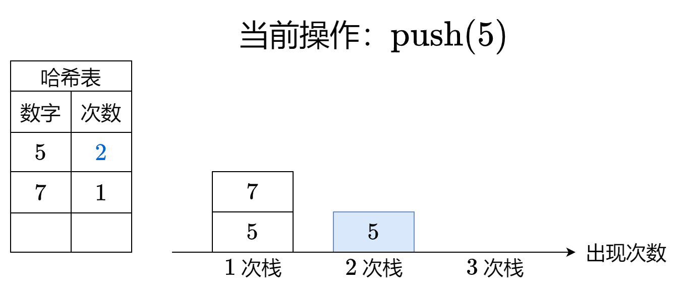
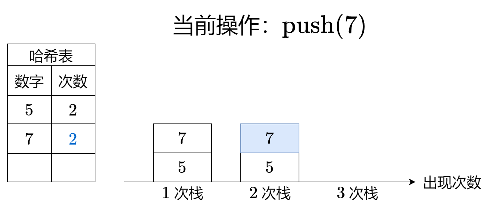
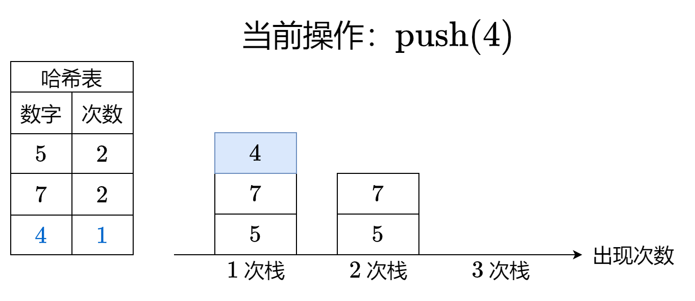
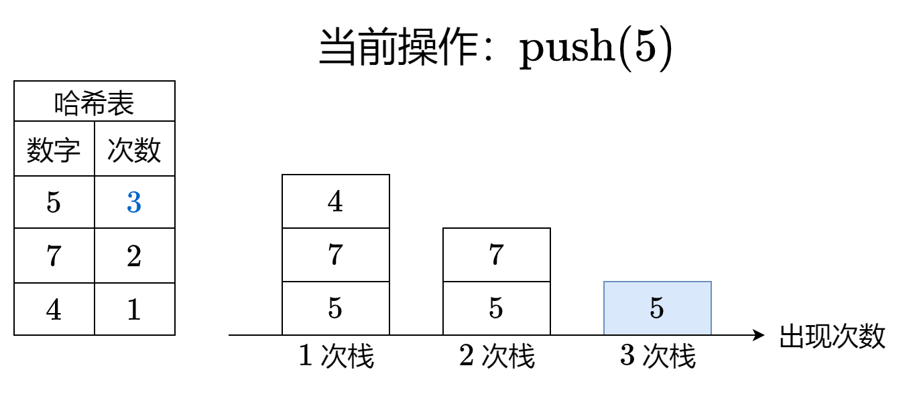
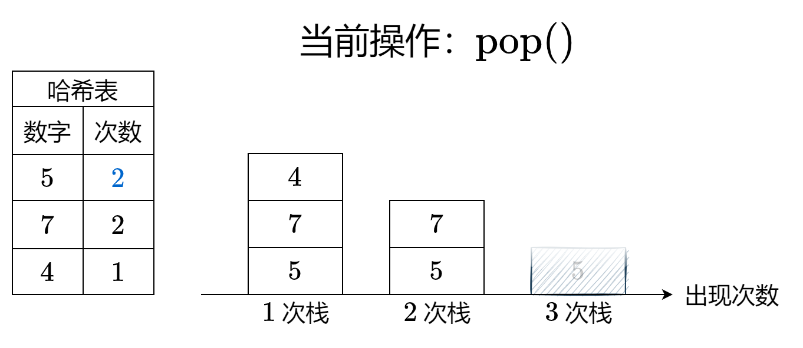
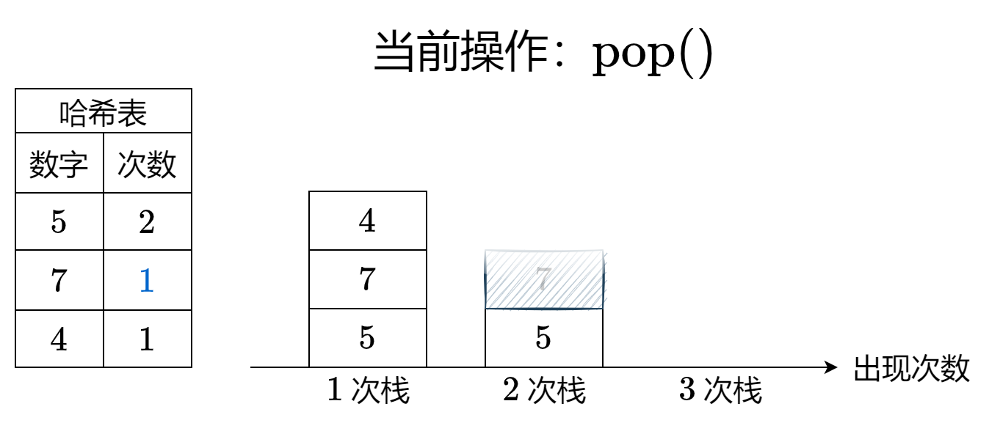
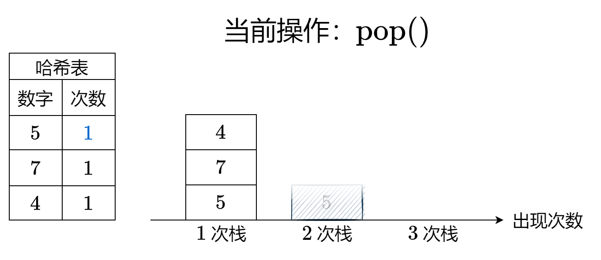

#### [最大频率栈](https://leetcode.cn/problems/maximum-frequency-stack/solutions/1998430/mei-xiang-ming-bai-yi-ge-dong-hua-miao-d-oich/)

核心思路：把频率（出现次数）不同的元素，压入不同的栈中。每次出栈时，弹出含有频率最高元素的栈的栈顶。
同时，为了知道每个元素的频率，还需要用一个哈希表来实时维护。

下面的 PPT 动画展示了示例 1 是如何操作的。












> 注：代码实现时，为了简单地实现，当元素频率减为 0 时，并没有从哈希表中删除元素。

#### 答疑

**问**：是否会出现**中间**的某个栈为空的情况？

**答**：不会。因为出栈一定是在元素频率最高的栈上发生的，即上面动画中最右侧的非空栈。

**问**：如果有多个相同频率的数字，怎么保证弹出的是一定最接近栈顶的那个数字？

**答**：因为这个做法本质上就是**把原始栈拆分成多个栈**，每个栈都存储着相同频率的数字（这里的频率指的是数字入栈时的频率），且保持了原有的入栈顺序，因此弹出的是一定最接近栈顶的那个数字。

```py
class FreqStack:
    def __init__(self):
        self.cnt = Counter()
        self.stacks = []  # 每个元素都是一个栈

    def push(self, val: int) -> None:
        if self.cnt[val] == len(self.stacks):  # 这个元素的频率已经是目前最多的，现在又出现了一次
            self.stacks.append([val])  # 那么必须创建一个新栈
        else:
            self.stacks[self.cnt[val]].append(val)  # 否则就压入对应的栈
        self.cnt[val] += 1  # 更新频率

    def pop(self) -> int:
        val = self.stacks[-1].pop()  # 弹出最右侧栈的栈顶
        if len(self.stacks[-1]) == 0:  # 栈为空
            self.stacks.pop()  # 删除
        self.cnt[val] -= 1  # 更新频率
        return val
```

```java
class FreqStack {
    private final Map<Integer, Integer> cnt = new HashMap<>();
    private final List<Deque<Integer>> stacks = new ArrayList<>();

    public void push(int val) {
        int c = cnt.getOrDefault(val, 0);
        if (c == stacks.size()) // 这个元素的频率已经是目前最多的，现在又出现了一次
            stacks.add(new ArrayDeque<>()); // 那么必须创建一个新栈
        stacks.get(c).push(val);
        cnt.put(val, c + 1); // 更新频率
    }

    public int pop() {
        int back = stacks.size() - 1;
        int val = stacks.get(back).pop(); // 弹出最右侧栈的栈顶
        if (stacks.get(back).isEmpty()) // 栈为空
            stacks.remove(back); // 删除
        cnt.put(val, cnt.get(val) - 1); // 更新频率
        return val;
    }
}
```

```cpp
class FreqStack {
    unordered_map<int, int> cnt;
    vector<stack<int>> stacks;
public:
    void push(int val) {
        if (cnt[val] == stacks.size()) // 这个元素的频率已经是目前最多的，现在又出现了一次
            stacks.push_back({}); // 那么必须创建一个新栈
        stacks[cnt[val]].push(val);
        ++cnt[val]; // 更新频率
    }

    int pop() {
        int val = stacks.back().top(); // 弹出最右侧栈的栈顶
        stacks.back().pop();
        if (stacks.back().empty()) // 栈为空
            stacks.pop_back(); // 删除
        --cnt[val]; // 更新频率
        return val;
    }
};
```

```go
type FreqStack struct {
    cnt    map[int]int
    stacks [][]int
}

func Constructor() FreqStack {
    return FreqStack{cnt: map[int]int{}}
}

func (f *FreqStack) Push(val int) {
    c := f.cnt[val]
    if c == len(f.stacks) { // 这个元素的频率已经是目前最多的，现在又出现了一次
        f.stacks = append(f.stacks, []int{val}) // 那么必须创建一个新栈
    } else {
        f.stacks[c] = append(f.stacks[c], val) // 否则就压入对应的栈
    }
    f.cnt[val]++ // 更新频率
}

func (f *FreqStack) Pop() int {
    back := len(f.stacks) - 1
    st := f.stacks[back]
    bk := len(st) - 1
    val := st[bk] // 弹出最右侧栈的栈顶
    if bk == 0 { // 栈为空
        f.stacks = f.stacks[:back] // 删除
    } else {
        f.stacks[back] = st[:bk]
    }
    f.cnt[val]-- // 更新频率
    return val
}
```

#### 复杂度分析

-   时间复杂度：均为 $O(1)$。
-   空间复杂度：$O(q)$，其中 $q$ 为 $push$ 调用的次数。
