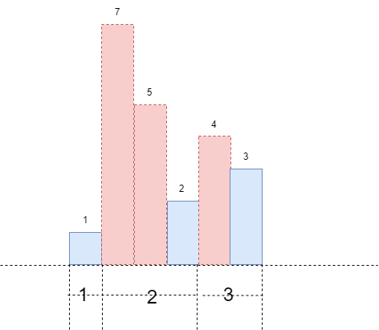

#### [](https://leetcode.cn/problems/sum-of-subarray-minimums/solution/zi-shu-zu-de-zui-xiao-zhi-zhi-he-by-leet-bp3k//#方法二：动态规划)方法二：动态规划

设 s[j][i] 表示子数组 [arr[j],arr[j+1],⋯ ,arr[i]] 的最小值，则可以推出所有连续子数组的最小值之和为$\sum\limits_{i=0}^{n-1}\sum\limits_{j=0}^{i}s[j][i]$。对于每个以 i 为最右的子数组最小值之和为$\sum\limits_{j=0}^{i}s[j][i]$。我们只需要求出以每个元素 arr[i] 为最右的子数组最小值之和，即可求出所有的子数组的最小值之和。每当我们减少 j 时，子序列的最小值可能会有关联，事实上我们可以观察到 s[j−1][i]=min⁡(s[j][i],arr[j−1])。
假设当前数组为: arr=[1,7,5,2,4,3,9]，当 i=5 时，所有以索引 j 为起点且以 i 结尾的连续子序列为:
j=5, [3]
j=4, [4,3]
j=3, [2,4,3]
j=2, [5,2,4,3]
j=1, [7,5,2,4,3]
j=0, [1,7,5,2,4,3]
上述序列的最小值分别为 [3,3,2,2,2,1]，可以发现重要点是 j=5,j=3,j=0，分别是 j 从 i 开始向左移动遇到的最小值的位置。如下图所示:


设以 arr[i] 为最右且最小的最长子序列长度为 k：
-   当 $j>=i−k+1$ 时：连续子序列 $[arr[j]，arr[j+1],⋯，arr[i]]$ 的最小值为 $arr[i]$，即 $s[j][i]=arr[i]$。
-   当 $j<i−k+1$ 时：连续子序列 $[arr[j]，arr[j+1],⋯，arr[i]]$ 的最小值一定比 $arr[i]$ 更小，通过分析可以知道它的最小值 $s[j][i]=min⁡(s[j][i−k],arr[i])=s[j][i−k]$。

则可以知道递推公式如下：
$\sum\limits_{j=0}^{i}s[j][i]=\sum\limits_{j=0}^{i-k}s[j][i]+\sum\limits_{j=i-k+1}^{i}s[j][i]\\
\qquad\qquad=\sum\limits_{j=0}^{i-k}s[j][i]+k \times arr[i]\\
\qquad\qquad=\sum\limits_{j=0}^{i-k}s[j][i-k]+k \times arr[i]$

我们令$dp[i]=\sum\limits_{j=0}^{i}s[j][i]$，则上述等式转换为：
$dp[i]=dp[i−k]+k×arr[i]$

我们维护一个单调栈，很容易求出元素 x 的左边第一个比它小的元素，即求出以 x 为最右且最小的子序列的最大长度，子数组的最小值之和即为$\sum\limits_{i=0}^{n-1}dp[i]$。

具体解法过程如下：
-   从左向右遍历数组并维护一个单调递增的栈，如果栈顶的元素大于等于当前元素 arr[i] 则弹出栈，此时栈顶的元素即为左边第一个小于小于当前值的元素；
-   我们求出以当前值为最右且最小的子序列的长度 k，根据上述递推公式求出 dp[i]，最终的返回值即为$\sum\limits_{i=0}^{n-1}dp[i]$。

```Python
MOD = 10 ** 9 + 7

class Solution:
    def sumSubarrayMins(self, arr: List[int]) -> int:
        n = len(arr)
        monoStack = []
        dp = [0] * n
        ans = 0
        for i, x in enumerate(arr):
            while monoStack and arr[monoStack[-1]] > x:
                monoStack.pop()
            k = i - monoStack[-1] if monoStack else i + 1
            dp[i] = k * x + (dp[i - k] if monoStack else 0)
            ans = (ans + dp[i]) % MOD
            monoStack.append(i)
        return ans
```

```C++
class Solution {
public:
    int sumSubarrayMins(vector<int>& arr) {
        int n = arr.size();
        long long ans = 0;
        long long mod = 1e9 + 7;
        stack<int> monoStack;
        vector<int> dp(n);
        for (int i = 0; i < n; i++) {
            while (!monoStack.empty() && arr[monoStack.top()] > arr[i]) {
                monoStack.pop();
            }
            int k = monoStack.empty() ? (i + 1) : (i - monoStack.top());
            dp[i] = k * arr[i] + (monoStack.empty() ? 0 : dp[i - k]);
            ans = (ans + dp[i]) % mod;
            monoStack.emplace(i);
        }
        return ans;
    }
};
```

```Java
class Solution {
    public int sumSubarrayMins(int[] arr) {
        int n = arr.length;
        long ans = 0;
        final int MOD = 1000000007;
        Deque<Integer> monoStack = new ArrayDeque<Integer>();
        int[] dp = new int[n];
        for (int i = 0; i < n; i++) {
            while (!monoStack.isEmpty() && arr[monoStack.peek()] > arr[i]) {
                monoStack.pop();
            }
            int k = monoStack.isEmpty() ? (i + 1) : (i - monoStack.peek());
            dp[i] = k * arr[i] + (monoStack.isEmpty() ? 0 : dp[i - k]);
            ans = (ans + dp[i]) % MOD;
            monoStack.push(i);
        }
        return (int) ans;
    }
}
```

```C#
public class Solution {
    public int SumSubarrayMins(int[] arr) {
        int n = arr.Length;
        long ans = 0;
        const int MOD = 1000000007;
        Stack<int> monoStack = new Stack<int>();
        int[] dp = new int[n];
        for (int i = 0; i < n; i++) {
            while (monoStack.Count > 0 && arr[monoStack.Peek()] > arr[i]) {
                monoStack.Pop();
            }
            int k = monoStack.Count == 0 ? (i + 1) : (i - monoStack.Peek());
            dp[i] = k * arr[i] + (monoStack.Count == 0 ? 0 : dp[i - k]);
            ans = (ans + dp[i]) % MOD;
            monoStack.Push(i);
        }
        return (int) ans;
    }
}
```

```C
int sumSubarrayMins(int* arr, int arrSize) {
    long long ans = 0;
    long long mod = 1e9 + 7;
    int monoStack[arrSize], dp[arrSize];
    int top = 0;
    for (int i = 0; i < arrSize; i++) {
        while (top > 0 && arr[monoStack[top - 1]] > arr[i]) {
            top--;
        }
        int k = top == 0 ? (i + 1) : (i - monoStack[top - 1]);
        dp[i] = k * arr[i] + (top == 0 ? 0 : dp[i - k]);
        ans = (ans + dp[i]) % mod;
        monoStack[top++] = i;
    }
    return ans;
}
```

```JavaScript
var sumSubarrayMins = function(arr) {
    const n = arr.length;
    let ans = 0;
    const MOD = 1000000007;
    const monoStack = [];
    const dp = new Array(n).fill(0);
    for (let i = 0; i < n; i++) {
        while (monoStack.length !== 0 && arr[monoStack[monoStack.length - 1]] > arr[i]) {
            monoStack.pop();
        }
        const k = monoStack.length === 0 ? (i + 1) : (i - monoStack[monoStack.length - 1]);
        dp[i] = k * arr[i] + (monoStack.length === 0 ? 0 : dp[i - k]);
        ans = (ans + dp[i]) % MOD;
        monoStack.push(i);
    }
    return ans;
};
```

```Go
func sumSubarrayMins(arr []int) (ans int) {
    const mod int = 1e9 + 7
    n := len(arr)
    monoStack := []int{}
    dp := make([]int, n)
    for i, x := range arr {
        for len(monoStack) > 0 && arr[monoStack[len(monoStack)-1]] > x {
            monoStack = monoStack[:len(monoStack)-1]
        }
        k := i + 1
        if len(monoStack) > 0 {
            k = i - monoStack[len(monoStack)-1]
        }
        dp[i] = k * x
        if len(monoStack) > 0 {
            dp[i] += dp[i-k]
        }
        ans = (ans + dp[i]) % mod
        monoStack = append(monoStack, i)
    }
    return
}
```

**复杂度分析**

-   时间复杂度：O(n)，其中 n 为数组的长度。利用单调栈求出每个元素为最小值的子序列长度需要的时间为 O(n)。
-   空间复杂度：O(n)。其中 n 为数组的长度。需要存储每个元素为结尾的子序列最小值之和，所需的空间为 O(n)。
