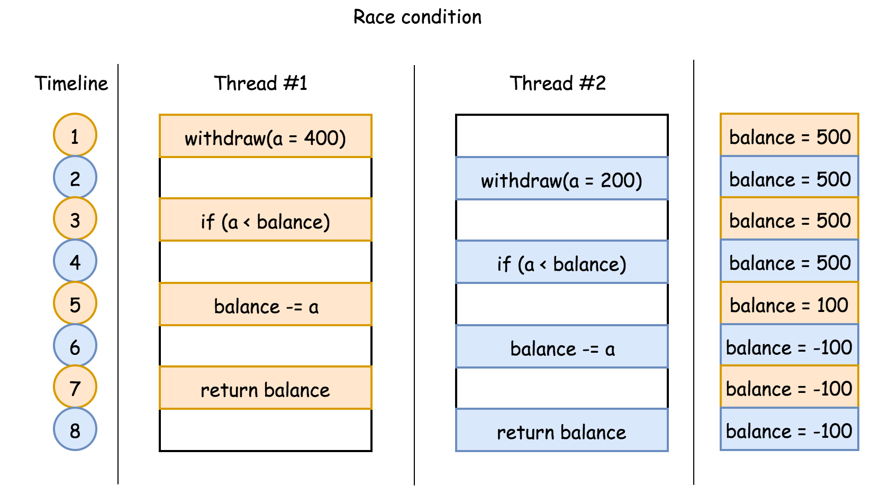
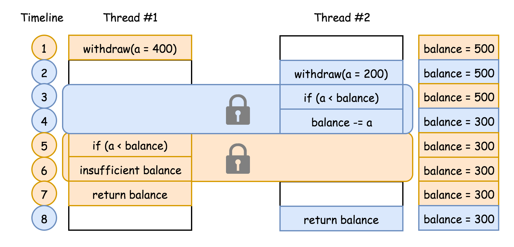
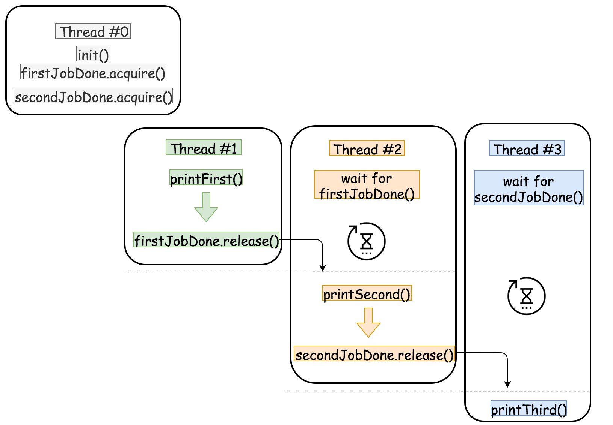

#### 并发问题

> 并发问题来自[并发计算](https://leetcode.cn/link/?target=https%3A%2F%2Fbaike.baidu.com%2Fitem%2F%E5%B9%B6%E5%8F%91%E8%AE%A1%E7%AE%97%2F9939802%3Ffr%3Daladdin)的场景，该场景下，程序在多线程（或多进程）中 _同时_ 执行。

同时进行并不是完全指进程或线程在不同的物理 CPU 上独立运行，更多情况下，是在一个物理 CPU 上交替执行多个线程或进程。_并发既可在线程中，也可在进程中。_

并发主要为多任务情况设计。但如果应用不当，可能会引发一些漏洞。按照情况不同，可以分为三种：

-   **竞态条件**：由于多进程之间的竞争执行，导致程序未按照期望的顺序输出。
    
-   **死锁**：并发程序等待一些必要资源，导致没有程序可以执行。
    
-   **资源不足**：进程被永久剥夺了运行所需的资源。
    

此题中存在竞态条件。下面展示一个竞态条件的例子。

假设有一个方法 `withdraw(amount)`，如果请求量小于当前余额，则从当前余额中减去请求量，然后返回余额。方法定义如下：

```
balance = 500
def withdraw(amount):
    if (amount < balance):
        balance -= amount
    return balance

```

```
int balance = 500;
int withdraw(int amount) {
  if (amount < balance) {
    balance -= amount;
  }
  return balance;
}

```

我们 _期望_ 该方法执行后余额永远不会为负。

但是有可能出现竞态条件，使得余额变为负数。假设两个线程同时使用不同的参数执行该方法。例如：线程 1 执行 `withdraw(amount=400)`，线程 2 执行 `withdraw(amount=200)`。这两个线程的执行顺序如下图所示。在每个时刻只执行一条语句。



上述流程执行结束后，余额变成负数，这并不是期望的输出。

#### [](https://leetcode.cn/problems/print-in-order/solution/an-xu-da-yin-by-leetcode//#无竞争并发)无竞争并发

并发问题有一个共同特征：多个线程/进程之间共享一些资源（例如：余额）。由于无法消除资源共享的约束，防止并发问题就变成了 _资源共享的协调_ 问题。

根据这个思路，如果可以确保程序中 **关键部分代码的独占性**（例如：检查和减少余额），就可以防止程序进入不一致的状态。

> 竞争条件的解决方案为：需要某些关键部分代码具有排他性，即在给定的时间内，只有一个线程可以进入关键部分代码。

可以将这种机制看做限制关键部分代码访问的锁。在前面示例的关键部分代码加锁，即检查余额和减少余额的语句。然后重新运行两个线程，会有下图的执行顺序：



在该机制下，一旦一个线程进入关键部分，它就可以阻止其他线程进入该关键部分。例如，在时间点 3，`线程 2` 进入关键部分，那么在时间点 4，如果没有锁保护，`线程 1` 就可能进入关键部分。最后两个线程同时运行，保证系统的一致性，并确保余额正确。

如果该线程未被授权进入关键代码，可以认为该线程被阻塞或进入睡眠状态。例如，`线程 1` 在时间点 4 被阻塞，之后关键部分被释放，可以通知其他等待线程。`线程 2` 在时间点 5 释放了关键部分，就可以通知 `线程 1` 进入。

> 这种机制还具有唤醒其他等待线程的功能。

总之，为了防止出现并发竞争状态，需要一种具有两种功能的机制：1）关键部分的访问控制；2）通知阻塞线程。

#### [](https://leetcode.cn/problems/print-in-order/solution/an-xu-da-yin-by-leetcode//#方法一：使用-synchronization)方法一：使用 synchronization

**思路**

题目要求按顺序依次执行三个方法，且每个方法都在单独的线程中运行。为了保证线程的执行顺序，可以在方法之间创建一些依赖关系，即第二个方法必须在第一个方法之后执行，第三个方法必须在第二个方法之后执行。

> 方法对之间的依赖关系形成了所有方法的特定的执行顺序。例如 `A < B`, `B < C`，则所有方法的执行顺序为 `A < B < C`。


依赖关系可以通过并发机制实现。使用一个共享变量 `firstJobDone` 协调第一个方法与第二个方法的执行顺序，使用另一个共享变量 `secondJobDone` 协调第二个方法与第三个方法的执行顺序。

**算法**

-   首先初始化共享变量 `firstJobDone` 和 `secondJobDone`，初始值表示所有方法未执行。
    
-   方法 `first()` 没有依赖关系，可以直接执行。在方法最后更新变量 `firstJobDone` 表示该方法执行完成。
    
-   方法 `second()` 中，检查 `firstJobDone` 的状态。如果未更新则进入等待状态，否则执行方法 `second()`。在方法末尾，更新变量 `secondJobDone` 表示方法 `second()` 执行完成。
    
-   方法 `third()` 中，检查 `secondJobDone` 的状态。与方法 `second()` 类似，执行 `third()` 之前，需要先等待 `secondJobDone` 的状态。



**实现**

上述算法的实现在很大程度上取决于选择的编程语言。尽管在 Java，C++ 和 Python 中都存在[互斥](https://leetcode.cn/link/?target=https%3A%2F%2Fbaike.baidu.com%2Fitem%2F%E4%BA%92%E6%96%A5%E4%BA%8B%E4%BB%B6%2F9980508%3Ffr%3Daladdin)与[信号量](https://leetcode.cn/link/?target=https%3A%2F%2Fbaike.baidu.com%2Fitem%2F%E4%BF%A1%E5%8F%B7%E9%87%8F%2F9807501%3Ffr%3Daladdin)，但不同语言对并发机制有不同实现。

```Python
from threading import Lock

class Foo:
    def __init__(self):
        self.firstJobDone = Lock()
        self.secondJobDone = Lock()
        self.firstJobDone.acquire()
        self.secondJobDone.acquire()

    def first(self, printFirst: 'Callable[[], None]') -> None:
        # printFirst() outputs "first".
        printFirst()
        # Notify the thread that is waiting for the first job to be done.
        self.firstJobDone.release()

    def second(self, printSecond: 'Callable[[], None]') -> None:
        # Wait for the first job to be done
        with self.firstJobDone:
            # printSecond() outputs "second".
            printSecond()
            # Notify the thread that is waiting for the second job to be done.
            self.secondJobDone.release()

    def third(self, printThird: 'Callable[[], None]') -> None:

        # Wait for the second job to be done.
        with self.secondJobDone:
            # printThird() outputs "third".
            printThird()

```

```Cpp
#include <semaphore.h>

class Foo {

protected:
    sem_t firstJobDone;
    sem_t secondJobDone;

public:

    Foo() {
        sem_init(&firstJobDone, 0, 0);
        sem_init(&secondJobDone, 0, 0);
    }

    void first(function<void()> printFirst) {
        // printFirst() outputs "first".
        printFirst();
        sem_post(&firstJobDone);
    }

    void second(function<void()> printSecond) {
        sem_wait(&firstJobDone);
        // printSecond() outputs "second".
        printSecond();
        sem_post(&secondJobDone);
        
    }

    void third(function<void()> printThird) {
        sem_wait(&secondJobDone);
        // printThird() outputs "third".
        printThird();
    }
};

```

```Java
class Foo {

  private AtomicInteger firstJobDone = new AtomicInteger(0);
  private AtomicInteger secondJobDone = new AtomicInteger(0);

  public Foo() {}

  public void first(Runnable printFirst) throws InterruptedException {
    // printFirst.run() outputs "first".
    printFirst.run();
    // mark the first job as done, by increasing its count.
    firstJobDone.incrementAndGet();
  }

  public void second(Runnable printSecond) throws InterruptedException {
    while (firstJobDone.get() != 1) {
      // waiting for the first job to be done.
    }
    // printSecond.run() outputs "second".
    printSecond.run();
    // mark the second as done, by increasing its count.
    secondJobDone.incrementAndGet();
  }

  public void third(Runnable printThird) throws InterruptedException {
    while (secondJobDone.get() != 1) {
      // waiting for the second job to be done.
    }
    // printThird.run() outputs "third".
    printThird.run();
  }
}


```
