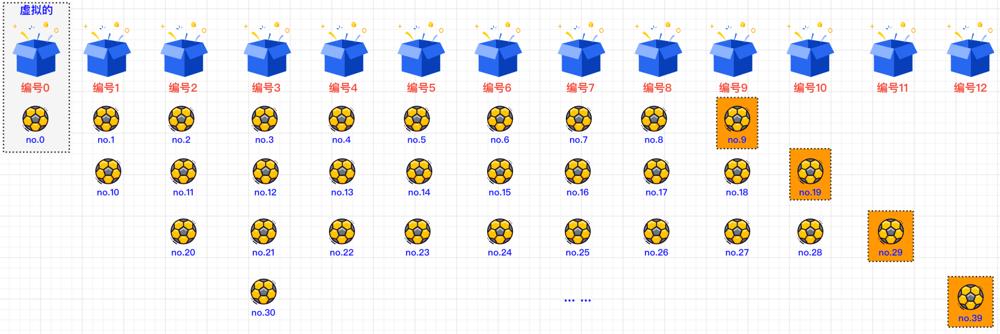

#### [解题思路](https://leetcode.cn/problems/maximum-number-of-balls-in-a-box/solutions/1986523/-by-muse-77-ru13/)

##### 1> 模拟

根据题目描述，我们可以最先想到的方式就是暴力破解，即：从`lowLimit`开始，到`hightLimit`结束，计算每个数字的每一位，然后将其进行加和操作，**总和就是该数字所在的盒子编号**，那么该编号盒子小球数量**加1**即可。将所有数字都计算完毕后，再遍历所有盒子，找出最大的盒子中球的数量作为最终结果返回。

由于题目的“提示”部分已经指出`1 <= lowLimit <= highLimit <= 10^5`，那么最大盒子编号应该是小球“`99999`”放置的位置，即：`9+9+9+9+9=45`。那么我们可以创建长度为**46**的数组，即：`int[] resultMap = new int[46]`，数组中下标`index`表示盒子编号，`resultMap[index]`表示盒子中的小球数量。

##### 2> 找规律

我们可以根据题意，将小球从编号为1开始，放入每个箱子中，我们会发现如下规律：

> **当小球A是“9”的时候**，它的在编号为`9`的箱子里，那么下一个小球B“10”所在的位置，就是编号为`1`的箱子。 **当小球A是“19”的时候**，它的在编号为`10`的箱子里，那么下一个小球B“20”所在的位置，就是编号为`2`的箱子。 **当小球A是“29”的时候**，它的在编号为`11`的箱子里，那么下一个小球B“30”所在的位置，就是编号为`3`的箱子。 …… **当小球A是“99”的时候**，它的在编号为`18`的箱子里，那么下一个小球B“100”所在的位置，就是编号为`1`的箱子。 …… **当小球A是“999”的时候**，它的在编号为`27`的箱子里，那么下一个小球B“1000”所在的位置，就是编号为`1`的箱子。 **以此类推……**

因此从上面的例子中，我们可以找出如下规律，即：**B球所在箱子编号 = A球所在箱子编号 - （9 \* [末尾9的个数]）+ 1**

那么根据这个规律，我们就可以**只针对末尾是9的小球进行特殊定位计算，而其他小球所在的位置，只需要根据前面小球位置+1**即可。下图是小球示例图：



##### 代码实现

##### 1> 模拟

```dart
class Solution {
    public int countBalls(int lowLimit, int highLimit) {
        int result = 0;
        int[] resultMap = new int[46];
        for(int i = lowLimit; i <= highLimit; i++) {
            int num = i, index = 0;
            while(num > 0) {
                index += num % 10;
                num = num / 10;
            }
            resultMap[index] += 1;
        }
        for (int r : resultMap) result = Math.max(result, r);
        return result;
    }
}
```

##### 2> 找规律

```dart
class Solution {
    public int countBalls(int lowLimit, int highLimit) {
        int[] resultMap = new int[46];
        int firstIndex = 0, result = 0;
        for (int num = lowLimit; num > 0; num = num / 10) firstIndex += num % 10;
        resultMap[firstIndex] = 1; // 初始化第一个数字lowLimit所在编号盒子的小球数量
        for (int i = lowLimit; i < highLimit; i++) {
            for (int prevNum = i; prevNum % 10 == 9; prevNum /= 10) // 根据前一个数的末位是否为9，来重新定位下一个数的位置
                firstIndex -= 9; // 前移9位
            resultMap[++firstIndex]++;
        }
        for (int rm : resultMap) result = Math.max(result, rm);
        return result;
    }
}
```
