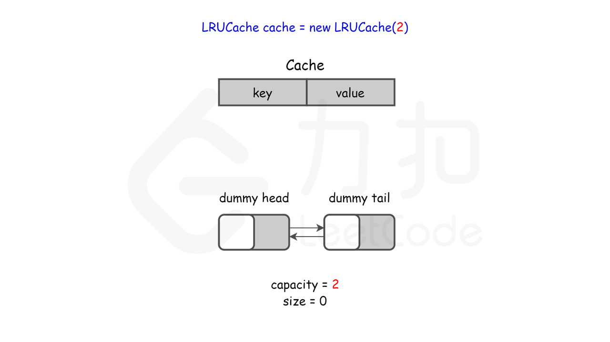

#### 前言

实现本题的两种操作，需要用到一个哈希表和一个双向链表。在面试中，面试官一般会期望读者能够自己实现一个简单的双向链表，而不是使用语言自带的、封装好的数据结构。在 `Python` 语言中，有一种结合了哈希表与双向链表的数据结构 `OrderedDict`，只需要短短的几行代码就可以完成本题。在 `Java` 语言中，同样有类似的数据结构 `LinkedHashMap`。这些做法都不会符合面试官的要求，因此下面只给出使用封装好的数据结构实现的代码，而不多做任何阐述。

```Python3
class LRUCache(collections.OrderedDict):

    def __init__(self, capacity: int):
        super().__init__()
        self.capacity = capacity


    def get(self, key: int) -> int:
        if key not in self:
            return -1
        self.move_to_end(key)
        return self[key]

    def put(self, key: int, value: int) -> None:
        if key in self:
            self.move_to_end(key)
        self[key] = value
        if len(self) > self.capacity:
            self.popitem(last=False)

```

```Java
class LRUCache extends LinkedHashMap<Integer, Integer>{
    private int capacity;
    
    public LRUCache(int capacity) {
        super(capacity, 0.75F, true);
        this.capacity = capacity;
    }

    public int get(int key) {
        return super.getOrDefault(key, -1);
    }

    public void put(int key, int value) {
        super.put(key, value);
    }

    @Override
    protected boolean removeEldestEntry(Map.Entry<Integer, Integer> eldest) {
        return size() > capacity; 
    }
}

```

#### [](https://leetcode.cn/problems/OrIXps/solution/zui-jin-zui-shao-shi-yong-huan-cun-by-le-p3c2//#方法一：哈希表-双向链表)方法一：哈希表 + 双向链表

**算法**

LRU 缓存机制可以通过哈希表辅以双向链表实现，我们用一个哈希表和一个双向链表维护所有在缓存中的键值对。

-   双向链表按照被使用的顺序存储了这些键值对，靠近头部的键值对是最近使用的，而靠近尾部的键值对是最久未使用的。

-   哈希表即为普通的哈希映射（HashMap），通过缓存数据的键映射到其在双向链表中的位置。


这样以来，我们首先使用哈希表进行定位，找出缓存项在双向链表中的位置，随后将其移动到双向链表的头部，即可在 O(1) 的时间内完成 `get` 或者 `put` 操作。具体的方法如下：

-   对于 `get` 操作，首先判断 `key` 是否存在：

    -   如果 `key` 不存在，则返回 −1；

    -   如果 `key` 存在，则 `key` 对应的节点是最近被使用的节点。通过哈希表定位到该节点在双向链表中的位置，并将其移动到双向链表的头部，最后返回该节点的值。
        
-   对于 `put` 操作，首先判断 `key` 是否存在：
    
    -   如果 `key` 不存在，使用 `key` 和 `value` 创建一个新的节点，在双向链表的头部添加该节点，并将 `key` 和该节点添加进哈希表中。然后判断双向链表的节点数是否超出容量，如果超出容量，则删除双向链表的尾部节点，并删除哈希表中对应的项；
        
    -   如果 `key` 存在，则与 `get` 操作类似，先通过哈希表定位，再将对应的节点的值更新为 `value`，并将该节点移到双向链表的头部。
        

上述各项操作中，访问哈希表的时间复杂度为 O(1)，在双向链表的头部添加节点、在双向链表的尾部删除节点的复杂度也为 O(1)。而将一个节点移到双向链表的头部，可以分成「删除该节点」和「在双向链表的头部添加节点」两步操作，都可以在 O(1) 时间内完成。

**小贴士**

在双向链表的实现中，使用一个**伪头部**（dummy head）和**伪尾部**（dummy tail）标记界限，这样在添加节点和删除节点的时候就不需要检查相邻的节点是否存在。




```Python3
class DLinkedNode:
    def __init__(self, key=0, value=0):
        self.key = key
        self.value = value
        self.prev = None
        self.next = None


class LRUCache:

    def __init__(self, capacity: int):
        self.cache = dict()
        # 使用伪头部和伪尾部节点    
        self.head = DLinkedNode()
        self.tail = DLinkedNode()
        self.head.next = self.tail
        self.tail.prev = self.head
        self.capacity = capacity
        self.size = 0

    def get(self, key: int) -> int:
        if key not in self.cache:
            return -1
        # 如果 key 存在，先通过哈希表定位，再移到头部
        node = self.cache[key]
        self.moveToHead(node)
        return node.value

    def put(self, key: int, value: int) -> None:
        if key not in self.cache:
            # 如果 key 不存在，创建一个新的节点
            node = DLinkedNode(key, value)
            # 添加进哈希表
            self.cache[key] = node
            # 添加至双向链表的头部
            self.addToHead(node)
            self.size += 1
            if self.size > self.capacity:
                # 如果超出容量，删除双向链表的尾部节点
                removed = self.removeTail()
                # 删除哈希表中对应的项
                self.cache.pop(removed.key)
                self.size -= 1
        else:
            # 如果 key 存在，先通过哈希表定位，再修改 value，并移到头部
            node = self.cache[key]
            node.value = value
            self.moveToHead(node)
    
    def addToHead(self, node):
        node.prev = self.head
        node.next = self.head.next
        self.head.next.prev = node
        self.head.next = node
    
    def removeNode(self, node):
        node.prev.next = node.next
        node.next.prev = node.prev

    def moveToHead(self, node):
        self.removeNode(node)
        self.addToHead(node)

    def removeTail(self):
        node = self.tail.prev
        self.removeNode(node)
        return node

```

```Java
public class LRUCache {
    class DLinkedNode {
        int key;
        int value;
        DLinkedNode prev;
        DLinkedNode next;
        public DLinkedNode() {}
        public DLinkedNode(int _key, int _value) {key = _key; value = _value;}
    }

    private Map<Integer, DLinkedNode> cache = new HashMap<Integer, DLinkedNode>();
    private int size;
    private int capacity;
    private DLinkedNode head, tail;

    public LRUCache(int capacity) {
        this.size = 0;
        this.capacity = capacity;
        // 使用伪头部和伪尾部节点
        head = new DLinkedNode();
        tail = new DLinkedNode();
        head.next = tail;
        tail.prev = head;
    }

    public int get(int key) {
        DLinkedNode node = cache.get(key);
        if (node == null) {
            return -1;
        }
        // 如果 key 存在，先通过哈希表定位，再移到头部
        moveToHead(node);
        return node.value;
    }

    public void put(int key, int value) {
        DLinkedNode node = cache.get(key);
        if (node == null) {
            // 如果 key 不存在，创建一个新的节点
            DLinkedNode newNode = new DLinkedNode(key, value);
            // 添加进哈希表
            cache.put(key, newNode);
            // 添加至双向链表的头部
            addToHead(newNode);
            ++size;
            if (size > capacity) {
                // 如果超出容量，删除双向链表的尾部节点
                DLinkedNode tail = removeTail();
                // 删除哈希表中对应的项
                cache.remove(tail.key);
                --size;
            }
        }
        else {
            // 如果 key 存在，先通过哈希表定位，再修改 value，并移到头部
            node.value = value;
            moveToHead(node);
        }
    }

    private void addToHead(DLinkedNode node) {
        node.prev = head;
        node.next = head.next;
        head.next.prev = node;
        head.next = node;
    }

    private void removeNode(DLinkedNode node) {
        node.prev.next = node.next;
        node.next.prev = node.prev;
    }

    private void moveToHead(DLinkedNode node) {
        removeNode(node);
        addToHead(node);
    }

    private DLinkedNode removeTail() {
        DLinkedNode res = tail.prev;
        removeNode(res);
        return res;
    }
}

```

```C++
struct DLinkedNode {
    int key, value;
    DLinkedNode* prev;
    DLinkedNode* next;
    DLinkedNode(): key(0), value(0), prev(nullptr), next(nullptr) {}
    DLinkedNode(int _key, int _value): key(_key), value(_value), prev(nullptr), next(nullptr) {}
};

class LRUCache {
private:
    unordered_map<int, DLinkedNode*> cache;
    DLinkedNode* head;
    DLinkedNode* tail;
    int size;
    int capacity;

public:
    LRUCache(int _capacity): capacity(_capacity), size(0) {
        // 使用伪头部和伪尾部节点
        head = new DLinkedNode();
        tail = new DLinkedNode();
        head->next = tail;
        tail->prev = head;
    }
    
    int get(int key) {
        if (!cache.count(key)) {
            return -1;
        }
        // 如果 key 存在，先通过哈希表定位，再移到头部
        DLinkedNode* node = cache[key];
        moveToHead(node);
        return node->value;
    }
    
    void put(int key, int value) {
        if (!cache.count(key)) {
            // 如果 key 不存在，创建一个新的节点
            DLinkedNode* node = new DLinkedNode(key, value);
            // 添加进哈希表
            cache[key] = node;
            // 添加至双向链表的头部
            addToHead(node);
            ++size;
            if (size > capacity) {
                // 如果超出容量，删除双向链表的尾部节点
                DLinkedNode* removed = removeTail();
                // 删除哈希表中对应的项
                cache.erase(removed->key);
                // 防止内存泄漏
                delete removed;
                --size;
            }
        }
        else {
            // 如果 key 存在，先通过哈希表定位，再修改 value，并移到头部
            DLinkedNode* node = cache[key];
            node->value = value;
            moveToHead(node);
        }
    }

    void addToHead(DLinkedNode* node) {
        node->prev = head;
        node->next = head->next;
        head->next->prev = node;
        head->next = node;
    }
    
    void removeNode(DLinkedNode* node) {
        node->prev->next = node->next;
        node->next->prev = node->prev;
    }

    void moveToHead(DLinkedNode* node) {
        removeNode(node);
        addToHead(node);
    }

    DLinkedNode* removeTail() {
        DLinkedNode* node = tail->prev;
        removeNode(node);
        return node;
    }
};

```

```Golang
type LRUCache struct {
    size int
    capacity int
    cache map[int]*DLinkedNode
    head, tail *DLinkedNode
}

type DLinkedNode struct {
    key, value int
    prev, next *DLinkedNode
}

func initDLinkedNode(key, value int) *DLinkedNode {
    return &DLinkedNode{
        key: key,
        value: value,
    }
}

func Constructor(capacity int) LRUCache {
    l := LRUCache{
        cache: map[int]*DLinkedNode{},
        head: initDLinkedNode(0, 0),
        tail: initDLinkedNode(0, 0),
        capacity: capacity,
    }
    l.head.next = l.tail
    l.tail.prev = l.head
    return l
}

func (this *LRUCache) Get(key int) int {
    if _, ok := this.cache[key]; !ok {
        return -1
    }
    node := this.cache[key]
    this.moveToHead(node)
    return node.value
}


func (this *LRUCache) Put(key int, value int)  {
    if _, ok := this.cache[key]; !ok {
        node := initDLinkedNode(key, value)
        this.cache[key] = node
        this.addToHead(node)
        this.size++
        if this.size > this.capacity {
            removed := this.removeTail()
            delete(this.cache, removed.key)
            this.size--
        }
    } else {
        node := this.cache[key]
        node.value = value
        this.moveToHead(node)
    }
}

func (this *LRUCache) addToHead(node *DLinkedNode) {
    node.prev = this.head
    node.next = this.head.next
    this.head.next.prev = node
    this.head.next = node
}

func (this *LRUCache) removeNode(node *DLinkedNode) {
    node.prev.next = node.next
    node.next.prev = node.prev
}

func (this *LRUCache) moveToHead(node *DLinkedNode) {
    this.removeNode(node)
    this.addToHead(node)
}

func (this *LRUCache) removeTail() *DLinkedNode {
    node := this.tail.prev
    this.removeNode(node)
    return node
}

```

**复杂度分析**

-   时间复杂度：对于 `put` 和 `get` 都是 O(1)。

-   空间复杂度：O(capacity)，因为哈希表和双向链表最多存储 capacity+1 个元素。
